# 寻旅记 -- 数据库设计文档

## 文档信息

| 项目 | 说明 |
|------|------|
| 项目名称 | 寻旅记 |
| 文档版本 | v2.1.7 |
| 创建日期 | 2026-06-22 |
| 更新日期 | 2026年6月 |
| 推荐数据库 | MySQL 8.0+ / PostgreSQL 15+ |
| 字符集 | utf8mb4（MySQL）/ UTF-8（PostgreSQL） |
| 排序规则 | utf8mb4_unicode_ci |

---

## 一、数据库选型

推荐使用 **MySQL 8.0+** 作为主数据库，理由如下：

1. **成熟稳定**：MySQL 在互联网行业的实践极其丰富，社区活跃，运维成本低。
2. **读写分离与分库分表**：MySQL 生态有成熟的中间件（如 ShardingSphere、ProxySQL）支持水平扩展，契合寻旅记未来用户量增长的扩展需求。
3. **空间索引**：MySQL 8.0 支持 `SRID 4326` 的地理空间索引，适合地点经纬度查询（附近地点推荐）。
4. **JSON 类型**：MySQL 8.0 原生支持 JSON 类型及函数，适合存储标签列表、图片列表等半结构化数据。

> **备选**：PostgreSQL 15+ 在全文检索、地理空间扩展（PostGIS）、复杂查询优化方面更强，如果团队对 PG 更熟悉，也可作为备选。

---

## 二、Mermaid ER 关系图

```mermaid
erDiagram
    User ||--o{ CheckInRecord : "打卡"
    User ||--o{ Trip : "创建行程"
    User ||--o{ Follow : "关注"
    User ||--o{ Favorite : "收藏"
    User ||--o{ Comment : "发表评论"
    User ||--o{ Message : "接收消息"
    User ||--o{ Route : "创建路线"
    User ||--o{ TipVote : "避雷点赞"

    Place ||--o{ CheckInRecord : "被打卡"
    Place ||--o{ RoutePoint : "关联点位"

    Route ||--o{ RoutePoint : "包含点位"
    Route ||--o{ Favorite : "被收藏"
    Route ||--o{ Comment : "被评论"
    Route ||--o{ Trip : "关联行程"

    Trip ||--o{ TripPoint : "包含点位"
    TripPoint }o--|| Place : "对应地点"

    Guide ||--o{ Favorite : "被收藏"
    Guide ||--o{ Comment : "被评论"

    CheckInRecord ||--o{ TipVote : "避雷被点赞"

    Comment ||--o{ Comment : "二级回复"
    Comment ||--o{ CommentLike : "被点赞"

    User ||--o{ CommentLike : "评论点赞"
    Route ||--o{ RouteRelated : "相关推荐"
    Guide ||--o{ GuideQuestion : "提问"
    Guide ||--o{ GuideAnswer : "回答"
    GuideQuestion ||--o{ GuideAnswer : "回答"
    User ||--o{ GuideQuestion : "提问"
    User ||--o{ GuideAnswer : "回答"

    User ||--o{ UserOauth : "第三方账号"
    User ||--o{ ChatGroup : "创建群聊"
    ChatGroup ||--o{ GroupMember : "群成员"
    User ||--o{ GroupMember : "群成员"
    User ||--o{ UserBadge : "用户勋章"
    BadgeDefinition ||--o{ UserBadge : "勋章定义"
    User ||--o{ UserMedalSummary : "勋章汇总"
    User ||--o{ AiChatSession : "AI对话"
    AiChatSession ||--o{ AiChatMessage : "对话消息"
    GuideAnswer ||--o{ GuideAnswerLike : "回答点赞"
    User ||--o{ GuideAnswerLike : "回答点赞"
    User ||--o{ UserRole : "用户角色"
    Role ||--o{ UserRole : "角色"
    User ||--o{ CpsOrder : "CPS订单"
    Place ||--o{ CpsOrder : "关联订单"
    User ||--o{ CreatorApplication : "创作者申请"
    User ||--o{ AuditLog : "审计日志"
    User ||--o{ UserCityProgress : "城市进度"
    City ||--o{ UserCityProgress : "城市进度"
    User ||--o{ UserProvinceProgress : "省份进度"
    User ||--o{ UserNationalRanking : "全国排名"
    User ||--o{ UserSetting : "隐私设置"

    Trip ||--o{ RouteTransport : "行程交通"
    Place ||--o{ RouteTransport : "起终点地点"
    User ||--o{ Report : "举报"
    Trip ||--o{ TripChecklist : "准备清单"
    Trip ||--o{ TripExpense : "行程账单"
    Place ||--o{ TripExpense : "关联地点"
    CheckInRecord ||--o{ TripExpense : "关联打卡"

    User {
        bigint id PK
        varchar nickname
        varchar avatar
        varchar phone
        varchar email
        varchar password_hash
        varchar role "已废弃,见user_role"
        int credit_score
        json prefer_tags
        int visited_city_count
        int follower_count
        int following_count
        int like_count
        varchar bio
        date birthday
        datetime created_at
        datetime updated_at
        datetime delete_requested_at
        varchar language
        tinyint status
    }

    Place {
        bigint id PK
        varchar name
        varchar category
        point location
        varchar address
        varchar opening_hours
        varchar phone
        decimal avg_cost
        json cover_image
        varchar recommend_level
        int suggest_duration
        json tags
        varchar city
        decimal rating
        int checkin_count
        int comment_count
        json extra_fields
        json cps_links
        json multi_lang
        json foreigner_info
        varchar target_audience
        datetime created_at
        datetime updated_at
    }

    CheckInRecord {
        bigint id PK
        bigint user_id FK
        bigint place_id FK
        json images
        decimal rating
        text description
        decimal actual_cost
        json pitfall_tips
        datetime checkin_time
        varchar checkin_type
        varchar visibility
        varchar status
        varchar reject_reason
        varchar source
        json extra_data
        varchar content_richness
        boolean gps_verified
        datetime created_at
        datetime updated_at
    }

    Route {
        bigint id PK
        varchar title
        json cover_image
        int total_duration
        decimal total_budget
        varchar suitable_for
        varchar category
        json tags
        bigint creator_id FK
        varchar source
        int usage_count
        int favorite_count
        int comment_count
        decimal rating
        tinyint status
        datetime created_at
        datetime updated_at
    }

    Trip {
        bigint id PK
        bigint user_id FK
        varchar name
        date trip_date
        varchar status
        bigint route_id FK
        datetime created_at
        datetime updated_at
    }

    TripPoint {
        bigint id PK
        bigint trip_id FK
        bigint place_id FK
        varchar name
        time point_time
        int stay_duration
        decimal cost
        varchar category
        varchar transport
        varchar checkin_status
    }

    Comment {
        bigint id PK
        varchar target_type
        bigint target_id
        bigint user_id FK
        bigint parent_id
        text content
        int like_count
        datetime created_at
    }

    Follow {
        bigint id PK
        bigint follower_id FK
        bigint following_id FK
        datetime created_at
    }

    Favorite {
        bigint id PK
        bigint user_id FK
        varchar target_type
        bigint target_id
        datetime created_at
    }

    Message {
        bigint id PK
        varchar type
        bigint sender_id FK
        bigint receiver_id FK
        text content
        tinyint is_read
        datetime created_at
    }

    TipVote {
        bigint id PK
        bigint checkin_id FK
        int tip_index
        bigint user_id FK
        datetime created_at
    }

    CommentLike {
        bigint id PK
        bigint comment_id FK
        bigint user_id FK
        datetime created_at
    }

    RouteRelated {
        bigint id PK
        bigint route_id FK
        bigint related_route_id FK
        int sort_order
        datetime created_at
    }

    GuideQA {
        bigint id PK
        bigint guide_id FK
        bigint user_id FK
        text question
        text answer
        bigint answered_by FK
        datetime answer_at
        int like_count
        datetime created_at
    }

    Guide {
        bigint id PK
        varchar title
        json cover_image
        varchar category
        varchar city
        int duration
        decimal price
        int read_duration
        varchar address
        varchar opening_hours
        varchar transport
        mediumtext content
        text highlights
        text pitfall_reminders
        int verified_count
        int comment_count
        varchar source
        tinyint status
        datetime created_at
        datetime updated_at
    }

    UserOauth {
        bigint id PK
        bigint user_id FK
        varchar provider
        varchar oauth_id
        varchar union_id
        datetime created_at
        datetime updated_at
    }

    ChatGroup {
        bigint id PK
        varchar name
        varchar avatar
        bigint owner_id FK
        int member_count
        datetime created_at
        datetime updated_at
    }

    GroupMember {
        bigint id PK
        bigint group_id FK
        bigint user_id FK
        varchar role
        datetime joined_at
    }

    BadgeDefinition {
        bigint id PK
        varchar code
        varchar name
        varchar description
        varchar icon
        varchar category
        varchar condition_type
        varchar condition_value
        int sort_order
        tinyint status
        datetime created_at
    }

    UserBadge {
        bigint id PK
        bigint user_id FK
        bigint badge_id FK
        datetime unlocked_at
    }

    UserMedalSummary {
        bigint id PK
        bigint user_id FK
        int total_count
        datetime updated_at
    }

    AiChatSession {
        bigint id PK
        bigint user_id FK
        varchar title
        json context
        datetime created_at
        datetime updated_at
    }

    AiChatMessage {
        bigint id PK
        bigint session_id FK
        varchar role
        text content
        datetime created_at
    }

    GuideAnswerLike {
        bigint id PK
        bigint answer_id FK
        bigint user_id FK
        datetime created_at
    }

    Role {
        bigint id PK
        varchar name
        varchar code
        varchar description
        json permissions
        datetime created_at
    }

    UserRole {
        bigint id PK
        bigint user_id FK
        bigint role_id FK
        datetime created_at
    }

    CreatorApplication {
        bigint id PK
        bigint user_id FK
        varchar real_name
        varchar id_card
        varchar portfolio
        varchar status
        bigint reviewer_id FK
        varchar review_note
        datetime created_at
        datetime reviewed_at
    }

    AuditLog {
        bigint id PK
        bigint user_id FK
        varchar action
        varchar target_type
        bigint target_id
        json detail
        varchar ip
        datetime created_at
    }

    City {
        bigint id PK
        varchar name
        bigint province_id FK
        varchar province
        decimal longitude
        decimal latitude
        varchar best_season
        text description
        varchar cover_image
        tinyint is_hot
        int sort_order
        tinyint status
        datetime created_at
    }

    UserCityProgress {
        bigint id PK
        bigint user_id FK
        bigint city_id FK
        int total_places
        int checked_places
        decimal progress
        datetime unlocked_at
        datetime updated_at
    }

    UserProvinceProgress {
        bigint id PK
        bigint user_id FK
        bigint province_id FK
        tinyint unlocked
        datetime unlocked_at
    }

    UserNationalRanking {
        bigint id PK
        bigint user_id FK
        int city_count
        int checkin_count
        decimal total_score
        int rank
        datetime updated_at
    }

    UserSetting {
        bigint id PK
        bigint user_id FK
        varchar footprint_public
        tinyint content_public
        varchar allow_dm_scope
        varchar follow_scope
        tinyint location_public
        tinyint history_public
        tinyint notification_push
        tinyint notification_interactive
        tinyint notification_trip
        varchar language
        tinyint font_size
        tinyint dark_mode
        int daily_push_limit
        datetime updated_at
    }

    RouteTransport {
        bigint id PK
        bigint trip_id FK
        bigint from_place_id FK
        bigint to_place_id FK
        varchar transport_type
        int distance
        int duration
        decimal cost
        varchar cps_link
        int sort_order
        datetime created_at
    }

    Report {
        bigint id PK
        bigint reporter_id FK
        varchar target_type
        bigint target_id
        varchar reason
        text description
        varchar status
        bigint handled_by FK
        datetime handled_at
        datetime created_at
    }

    TripChecklist {
        bigint id PK
        bigint trip_id FK
        varchar item_name
        varchar item_category
        tinyint is_checked
        tinyint is_ai_generated
        int sort_order
        datetime created_at
    }

    TripExpense {
        bigint id PK
        bigint trip_id FK
        bigint place_id FK
        bigint checkin_id FK
        varchar expense_type
        decimal amount
        varchar description
        tinyint is_auto
        datetime created_at
    }
```



---

## 三、表结构详细设计

### 3.1 用户表（user）

| 字段名 | 类型 | 长度 | 是否必填 | 默认值 | 说明 |
|--------|------|------|----------|--------|------|
| id | BIGINT UNSIGNED | - | 是 | AUTO_INCREMENT | 主键，用户唯一标识 |
| nickname | VARCHAR | 64 | 是 | - | 用户昵称，2-20 个字符 |
| avatar | VARCHAR | 512 | 否 | NULL | 头像图片 URL |
| phone | VARCHAR | 20 | 否 | NULL | 手机号（唯一索引，与 email 至少填一个） |
| email | VARCHAR | 128 | 否 | NULL | 邮箱（唯一索引，与 phone 至少填一个） |
| password_hash | VARCHAR | 256 | 否 | NULL | bcrypt 加密后的密码哈希（第三方登录用户可为空） |
| credit_score | INT | - | 是 | 100 | 信用分，范围 0-100，默认 100 |
| prefer_tags | JSON | - | 否 | NULL | 偏好标签，格式：`["美食","古镇","户外"]` |
| visited_city_count | INT | - | 是 | 0 | 已打卡城市数量 |
| follower_count | INT | - | 是 | 0 | 粉丝数（冗余字段，避免 JOIN 查询） |
| following_count | INT | - | 是 | 0 | 关注数（冗余字段） |
| like_count | INT | - | 是 | 0 | 获赞总数（冗余字段） |
| bio | VARCHAR | 200 | 否 | NULL | 个人简介 |
| birthday | DATE | - | 否 | NULL | 生日 |
| created_at | DATETIME | - | 是 | CURRENT_TIMESTAMP | 注册时间 |
| updated_at | DATETIME | - | 是 | CURRENT_TIMESTAMP ON UPDATE CURRENT_TIMESTAMP | 更新时间 |
| delete_requested_at | DATETIME | - | 否 | NULL | 注销申请时间（30 天冷静期） |
| language | VARCHAR | 16 | 是 | 'zh-CN' | 语言偏好，如 zh-CN / en-US |
| is_onboarded | TINYINT | - | 是 | 0 | 是否已完成新手引导：0-未完成, 1-已完成 |
| status | TINYINT | - | 是 | 1 | 状态：0-禁用, 1-正常, 2-注销 |

**索引设计**：

| 索引名 | 类型 | 字段 | 说明 |
|--------|------|------|------|
| PRIMARY | 主键 | id | 主键索引 |
| uk_phone | 唯一索引 | phone | 手机号唯一 |
| uk_email | 唯一索引 | email | 邮箱唯一 |
| idx_status | 普通索引 | status | 按状态查询 |
| idx_created_at | 普通索引 | created_at | 按注册时间排序 |

**约束说明**：
- `phone` 与 `email` 至少有一个不为空，通过应用层校验。
- `nickname` 长度 2-20 个字符，通过应用层校验。
- `credit_score` 范围 0-100，不可为负，通过 CHECK 约束保障：`CHECK (credit_score >= 0 AND credit_score <= 100)`。
- 用户角色管理统一使用 `role` + `user_role` 表实现 RBAC（详见 3.26 角色表 和 3.27 用户角色关联表），`user` 表不再维护 `role` 字段，通过 `user_role` 关联表查询用户所有角色。

---

### 3.2 地点表（place）

| 字段名 | 类型 | 长度 | 是否必填 | 默认值 | 说明 |
|--------|------|------|----------|--------|------|
| id | BIGINT UNSIGNED | - | 是 | AUTO_INCREMENT | 主键，地点唯一标识 |
| name | VARCHAR | 128 | 是 | - | 地点名称 |
| category | VARCHAR | 32 | 是 | - | 分类（6 大分类）：food（吃喝）/ fun（玩乐）/ sightseeing（逛看）/ outdoor（户外）/ shopping（逛街）/ accommodation（住宿） |
| location | POINT | - | 是 | - | 地理位置（SRID 4326），存储经纬度坐标，用于空间索引 |
| longitude | DECIMAL(10,7) | - | 是 | - | 经度（冗余字段，便于应用层读取），精度约 1cm |
| latitude | DECIMAL(10,7) | - | 是 | - | 纬度（冗余字段，便于应用层读取），精度约 1cm |
| address | VARCHAR | 256 | 否 | NULL | 详细地址 |
| opening_hours | VARCHAR | 128 | 否 | NULL | 营业时间，如 "09:00-22:00" |
| phone | VARCHAR | 20 | 否 | NULL | 联系电话 |
| avg_cost | DECIMAL(10,2) | - | 否 | NULL | 人均消费，单位：元 |
| cover_image | JSON | - | 否 | NULL | 封面图 URL 数组，格式：`["url1","url2"]` |
| recommend_level | VARCHAR | 16 | 否 | NULL | 推荐等级：must_go（必去）/ can_go（可去）/ avoid（避雷） |
| suggest_duration | INT | - | 否 | NULL | 建议游玩时长，单位：分钟 |
| tags | JSON | - | 否 | NULL | 标签，格式：`["网红","拍照","亲子"]` |
| city | VARCHAR | 64 | 是 | - | 所在城市 |
| region | VARCHAR | 20 | 否 | NULL | 省份/区域代码，如 "HB"（湖北），用于入境游区域筛选与数据分区 |
| rating | DECIMAL(2,1) | - | 是 | 0.0 | 综合评分，范围 0.0-5.0（冗余字段） |
| checkin_count | INT | - | 是 | 0 | 打卡总数（冗余字段） |
| comment_count | INT | - | 是 | 0 | 评论总数（冗余字段） |
| extra_fields | JSON | - | 否 | NULL | 专属模板数据（吃喝：菜系/招牌菜品；住宿：房型/设施等），按 category 存储差异化结构 |
| cps_links | JSON | - | 否 | NULL | CPS 分销链接，格式：`{"ctrip_ticket":"...","meituan_deal":"...","eleme_shop":"...","amap_taxi":"..."}`，由系统自动匹配。P0 阶段 ctrip_ticket/meituan_deal 为空，eleme_shop 和 amap_taxi 有值 |
| multi_lang | JSON | - | 否 | NULL | 多语言字段，预留入境游，格式：`{"en":{"name":"...","desc":"..."},"ja":{...}}` |
| foreigner_info | JSON | - | 否 | NULL | 外国游客专属信息，预留入境游，格式：`{"payment":"alipay/wechat/cash","visa_required":false,"english_guide":true,"signage_lang":["en","ja"]}` |
| target_audience | VARCHAR | 20 | 是 | 'domestic' | 目标受众标记：domestic（国内游）/ inbound（入境游）/ outbound（出境游） |
| created_at | DATETIME | - | 是 | CURRENT_TIMESTAMP | 创建时间 |
| updated_at | DATETIME | - | 是 | CURRENT_TIMESTAMP ON UPDATE CURRENT_TIMESTAMP | 更新时间 |

**索引设计**：

| 索引名 | 类型 | 字段 | 说明 |
|--------|------|------|------|
| PRIMARY | 主键 | id | 主键索引 |
| idx_category | 普通索引 | category | 按分类筛选 |
| idx_city | 普通索引 | city | 按城市筛选 |
| idx_region | 普通索引 | region | 按区域筛选（入境游分区） |
| idx_city_category | 联合索引 | city, category | 城市+分类组合查询 |
| idx_recommend_level | 普通索引 | recommend_level | 按推荐等级筛选 |
| idx_target_audience | 普通索引 | target_audience | 按目标受众筛选（入境游/出境游过滤） |
| sp_idx_location | 空间索引 | location | 地理位置附近查询（MySQL 8.0+ SRID 4326 POINT 类型） |

**约束说明**：
- `category` 取值（6 大分类）：food（吃喝）/ fun（玩乐）/ sightseeing（逛看）/ outdoor（户外）/ shopping（逛街）/ accommodation（住宿）。
- `recommend_level` 取值：must_go / can_go / avoid。
- `target_audience` 取值：domestic / inbound / outbound，默认 domestic，用于区分国内游与入境游/出境游内容。
- `rating` 范围 0.0-5.0，通过 CHECK 约束保障：`CHECK (rating >= 0.0 AND rating <= 5.0)`。
- `location` 为 POINT 类型（SRID 4326），由 `longitude` 和 `latitude` 组合生成，支持 SPATIAL INDEX 空间索引。
- `extra_fields` 按 category 存储差异化专属模板数据，结构示例：
  - 吃喝（food）：`{"cuisine":"川菜","signature_dishes":["麻婆豆腐","回锅肉"]}`
  - 住宿（accommodation）：`{"room_types":["大床房","双床房"],"facilities":["wifi","停车场","健身房"]}`
  - 逛看（sightseeing）：`{"ticket_price":60,"reservation_required":true}`
- `cps_links` 由系统在 Place 创建/更新时自动匹配填充（详见「八、CPS 分销数据流说明」），匹配不到时为空，前端按钮不显示。

> **特别说明**：地理位置查询使用 `ST_Distance_Sphere` 函数（MySQL）或 `ST_DWithin`（PostGIS），应用层动态计算附近的 POI。`location` 字段由应用层在写入时通过 `ST_PointFromText(CONCAT('POINT(', longitude, ' ', latitude, ')'), 4326)` 生成。

---

### 3.3 打卡记录表（checkin_record）

> **重要说明**：`checkin_record` 是 **UGC 内容表**，行程打卡与主动发布共用此表，通过 `source` 字段区分内容来源。

| 字段名 | 类型 | 长度 | 是否必填 | 默认值 | 说明 |
|--------|------|------|----------|--------|------|
| id | BIGINT UNSIGNED | - | 是 | AUTO_INCREMENT | 主键 |
| user_id | BIGINT UNSIGNED | - | 是 | - | 外键，关联 user.id |
| place_id | BIGINT UNSIGNED | - | 是 | - | 外键，关联 place.id |
| region | VARCHAR | 20 | 否 | NULL | 省份/区域代码，如 "HB"（湖北），用于入境游区域筛选与数据分区 |
| trip_id | BIGINT UNSIGNED | - | 否 | NULL | 外键，关联 trip.id（可选，行程打卡时关联） |
| trip_point_id | BIGINT UNSIGNED | - | 否 | NULL | 外键，关联 trip_point.id（可选，行程打卡时关联具体点位） |
| images | JSON | - | 否 | NULL | 图片 URL 列表，格式：`["url1","url2"]` |
| rating | DECIMAL(2,1) | - | 否 | NULL | 评分，范围 0.0-5.0 |
| description | TEXT | - | 否 | NULL | 感受描述 |
| actual_cost | DECIMAL(8,2) | - | 否 | NULL | 实际消费，单位：元 |
| pitfall_tips | JSON | - | 否 | NULL | 避雷建议列表，格式：`["建议1","建议2"]`，支持按索引点赞 |
| checkin_time | DATETIME | - | 是 | CURRENT_TIMESTAMP | 打卡时间 |
| checkin_type | VARCHAR | 16 | 是 | 'normal' | 打卡类型：store（到店打卡）/ normal（普通打卡） |
| visibility | VARCHAR | 16 | 是 | 'public' | 可见性：public（公开，发布到打卡地页面展示）/ private（仅自己可见） |
| status | VARCHAR | 16 | 是 | 'pending' | 状态：pending-审核中（含 PRD 的 pending_review/ai_reviewing/ai_approved/ai_rejected/human_review 中间态）/ approved-已通过 / rejected-已驳回 |
| reject_reason | VARCHAR | 256 | 否 | NULL | 审核驳回原因（status=rejected 时有值） |
| source | VARCHAR | 20 | 是 | 'trip_checkin' | 内容来源：trip_checkin（行程打卡）/ manual_publish（主动发布） |
| extra_data | JSON | - | 否 | NULL | 打卡专属内容（吃喝打卡的菜品评价，住宿打卡的房型体验等），按 place.category 存储差异化结构 |
| content_richness | VARCHAR | 10 | 是 | 'light' | 内容丰富度：light（轻量）/ standard（标准）/ rich（丰富），系统自动计算（见下方计算规则） |
| gps_verified | BOOLEAN | - | 是 | 0 | GPS 验证标记：1-在 100 米范围内打卡（已验证），0-未验证 |
| created_at | DATETIME | - | 是 | CURRENT_TIMESTAMP | 创建时间 |
| updated_at | DATETIME | - | 是 | CURRENT_TIMESTAMP ON UPDATE CURRENT_TIMESTAMP | 更新时间 |

**索引设计**：

| 索引名 | 类型 | 字段 | 说明 |
|--------|------|------|------|
| PRIMARY | 主键 | id | 主键索引 |
| idx_user_id | 普通索引 | user_id | 按用户查询打卡记录 |
| idx_place_id | 普通索引 | place_id | 按地点查询打卡记录 |
| idx_user_place | 联合索引 | user_id, place_id | 用户+地点联合查询 |
| idx_checkin_time | 普通索引 | checkin_time | 按时间排序 |
| idx_status | 普通索引 | status | 审核状态筛选 |
| idx_visibility | 普通索引 | visibility | 可见性筛选 |
| idx_source | 普通索引 | source | 按内容来源筛选（行程打卡/主动发布） |
| idx_content_richness | 普通索引 | content_richness | 按内容丰富度筛选，用于优先推荐 rich 内容 |
| idx_region | 普通索引 | region | 按区域筛选（入境游分区） |
| idx_trip_id | 普通索引 | trip_id | 按行程查询关联打卡记录 |
| idx_trip_point_id | 普通索引 | trip_point_id | 按行程点位查询关联打卡记录 |

**外键约束**：

| 外键名 | 关联表 | 关联字段 | 删除策略 |
|--------|--------|----------|----------|
| fk_checkin_user | user | user_id | CASCADE（用户注销则删除打卡记录） |
| fk_checkin_place | place | place_id | RESTRICT（地点被引用时不可删除） |
| fk_checkin_trip | trip | trip_id | SET NULL（行程删除时取消关联） |
| fk_checkin_trip_point | trip_point | trip_point_id | SET NULL（点位删除时取消关联） |

**约束说明**：
- `rating` 范围 0.0-5.0，步长 0.5，通过 CHECK 约束保障：`CHECK (rating IS NULL OR (rating >= 0.0 AND rating <= 5.0))`。
- `checkin_type` 取值：store / normal。
- `visibility` 取值：public（公开，发布到打卡地页面展示）/ private（仅自己可见）。
- `status` 取值：pending / approved / rejected（数据库 3 态映射 PRD 7 态：pending-审核中，含 pending_review/ai_reviewing/ai_approved/ai_rejected/human_review 中间态 / approved-已通过 / rejected-已驳回）。
- `source` 取值：trip_checkin（行程打卡，由行程点位打卡产生）/ manual_publish（主动发布，用户直接在打卡地页面发布）。
- `content_richness` 取值：light / standard / rich，由系统在内容提交时自动计算（见下方规则），不可由用户手动设置。
- `gps_verified` 取值：1（在 100 米范围内打卡，已验证）/ 0（未验证，如远程打卡或主动发布）。
- `pitfall_tips` 为 JSON 数组，`tip_vote` 表的 `tip_index` 对应数组索引位置。
- `extra_data` 按 place.category 存储差异化打卡专属内容，结构示例：
  - 吃喝（food）：`{"dishes":[{"name":"麻婆豆腐","score":5,"comment":"很正宗"}],"avg_per_person":85}`
  - 住宿（accommodation）：`{"room_type":"大床房","stay_date":"2026-06-22","experience":"隔音一般"}`
  - 逛看（sightseeing）：`{"queue_time":30,"ticket_price":60,"best_time":"上午"}`

**content_richness 内容丰富度计算规则**：

系统在用户提交打卡/发布内容时，根据内容完整度自动计算 `content_richness`，用于决定前端卡片展示规格与推荐优先级：

| 丰富度 | 取值 | 判定条件 | 卡片展示 | 推荐优先级 |
|--------|------|----------|----------|------------|
| 轻量 | light | 仅有照片 + 评分 | 小卡片 | 低 |
| 标准 | standard | 照片 + 评分 + 文字描述 | 中卡片 | 中 |
| 丰富 | rich | 照片 + 评分 + 文字描述 + 专属模板（extra_data 非空） | 大卡片 | 高（优先推荐） |

> **计算逻辑**：若 `extra_data` 非空且 `images` 非空且 `rating` 非空且 `description` 非空 → `rich`；若 `images` 非空且 `rating` 非空且 `description` 非空 → `standard`；其余 → `light`。

---

### 3.4 路线表（route）

| 字段名 | 类型 | 长度 | 是否必填 | 默认值 | 说明 |
|--------|------|------|----------|--------|------|
| id | BIGINT UNSIGNED | - | 是 | AUTO_INCREMENT | 主键 |
| title | VARCHAR | 128 | 是 | - | 路线标题 |
| cover_image | JSON | - | 否 | NULL | 封面图 URL 数组，格式：`["url1","url2"]` |
| total_duration | INT | - | 是 | - | 总时长，单位：分钟 |
| total_budget | DECIMAL(10,2) | - | 否 | NULL | 总预算，单位：元 |
| suitable_for | VARCHAR | 64 | 否 | NULL | 适合人群，如 "情侣/亲子/独自/朋友" |
| category | VARCHAR | 32 | 是 | - | 分类：half_day（半日游）/ one_day（一日游）/ two_day（两日游）/ three_day_plus（三日及以上） |
| tags | JSON | - | 否 | NULL | 标签，格式：`["文艺","美食","徒步"]` |
| creator_id | BIGINT UNSIGNED | - | 是 | - | 外键，关联 user.id |
| source | VARCHAR | 16 | 是 | 'user' | 来源标签：user（用户）/ AI（AI生成）/ official（官方） |
| usage_count | INT | - | 是 | 0 | 使用人数（冗余字段） |
| favorite_count | INT | - | 是 | 0 | 收藏数（冗余字段） |
| comment_count | INT | - | 是 | 0 | 评论总数（冗余字段） |
| rating | DECIMAL(2,1) | - | 是 | 0.0 | 综合评分，范围 0.0-5.0 |
| status | TINYINT | - | 是 | 1 | 状态：0-下架, 1-正常, 2-草稿 |
| created_at | DATETIME | - | 是 | CURRENT_TIMESTAMP | 创建时间 |
| updated_at | DATETIME | - | 是 | CURRENT_TIMESTAMP ON UPDATE CURRENT_TIMESTAMP | 更新时间 |

**索引设计**：

| 索引名 | 类型 | 字段 | 说明 |
|--------|------|------|------|
| PRIMARY | 主键 | id | 主键索引 |
| idx_creator_id | 普通索引 | creator_id | 按创建者查询 |
| idx_category | 普通索引 | category | 按分类筛选 |
| idx_source | 普通索引 | source | 按来源筛选 |
| idx_rating | 普通索引 | rating | 按评分排序 |
| idx_usage_count | 普通索引 | usage_count | 按热度排序 |
| idx_created_at | 普通索引 | created_at | 按创建时间排序 |
| idx_status | 普通索引 | status | 按状态筛选 |

**外键约束**：

| 外键名 | 关联表 | 关联字段 | 删除策略 |
|--------|--------|----------|----------|
| fk_route_creator | user | creator_id | RESTRICT（用户注销时保留路线，由系统接管） |

**约束说明**：
- `category` 取值：half_day / one_day / two_day / three_day_plus。
- `source` 取值：user / AI / official。
- `rating` 范围 0.0-5.0，通过 CHECK 约束保障：`CHECK (rating >= 0.0 AND rating <= 5.0)`。
- 用户注销时，其创建的路线不删除，creator_id 置为 NULL 或转移至系统账号。

---

### 3.5 路线点位表（route_point）

| 字段名 | 类型 | 长度 | 是否必填 | 默认值 | 说明 |
|--------|------|------|----------|--------|------|
| id | BIGINT UNSIGNED | - | 是 | AUTO_INCREMENT | 主键 |
| route_id | BIGINT UNSIGNED | - | 是 | - | 外键，关联 route.id |
| day_number | INT | - | 是 | 1 | 天数序号，从 1 开始，用于多日路线划分 |
| sort_order | INT | - | 是 | 1 | 排序序号，从 1 开始 |
| point_time | TIME | - | 否 | NULL | 预计到达/开始时间 |
| place_id | BIGINT UNSIGNED | - | 否 | NULL | 外键，关联 place.id（可选，自定义点位时为空） |
| name | VARCHAR | 128 | 是 | - | 点位名称 |
| stay_duration | INT | - | 否 | NULL | 停留时长，单位：分钟 |
| cost | DECIMAL(10,2) | - | 否 | NULL | 预计消费，单位：元 |
| category | VARCHAR | 32 | 否 | NULL | 分类，与 place.category 一致 |
| transport | VARCHAR | 32 | 否 | NULL | 交通方式，如 "步行/地铁/公交/打车/自驾" |
| created_at | DATETIME | - | 是 | CURRENT_TIMESTAMP | 创建时间 |
| updated_at | DATETIME | - | 是 | CURRENT_TIMESTAMP ON UPDATE CURRENT_TIMESTAMP | 更新时间 |

**索引设计**：

| 索引名 | 类型 | 字段 | 说明 |
|--------|------|------|------|
| PRIMARY | 主键 | id | 主键索引 |
| idx_route_id | 普通索引 | route_id | 按路线查询点位 |
| idx_route_sort | 联合索引 | route_id, sort_order | 按路线+排序查询 |

**外键约束**：

| 外键名 | 关联表 | 关联字段 | 删除策略 |
|--------|--------|----------|----------|
| fk_rp_route | route | route_id | CASCADE（路线删除时级联删除点位） |
| fk_rp_place | place | place_id | SET NULL（地点删除时点位保留，place_id 置空） |

---

### 3.6 攻略表（guide）

| 字段名 | 类型 | 长度 | 是否必填 | 默认值 | 说明 |
|--------|------|------|----------|--------|------|
| id | BIGINT UNSIGNED | - | 是 | AUTO_INCREMENT | 主键 |
| title | VARCHAR | 128 | 是 | - | 攻略标题 |
| cover_image | JSON | - | 否 | NULL | 封面图 URL 数组，格式：`["url1","url2"]` |
| category | VARCHAR | 32 | 是 | - | 分类（7 大分类）：nature（自然生态）/ history（历史文化）/ entertainment（人工娱乐）/ urban（城市公共）/ transport（交通枢纽）/ red_tourism（红色旅游）/ religion（宗教场所） |
| city | VARCHAR | 64 | 是 | - | 所在城市 |
| duration | INT | - | 否 | NULL | 游玩时长，单位：分钟 |
| price | DECIMAL(10,2) | - | 否 | NULL | 价格，单位：元 |
| read_duration | INT | - | 否 | NULL | 阅读时长，单位：分钟 |
| address | VARCHAR | 256 | 否 | NULL | 地址 |
| opening_hours | VARCHAR | 128 | 否 | NULL | 开放时间 |
| transport | VARCHAR | 256 | 否 | NULL | 交通方式描述 |
| content | MEDIUMTEXT | - | 是 | - | 正文内容（富文本 Markdown） |
| highlights | TEXT | - | 否 | NULL | 必看亮点 |
| pitfall_reminders | TEXT | - | 否 | NULL | 避雷提醒 |
| verified_count | INT | - | 是 | 0 | 验证人数（冗余字段） |
| comment_count | INT | - | 是 | 0 | 评论总数（冗余字段） |
| source | VARCHAR | 16 | 是 | 'AI' | 固定为 "AI" |
| status | TINYINT | - | 是 | 1 | 状态：0-下架, 1-正常, 2-草稿 |
| created_at | DATETIME | - | 是 | CURRENT_TIMESTAMP | 创建时间 |
| updated_at | DATETIME | - | 是 | CURRENT_TIMESTAMP ON UPDATE CURRENT_TIMESTAMP | 更新时间 |

**索引设计**：

| 索引名 | 类型 | 字段 | 说明 |
|--------|------|------|------|
| PRIMARY | 主键 | id | 主键索引 |
| idx_category | 普通索引 | category | 按分类筛选 |
| idx_city | 普通索引 | city | 按城市筛选 |
| idx_city_category | 联合索引 | city, category | 城市+分类组合查询 |
| idx_verified_count | 普通索引 | verified_count | 按热门排序 |
| idx_created_at | 普通索引 | created_at | 按创建时间排序 |
| idx_status | 普通索引 | status | 状态筛选 |

**约束说明**：
- `category` 取值（7 大分类）：nature / history / entertainment / urban / transport / red_tourism / religion。
- `source` 固定为 "AI"，用于标识 AI 生成内容，后续如有 UGC 攻略可扩展。
- `content` 使用 MEDIUMTEXT 类型，支持存储 16MB 以内的富文本内容。

---

### 3.7 行程表（trip）

| 字段名 | 类型 | 长度 | 是否必填 | 默认值 | 说明 |
|--------|------|------|----------|--------|------|
| id | BIGINT UNSIGNED | - | 是 | AUTO_INCREMENT | 主键 |
| user_id | BIGINT UNSIGNED | - | 是 | - | 外键，关联 user.id |
| name | VARCHAR | 128 | 是 | - | 行程名称 |
| trip_date | DATE | - | 是 | - | 出行日期（开始日期） |
| end_date | DATE | - | 否 | NULL | 结束日期 |
| budget | DECIMAL(10,2) | - | 否 | NULL | 行程预算，单位：元 |
| visibility | VARCHAR | 16 | 是 | 'private' | 可见性：public（公开）/ private（仅自己可见）/ friends（仅好友可见） |
| status | VARCHAR | 16 | 是 | 'pending' | 状态：pending（待出发）/ active（进行中）/ completed（已完成） |
| route_id | BIGINT UNSIGNED | - | 否 | NULL | 外键，关联 route.id（可选，可基于路线创建行程） |
| created_at | DATETIME | - | 是 | CURRENT_TIMESTAMP | 创建时间 |
| updated_at | DATETIME | - | 是 | CURRENT_TIMESTAMP | 更新时间 |

**索引设计**：

| 索引名 | 类型 | 字段 | 说明 |
|--------|------|------|------|
| PRIMARY | 主键 | id | 主键索引 |
| idx_user_id | 普通索引 | user_id | 按用户查询行程 |
| idx_user_status | 联合索引 | user_id, status | 用户+状态联合查询 |
| idx_trip_date | 普通索引 | trip_date | 按日期排序 |
| idx_route_id | 普通索引 | route_id | 按路线查询关联行程 |
| idx_created_at | 普通索引 | created_at | 按创建时间排序 |

**外键约束**：

| 外键名 | 关联表 | 关联字段 | 删除策略 |
|--------|--------|----------|----------|
| fk_trip_user | user | user_id | CASCADE（用户注销则删除行程） |
| fk_trip_route | route | route_id | SET NULL（路线删除则取消关联） |

**约束说明**：
- `status` 取值：pending / active / completed。
- 行程状态变更规则：待出发 -> 进行中 -> 已完成，不可逆，通过应用层保障。
- **行程进度计算公式**：行程进度 = 已打卡点位数量 / (总点位数量 - 已跳过点位数量) x 100%。分母为零保护：当（总点位数量 - 已跳过点位数量）为 0 时，进度显示为 0%。计算 SQL 示例：
  ```sql
  SELECT 
    COUNT(CASE WHEN checkin_status = 'checked' THEN 1 END) AS checked_count,
    COUNT(CASE WHEN checkin_status = 'skipped' THEN 1 END) AS skipped_count,
    COUNT(*) AS total_count,
    CASE WHEN (COUNT(*) - COUNT(CASE WHEN checkin_status = 'skipped' THEN 1 END)) = 0 THEN 0 
         ELSE ROUND(COUNT(CASE WHEN checkin_status = 'checked' THEN 1 END) * 100.0 / (COUNT(*) - COUNT(CASE WHEN checkin_status = 'skipped' THEN 1 END)), 2) 
    END AS progress_pct
  FROM trip_point WHERE trip_id = ?;
  ```

---

### 3.8 行程点位表（trip_point）

| 字段名 | 类型 | 长度 | 是否必填 | 默认值 | 说明 |
|--------|------|------|----------|--------|------|
| id | BIGINT UNSIGNED | - | 是 | AUTO_INCREMENT | 主键 |
| trip_id | BIGINT UNSIGNED | - | 是 | - | 外键，关联 trip.id |
| day_number | INT | - | 是 | 1 | 天数序号，从 1 开始，用于多日行程划分 |
| sort_order | INT | - | 是 | 1 | 排序序号，从 1 开始 |
| place_id | BIGINT UNSIGNED | - | 否 | NULL | 外键，关联 place.id |
| name | VARCHAR | 128 | 是 | - | 点位名称 |
| point_time | TIME | - | 否 | NULL | 安排时间 |
| stay_duration | INT | - | 否 | NULL | 停留时长，单位：分钟 |
| cost | DECIMAL(10,2) | - | 否 | NULL | 预计消费，单位：元 |
| category | VARCHAR | 32 | 否 | NULL | 分类 |
| transport | VARCHAR | 32 | 否 | NULL | 交通方式 |
| checkin_status | VARCHAR | 16 | 是 | 'pending' | 打卡状态：pending（待打卡）/ checked（已打卡）/ skipped（已跳过） |
| created_at | DATETIME | - | 是 | CURRENT_TIMESTAMP | 创建时间 |
| updated_at | DATETIME | - | 是 | CURRENT_TIMESTAMP ON UPDATE CURRENT_TIMESTAMP | 更新时间 |

**索引设计**：

| 索引名 | 类型 | 字段 | 说明 |
|--------|------|------|------|
| PRIMARY | 主键 | id | 主键索引 |
| idx_trip_id | 普通索引 | trip_id | 按行程查询点位 |
| idx_trip_sort | 联合索引 | trip_id, sort_order | 按行程+排序查询 |
| idx_checkin_status | 普通索引 | checkin_status | 按打卡状态筛选 |

**外键约束**：

| 外键名 | 关联表 | 关联字段 | 删除策略 |
|--------|--------|----------|----------|
| fk_tp_trip | trip | trip_id | CASCADE（行程删除时级联删除点位） |
| fk_tp_place | place | place_id | SET NULL（地点删除时点位保留，place_id 置空） |

**约束说明**：
- `checkin_status` 取值：pending / checked / skipped。
- 当用户打卡时，可在 `trip_point` 中更新状态，同时插入 `checkin_record`。

---

### 3.9 评论表（comment）

| 字段名 | 类型 | 长度 | 是否必填 | 默认值 | 说明 |
|--------|------|------|----------|--------|------|
| id | BIGINT UNSIGNED | - | 是 | AUTO_INCREMENT | 主键 |
| target_type | VARCHAR | 16 | 是 | - | 目标类型：route（路线）/ place（打卡地）/ guide（攻略） |
| target_id | BIGINT UNSIGNED | - | 是 | - | 目标 ID（关联具体表的 ID） |
| user_id | BIGINT UNSIGNED | - | 是 | - | 外键，关联 user.id |
| parent_id | BIGINT UNSIGNED | - | 否 | NULL | 父评论 ID（二级回复时使用，NULL 表示一级评论） |
| content | TEXT | - | 是 | - | 评论内容 |
| like_count | INT | - | 是 | 0 | 点赞数（冗余字段，来源于 comment_like 表） |
| created_at | DATETIME | - | 是 | CURRENT_TIMESTAMP | 创建时间 |
| updated_at | DATETIME | - | 是 | CURRENT_TIMESTAMP ON UPDATE CURRENT_TIMESTAMP | 更新时间 |

**索引设计**：

| 索引名 | 类型 | 字段 | 说明 |
|--------|------|------|------|
| PRIMARY | 主键 | id | 主键索引 |
| idx_target | 联合索引 | target_type, target_id | 按目标类型+ID 查询评论 |
| idx_user_id | 普通索引 | user_id | 按用户查询评论 |
| idx_parent_id | 普通索引 | parent_id | 查询子评论 |
| idx_created_at | 普通索引 | created_at | 按时间排序 |

**外键约束**：

| 外键名 | 关联表 | 关联字段 | 删除策略 |
|--------|--------|----------|----------|
| fk_comment_user | user | user_id | CASCADE（用户注销则删除评论） |
| fk_comment_parent | comment | parent_id | CASCADE（父评论删除则级联删除子评论） |

**约束说明**：
- `target_type` 取值：route / place / guide。
- `target_id` 为多态外键，不建立数据库级外键约束，由应用层保证数据一致性。
- `parent_id` 为 NULL 表示一级评论，非 NULL 表示二级回复（回复某条评论）。仅支持二级层级，不支持三级及以上嵌套。

---

### 3.10 关注关系表（follow）

| 字段名 | 类型 | 长度 | 是否必填 | 默认值 | 说明 |
|--------|------|------|----------|--------|------|
| id | BIGINT UNSIGNED | - | 是 | AUTO_INCREMENT | 主键 |
| follower_id | BIGINT UNSIGNED | - | 是 | - | 外键，关注者 ID，关联 user.id |
| following_id | BIGINT UNSIGNED | - | 是 | - | 外键，被关注者 ID，关联 user.id |
| created_at | DATETIME | - | 是 | CURRENT_TIMESTAMP | 关注时间 |

**索引设计**：

| 索引名 | 类型 | 字段 | 说明 |
|--------|------|------|------|
| PRIMARY | 主键 | id | 主键索引 |
| uk_follower_following | 唯一索引 | follower_id, following_id | 防止重复关注 |
| idx_following_id | 普通索引 | following_id | 查询粉丝列表 |
| idx_follower_id | 普通索引 | follower_id | 查询关注列表 |

**外键约束**：

| 外键名 | 关联表 | 关联字段 | 删除策略 |
|--------|--------|----------|----------|
| fk_follow_follower | user | follower_id | CASCADE |
| fk_follow_following | user | following_id | CASCADE |

**约束说明**：
- **联合唯一约束** `uk_follower_following` 确保同一用户不能重复关注同一人。
- 应用层需额外校验：用户不能关注自己（`follower_id != following_id`）。
- 关注/取消关注时，需同步更新 `user` 表的 `follower_count` 和 `following_count` 冗余字段。

---

### 3.11 收藏表（favorite）

| 字段名 | 类型 | 长度 | 是否必填 | 默认值 | 说明 |
|--------|------|------|----------|--------|------|
| id | BIGINT UNSIGNED | - | 是 | AUTO_INCREMENT | 主键 |
| user_id | BIGINT UNSIGNED | - | 是 | - | 外键，关联 user.id |
| target_type | VARCHAR | 16 | 是 | - | 目标类型：route（路线）/ place（打卡地）/ guide（攻略）/ trip（行程） |
| target_id | BIGINT UNSIGNED | - | 是 | - | 目标 ID |
| created_at | DATETIME | - | 是 | CURRENT_TIMESTAMP | 收藏时间 |

**索引设计**：

| 索引名 | 类型 | 字段 | 说明 |
|--------|------|------|------|
| PRIMARY | 主键 | id | 主键索引 |
| uk_user_target | 唯一索引 | user_id, target_type, target_id | 防止重复收藏 |
| idx_target | 联合索引 | target_type, target_id | 按目标类型+ID 查询 |

**外键约束**：

| 外键名 | 关联表 | 关联字段 | 删除策略 |
|--------|--------|----------|----------|
| fk_favorite_user | user | user_id | CASCADE |

**约束说明**：
- **联合唯一约束** `uk_user_target` 确保同一用户不能重复收藏同一目标。
- `target_type` 取值：route / place / guide / trip。
- `target_id` 为多态外键，不建立数据库级外键约束，由应用层保证数据一致性。
- 收藏/取消收藏时，需同步更新对应目标表的 `favorite_count` 冗余字段。

---

### 3.12 消息表（message）

| 字段名 | 类型 | 长度 | 是否必填 | 默认值 | 说明 |
|--------|------|------|----------|--------|------|
| id | BIGINT UNSIGNED | - | 是 | AUTO_INCREMENT | 主键 |
| type | VARCHAR | 16 | 是 | - | 消息类型：system（系统通知）/ private（私信）/ group（群聊） |
| sender_id | BIGINT UNSIGNED | - | 否 | NULL | 发送者 ID（系统通知时为 NULL） |
| receiver_id | BIGINT UNSIGNED | - | 是 | - | 接收者 ID / 群 ID |
| content | TEXT | - | 是 | - | 消息内容 |
| is_read | TINYINT | - | 是 | 0 | 已读状态：0-未读, 1-已读 |
| created_at | DATETIME | - | 是 | CURRENT_TIMESTAMP | 发送时间 |
| updated_at | DATETIME | - | 是 | CURRENT_TIMESTAMP ON UPDATE CURRENT_TIMESTAMP | 更新时间 |

**索引设计**：

| 索引名 | 类型 | 字段 | 说明 |
|--------|------|------|------|
| PRIMARY | 主键 | id | 主键索引 |
| idx_receiver_read | 联合索引 | receiver_id, is_read | 查询未读消息 |
| idx_sender_receiver | 联合索引 | sender_id, receiver_id | 私信会话查询 |
| idx_created_at | 普通索引 | created_at | 按时间排序 |
| idx_type | 普通索引 | type | 按类型筛选 |

**外键约束**：

| 外键名 | 关联表 | 关联字段 | 删除策略 |
|--------|--------|----------|----------|
| fk_msg_sender | user | sender_id | SET NULL |

**约束说明**：
- `type` 取值：system / private / group。
- 系统通知（type=system）时 `sender_id` 为 NULL。
- 私信（type=private）时 `receiver_id` 为对方用户 ID。
- 群聊（type=group）时 `receiver_id` 为群 ID（关联 chat_group 表）。
- `receiver_id` 不建立数据库级外键约束，由应用层校验（私信时校验用户存在，群聊时校验群存在及成员身份）。

---

### 3.13 避雷点赞表（tip_vote）

| 字段名 | 类型 | 长度 | 是否必填 | 默认值 | 说明 |
|--------|------|------|----------|--------|------|
| id | BIGINT UNSIGNED | - | 是 | AUTO_INCREMENT | 主键 |
| checkin_id | BIGINT UNSIGNED | - | 是 | - | 外键，关联 checkin_record.id |
| tip_index | INT | - | 是 | - | 避雷建议在打卡记录中的索引（0-based） |
| user_id | BIGINT UNSIGNED | - | 是 | - | 外键，关联 user.id |
| created_at | DATETIME | - | 是 | CURRENT_TIMESTAMP | 点赞时间 |

**索引设计**：

| 索引名 | 类型 | 字段 | 说明 |
|--------|------|------|------|
| PRIMARY | 主键 | id | 主键索引 |
| uk_checkin_tip_user | 唯一索引 | checkin_id, tip_index, user_id | 一人一票，防止重复点赞 |
| idx_checkin_tip | 普通索引 | checkin_id, tip_index | 查询某条避雷的点赞数 |

**外键约束**：

| 外键名 | 关联表 | 关联字段 | 删除策略 |
|--------|--------|----------|----------|
| fk_tipvote_checkin | checkin_record | checkin_id | CASCADE |
| fk_tipvote_user | user | user_id | CASCADE |

**约束说明**：
- **核心约束**：联合唯一索引 `uk_checkin_tip_user (checkin_id, tip_index, user_id)` 确保每个用户对每条避雷建议只能点赞一次，实现一人一票。
- `tip_index` 对应打卡记录中 `pitfall_tips` 字段（JSON 数组）内某条避雷建议的索引位置。
- 应用层需校验：用户不能给自己的避雷建议点赞（`user_id != checkin_record.user_id`）。

---

### 3.14 评论点赞表（comment_like）

| 字段名 | 类型 | 长度 | 是否必填 | 默认值 | 说明 |
|--------|------|------|----------|--------|------|
| id | BIGINT UNSIGNED | - | 是 | AUTO_INCREMENT | 主键 |
| comment_id | BIGINT UNSIGNED | - | 是 | - | 外键，关联 comment.id |
| user_id | BIGINT UNSIGNED | - | 是 | - | 外键，关联 user.id |
| created_at | DATETIME | - | 是 | CURRENT_TIMESTAMP | 点赞时间 |

**索引设计**：

| 索引名 | 类型 | 字段 | 说明 |
|--------|------|------|------|
| PRIMARY | 主键 | id | 主键索引 |
| uk_comment_user | 唯一索引 | comment_id, user_id | 防止重复点赞 |
| idx_user_id | 普通索引 | user_id | 按用户查询点赞记录 |

**外键约束**：

| 外键名 | 关联表 | 关联字段 | 删除策略 |
|--------|--------|----------|----------|
| fk_cl_comment | comment | comment_id | CASCADE |
| fk_cl_user | user | user_id | CASCADE |

**约束说明**：
- **联合唯一约束** `uk_comment_user (comment_id, user_id)` 确保每个用户对每条评论只能点赞一次。
- 点赞/取消点赞时，需同步更新 `comment` 表的 `like_count` 冗余字段。

---

### 3.15 路线关联表（route_related）

| 字段名 | 类型 | 长度 | 是否必填 | 默认值 | 说明 |
|--------|------|------|----------|--------|------|
| id | BIGINT UNSIGNED | - | 是 | AUTO_INCREMENT | 主键 |
| route_id | BIGINT UNSIGNED | - | 是 | - | 外键，关联 route.id |
| related_route_id | BIGINT UNSIGNED | - | 是 | - | 外键，关联 route.id（推荐路线） |
| sort_order | INT | - | 是 | 1 | 排序序号 |
| created_at | DATETIME | - | 是 | CURRENT_TIMESTAMP | 创建时间 |

**索引设计**：

| 索引名 | 类型 | 字段 | 说明 |
|--------|------|------|------|
| PRIMARY | 主键 | id | 主键索引 |
| uk_route_related | 唯一索引 | route_id, related_route_id | 防止重复关联 |
| idx_related_route_id | 普通索引 | related_route_id | 反向查询关联路线 |

**外键约束**：

| 外键名 | 关联表 | 关联字段 | 删除策略 |
|--------|--------|----------|----------|
| fk_rr_route | route | route_id | CASCADE |
| fk_rr_related_route | route | related_route_id | CASCADE |

**约束说明**：
- **联合唯一约束** `uk_route_related (route_id, related_route_id)` 确保同一路线不能重复关联同一推荐路线。
- 应用层需校验：路线不能关联自身（`route_id != related_route_id`）。

---

### 3.16 攻略提问表（guide_question）

| 字段名 | 类型 | 长度 | 是否必填 | 默认值 | 说明 |
|--------|------|------|----------|--------|------|
| id | BIGINT UNSIGNED | - | 是 | AUTO_INCREMENT | 主键 |
| guide_id | BIGINT UNSIGNED | - | 是 | - | 外键，关联 guide.id |
| user_id | BIGINT UNSIGNED | - | 是 | - | 外键，关联 user.id（提问者） |
| question | TEXT | - | 是 | - | 提问内容 |
| status | VARCHAR | 16 | 是 | 'pending' | 状态：pending（待回答）/ answered（已回答）/ closed（已关闭） |
| created_at | DATETIME | - | 是 | CURRENT_TIMESTAMP | 提问时间 |
| updated_at | DATETIME | - | 是 | CURRENT_TIMESTAMP ON UPDATE CURRENT_TIMESTAMP | 更新时间 |

**索引设计**：

| 索引名 | 类型 | 字段 | 说明 |
|--------|------|------|------|
| PRIMARY | 主键 | id | 主键索引 |
| idx_guide_id | 普通索引 | guide_id | 按攻略查询提问 |
| idx_user_id | 普通索引 | user_id | 按用户查询提问 |
| idx_status | 普通索引 | status | 按状态筛选 |
| idx_created_at | 普通索引 | created_at | 按时间排序 |

**外键约束**：

| 外键名 | 关联表 | 关联字段 | 删除策略 |
|--------|--------|----------|----------|
| fk_gq_guide | guide | guide_id | CASCADE |
| fk_gq_user | user | user_id | CASCADE |

**约束说明**：
- `status` 取值：pending / answered / closed。
- 攻略删除时，其关联提问级联删除。

---

### 3.16.2 攻略回答表（guide_answer）

| 字段名 | 类型 | 长度 | 是否必填 | 默认值 | 说明 |
|--------|------|------|----------|--------|------|
| id | BIGINT UNSIGNED | - | 是 | AUTO_INCREMENT | 主键 |
| question_id | BIGINT UNSIGNED | - | 是 | - | 外键，关联 guide_question.id |
| guide_id | BIGINT UNSIGNED | - | 是 | - | 外键，关联 guide.id（冗余字段，便于攻略维度查询） |
| user_id | BIGINT UNSIGNED | - | 是 | - | 外键，关联 user.id（回答者） |
| answer | TEXT | - | 是 | - | 回答内容 |
| like_count | INT | - | 是 | 0 | 点赞数（冗余字段，来源于 guide_qa_like 表） |
| created_at | DATETIME | - | 是 | CURRENT_TIMESTAMP | 回答时间 |
| updated_at | DATETIME | - | 是 | CURRENT_TIMESTAMP ON UPDATE CURRENT_TIMESTAMP | 更新时间 |

**索引设计**：

| 索引名 | 类型 | 字段 | 说明 |
|--------|------|------|------|
| PRIMARY | 主键 | id | 主键索引 |
| idx_question_id | 普通索引 | question_id | 按提问查询回答 |
| idx_guide_id | 普通索引 | guide_id | 按攻略查询回答 |
| idx_user_id | 普通索引 | user_id | 按回答者查询 |
| idx_created_at | 普通索引 | created_at | 按时间排序 |

**外键约束**：

| 外键名 | 关联表 | 关联字段 | 删除策略 |
|--------|--------|----------|----------|
| fk_ga_question | guide_question | question_id | CASCADE（提问删除时级联删除回答） |
| fk_ga_guide | guide | guide_id | CASCADE |
| fk_ga_user | user | user_id | CASCADE |

**约束说明**：
- 一个提问（guide_question）可以有多个回答（guide_answer）。
- 回答发布后，自动更新对应 guide_question 的 status 为 `answered`。
- 攻略删除时，其关联提问和回答级联删除。

### 3.17 第三方账号关联表（user_oauth）

| 字段名 | 类型 | 长度 | 是否必填 | 默认值 | 说明 |
|--------|------|------|----------|--------|------|
| id | BIGINT UNSIGNED | - | 是 | AUTO_INCREMENT | 主键 |
| user_id | BIGINT UNSIGNED | - | 是 | - | 外键，关联 user.id |
| provider | VARCHAR | 32 | 是 | - | 提供方：apple / google / wechat |
| oauth_id | VARCHAR | 128 | 是 | - | 第三方用户唯一标识 |
| union_id | VARCHAR | 128 | 否 | NULL | 联合 ID（微信 unionId，用于跨应用识别） |
| created_at | DATETIME | - | 是 | CURRENT_TIMESTAMP | 创建时间 |
| updated_at | DATETIME | - | 是 | CURRENT_TIMESTAMP ON UPDATE CURRENT_TIMESTAMP | 更新时间 |

**索引设计**：

| 索引名 | 类型 | 字段 | 说明 |
|--------|------|------|------|
| PRIMARY | 主键 | id | 主键索引 |
| uk_provider_oauth | 唯一索引 | provider, oauth_id | 同一提供方下唯一标识 |
| idx_user_id | 普通索引 | user_id | 按用户查询绑定账号 |
| idx_union_id | 普通索引 | union_id | 按联合 ID 查询 |

### 3.18 群聊表（chat_group）

| 字段名 | 类型 | 长度 | 是否必填 | 默认值 | 说明 |
|--------|------|------|----------|--------|------|
| id | BIGINT UNSIGNED | - | 是 | AUTO_INCREMENT | 主键 |
| name | VARCHAR | 64 | 是 | - | 群名称 |
| avatar | VARCHAR | 512 | 否 | NULL | 群头像 URL |
| owner_id | BIGINT UNSIGNED | - | 是 | - | 外键，关联 user.id（群主） |
| member_count | INT | - | 是 | 1 | 成员数（冗余字段） |
| created_at | DATETIME | - | 是 | CURRENT_TIMESTAMP | 创建时间 |
| updated_at | DATETIME | - | 是 | CURRENT_TIMESTAMP ON UPDATE CURRENT_TIMESTAMP | 更新时间 |

**索引设计**：

| 索引名 | 类型 | 字段 | 说明 |
|--------|------|------|------|
| PRIMARY | 主键 | id | 主键索引 |
| idx_owner_id | 普通索引 | owner_id | 按群主查询 |

### 3.19 群成员表（group_member）

| 字段名 | 类型 | 长度 | 是否必填 | 默认值 | 说明 |
|--------|------|------|----------|--------|------|
| id | BIGINT UNSIGNED | - | 是 | AUTO_INCREMENT | 主键 |
| group_id | BIGINT UNSIGNED | - | 是 | - | 外键，关联 chat_group.id |
| user_id | BIGINT UNSIGNED | - | 是 | - | 外键，关联 user.id |
| role | VARCHAR | 16 | 是 | 'member' | 群内角色：admin（管理员）/ member（普通成员） |
| joined_at | DATETIME | - | 是 | CURRENT_TIMESTAMP | 加入时间 |

**索引设计**：

| 索引名 | 类型 | 字段 | 说明 |
|--------|------|------|------|
| PRIMARY | 主键 | id | 主键索引 |
| uk_group_user | 唯一索引 | group_id, user_id | 同一用户不能重复加入同一群 |
| idx_user_id | 普通索引 | user_id | 按用户查询所在群 |

### 3.20 勋章定义表（badge_definition）

| 字段名 | 类型 | 长度 | 是否必填 | 默认值 | 说明 |
|--------|------|------|----------|--------|------|
| id | BIGINT UNSIGNED | - | 是 | AUTO_INCREMENT | 主键 |
| code | VARCHAR | 64 | 是 | - | 勋章编码（唯一） |
| name | VARCHAR | 64 | 是 | - | 勋章名称 |
| description | VARCHAR | 256 | 否 | NULL | 勋章描述 |
| icon | VARCHAR | 512 | 是 | - | 勋章图标 URL |
| category | VARCHAR | 32 | 是 | - | 分类：checkin / social / creator / system |
| condition_type | VARCHAR | 32 | 是 | - | 条件类型：city_count / checkin_count / follower_count 等 |
| condition_value | VARCHAR | 64 | 是 | - | 条件值 |
| sort_order | INT | - | 是 | 1 | 排序序号 |
| status | TINYINT | - | 是 | 1 | 状态：0-禁用, 1-启用 |
| created_at | DATETIME | - | 是 | CURRENT_TIMESTAMP | 创建时间 |

**索引设计**：

| 索引名 | 类型 | 字段 | 说明 |
|--------|------|------|------|
| PRIMARY | 主键 | id | 主键索引 |
| uk_code | 唯一索引 | code | 勋章编码唯一 |
| idx_category | 普通索引 | category | 按分类筛选 |
| idx_status | 普通索引 | status | 按状态筛选 |

### 3.21 用户勋章表（user_badge）

| 字段名 | 类型 | 长度 | 是否必填 | 默认值 | 说明 |
|--------|------|------|----------|--------|------|
| id | BIGINT UNSIGNED | - | 是 | AUTO_INCREMENT | 主键 |
| user_id | BIGINT UNSIGNED | - | 是 | - | 外键，关联 user.id |
| badge_id | BIGINT UNSIGNED | - | 是 | - | 外键，关联 badge_definition.id |
| unlocked_at | DATETIME | - | 是 | CURRENT_TIMESTAMP | 解锁时间 |

**索引设计**：

| 索引名 | 类型 | 字段 | 说明 |
|--------|------|------|------|
| PRIMARY | 主键 | id | 主键索引 |
| uk_user_badge | 唯一索引 | user_id, badge_id | 同一用户不能重复获得同一勋章 |
| idx_badge_id | 普通索引 | badge_id | 按勋章查询获得用户 |

### 3.22 勋章汇总表（user_medal_summary）

| 字段名 | 类型 | 长度 | 是否必填 | 默认值 | 说明 |
|--------|------|------|----------|--------|------|
| id | BIGINT UNSIGNED | - | 是 | AUTO_INCREMENT | 主键 |
| user_id | BIGINT UNSIGNED | - | 是 | - | 外键，关联 user.id |
| total_count | INT | - | 是 | 0 | 勋章总数（冗余字段） |
| updated_at | DATETIME | - | 是 | CURRENT_TIMESTAMP ON UPDATE CURRENT_TIMESTAMP | 更新时间 |

**索引设计**：

| 索引名 | 类型 | 字段 | 说明 |
|--------|------|------|------|
| PRIMARY | 主键 | id | 主键索引 |
| uk_user_id | 唯一索引 | user_id | 每个用户一条汇总记录 |

### 3.23 AI 对话会话表（ai_chat_session）【P1】

> **P1 标注**：AI 助手对话功能为 P1 优先级，P0 阶段不创建此表，P1 开发时建表。

| 字段名 | 类型 | 长度 | 是否必填 | 默认值 | 说明 |
|--------|------|------|----------|--------|------|
| id | BIGINT UNSIGNED | - | 是 | AUTO_INCREMENT | 主键 |
| user_id | BIGINT UNSIGNED | - | 是 | - | 外键，关联 user.id |
| title | VARCHAR | 128 | 是 | - | 会话标题 |
| context | JSON | - | 否 | NULL | 上下文信息（如关联的行程/地点 ID） |
| created_at | DATETIME | - | 是 | CURRENT_TIMESTAMP | 创建时间 |
| updated_at | DATETIME | - | 是 | CURRENT_TIMESTAMP ON UPDATE CURRENT_TIMESTAMP | 更新时间 |

**索引设计**：

| 索引名 | 类型 | 字段 | 说明 |
|--------|------|------|------|
| PRIMARY | 主键 | id | 主键索引 |
| idx_user_id | 普通索引 | user_id | 按用户查询会话 |
| idx_created_at | 普通索引 | created_at | 按时间排序 |

### 3.24 AI 对话消息表（ai_chat_message）【P1】

> **P1 标注**：AI 助手对话功能为 P1 优先级，P0 阶段不创建此表，P1 开发时建表。

| 字段名 | 类型 | 长度 | 是否必填 | 默认值 | 说明 |
|--------|------|------|----------|--------|------|
| id | BIGINT UNSIGNED | - | 是 | AUTO_INCREMENT | 主键 |
| session_id | BIGINT UNSIGNED | - | 是 | - | 外键，关联 ai_chat_session.id |
| role | VARCHAR | 16 | 是 | - | 角色：user（用户）/ assistant（AI） |
| content | TEXT | - | 是 | - | 消息内容 |
| created_at | DATETIME | - | 是 | CURRENT_TIMESTAMP | 创建时间 |

**索引设计**：

| 索引名 | 类型 | 字段 | 说明 |
|--------|------|------|------|
| PRIMARY | 主键 | id | 主键索引 |
| idx_session_id | 普通索引 | session_id | 按会话查询消息 |
| idx_created_at | 普通索引 | created_at | 按时间排序 |

### 3.25 攻略回答点赞表（guide_answer_like）

| 字段名 | 类型 | 长度 | 是否必填 | 默认值 | 说明 |
|--------|------|------|----------|--------|------|
| id | BIGINT UNSIGNED | - | 是 | AUTO_INCREMENT | 主键 |
| answer_id | BIGINT UNSIGNED | - | 是 | - | 外键，关联 guide_answer.id |
| user_id | BIGINT UNSIGNED | - | 是 | - | 外键，关联 user.id |
| created_at | DATETIME | - | 是 | CURRENT_TIMESTAMP | 创建时间 |

**索引设计**：

| 索引名 | 类型 | 字段 | 说明 |
|--------|------|------|------|
| PRIMARY | 主键 | id | 主键索引 |
| uk_answer_user | 唯一索引 | answer_id, user_id | 同一用户对同一回答只能点赞一次 |
| idx_gal_user | 普通索引 | user_id | 按用户查询点赞记录 |

**外键约束**：

| 外键名 | 关联表 | 关联字段 | 删除策略 |
|--------|--------|----------|----------|
| fk_gal_answer | guide_answer | answer_id | CASCADE（回答删除时级联删除点赞） |
| fk_gal_user | user | user_id | CASCADE |

### 3.26 角色表（role）

| 字段名 | 类型 | 长度 | 是否必填 | 默认值 | 说明 |
|--------|------|------|----------|--------|------|
| id | BIGINT UNSIGNED | - | 是 | AUTO_INCREMENT | 主键 |
| name | VARCHAR | 64 | 是 | - | 角色名称 |
| code | VARCHAR | 32 | 是 | - | 角色编码（唯一） |
| description | VARCHAR | 256 | 否 | NULL | 角色描述 |
| permissions | JSON | - | 否 | NULL | 权限列表（JSON 数组） |
| created_at | DATETIME | - | 是 | CURRENT_TIMESTAMP | 创建时间 |

**索引设计**：

| 索引名 | 类型 | 字段 | 说明 |
|--------|------|------|------|
| PRIMARY | 主键 | id | 主键索引 |
| uk_code | 唯一索引 | code | 角色编码唯一 |

### 3.27 用户角色关联表（user_role）

| 字段名 | 类型 | 长度 | 是否必填 | 默认值 | 说明 |
|--------|------|------|----------|--------|------|
| id | BIGINT UNSIGNED | - | 是 | AUTO_INCREMENT | 主键 |
| user_id | BIGINT UNSIGNED | - | 是 | - | 外键，关联 user.id |
| role_id | BIGINT UNSIGNED | - | 是 | - | 外键，关联 role.id |
| created_at | DATETIME | - | 是 | CURRENT_TIMESTAMP | 创建时间 |

**索引设计**：

| 索引名 | 类型 | 字段 | 说明 |
|--------|------|------|------|
| PRIMARY | 主键 | id | 主键索引 |
| uk_user_role | 唯一索引 | user_id, role_id | 同一用户不能重复分配同一角色 |
| idx_role_id | 普通索引 | role_id | 按角色查询用户 |

### 3.28 创作者认证申请表（creator_application）

| 字段名 | 类型 | 长度 | 是否必填 | 默认值 | 说明 |
|--------|------|------|----------|--------|------|
| id | BIGINT UNSIGNED | - | 是 | AUTO_INCREMENT | 主键 |
| user_id | BIGINT UNSIGNED | - | 是 | - | 外键，关联 user.id |
| real_name | VARCHAR | 64 | 是 | - | 真实姓名 |
| id_card | VARCHAR | 18 | 是 | - | 身份证号 |
| portfolio | VARCHAR | 512 | 否 | NULL | 作品集 URL |
| status | VARCHAR | 16 | 是 | 'pending' | 状态：pending / approved / rejected |
| reviewer_id | BIGINT UNSIGNED | - | 否 | NULL | 外键，关联 user.id（审核人） |
| review_note | VARCHAR | 256 | 否 | NULL | 审核备注 |
| created_at | DATETIME | - | 是 | CURRENT_TIMESTAMP | 创建时间 |
| reviewed_at | DATETIME | - | 否 | NULL | 审核时间 |

**索引设计**：

| 索引名 | 类型 | 字段 | 说明 |
|--------|------|------|------|
| PRIMARY | 主键 | id | 主键索引 |
| idx_user_id | 普通索引 | user_id | 按用户查询申请 |
| idx_status | 普通索引 | status | 按状态筛选 |

### 3.29 审计日志表（audit_log）

| 字段名 | 类型 | 长度 | 是否必填 | 默认值 | 说明 |
|--------|------|------|----------|--------|------|
| id | BIGINT UNSIGNED | - | 是 | AUTO_INCREMENT | 主键 |
| user_id | BIGINT UNSIGNED | - | 否 | NULL | 操作用户 ID（系统操作时为 NULL） |
| action | VARCHAR | 64 | 是 | - | 操作类型 |
| target_type | VARCHAR | 32 | 是 | - | 目标类型 |
| target_id | BIGINT UNSIGNED | - | 否 | NULL | 目标 ID |
| detail | JSON | - | 否 | NULL | 操作详情 |
| ip | VARCHAR | 45 | 否 | NULL | IP 地址（支持 IPv6） |
| created_at | DATETIME | - | 是 | CURRENT_TIMESTAMP | 创建时间 |

**索引设计**：

| 索引名 | 类型 | 字段 | 说明 |
|--------|------|------|------|
| PRIMARY | 主键 | id | 主键索引 |
| idx_user_id | 普通索引 | user_id | 按用户查询操作日志 |
| idx_action | 普通索引 | action | 按操作类型筛选 |
| idx_target | 联合索引 | target_type, target_id | 按目标查询操作日志 |
| idx_created_at | 普通索引 | created_at | 按时间排序 |

### 3.30 城市信息表（city）

| 字段名 | 类型 | 长度 | 是否必填 | 默认值 | 说明 |
|--------|------|------|----------|--------|------|
| id | BIGINT UNSIGNED | - | 是 | AUTO_INCREMENT | 主键 |
| name | VARCHAR | 50 | 是 | - | 城市名称 |
| province_id | BIGINT UNSIGNED | - | 否 | NULL | 省份 ID（预留，省份表后续扩展） |
| province | VARCHAR | 50 | 否 | NULL | 省份名称（冗余字段，便于直接展示） |
| latitude | DECIMAL(10,7) | - | 否 | NULL | 纬度 |
| longitude | DECIMAL(10,7) | - | 否 | NULL | 经度 |
| best_season | VARCHAR | 100 | 否 | NULL | 最佳旅行季节，如 "春季（3-5月）/秋季（9-11月）" |
| description | TEXT | - | 否 | NULL | 城市简介 |
| cover_image | VARCHAR | 500 | 否 | NULL | 封面图 URL |
| is_hot | BOOLEAN | - | 是 | 0 | 是否热门城市：1-是, 0-否 |
| sort_order | INT | - | 是 | 0 | 排序序号，数值越小越靠前 |
| status | TINYINT | - | 是 | 1 | 状态：0-禁用, 1-启用 |
| created_at | DATETIME | - | 是 | CURRENT_TIMESTAMP | 创建时间 |

**索引设计**：

| 索引名 | 类型 | 字段 | 说明 |
|--------|------|------|------|
| PRIMARY | 主键 | id | 主键索引 |
| uk_name | 唯一索引 | name | 城市名称唯一 |
| idx_province_id | 普通索引 | province_id | 按省份筛选 |
| idx_is_hot | 普通索引 | is_hot | 按热门城市筛选 |
| idx_sort_order | 普通索引 | sort_order | 按排序查询 |
| idx_status | 普通索引 | status | 按状态筛选 |

### 3.31 用户城市进度表（user_city_progress）

| 字段名 | 类型 | 长度 | 是否必填 | 默认值 | 说明 |
|--------|------|------|----------|--------|------|
| id | BIGINT UNSIGNED | - | 是 | AUTO_INCREMENT | 主键 |
| user_id | BIGINT UNSIGNED | - | 是 | - | 外键，关联 user.id |
| city_id | BIGINT UNSIGNED | - | 是 | - | 外键，关联 city.id |
| total_places | INT | - | 是 | 0 | 总地点数 |
| checked_places | INT | - | 是 | 0 | 已打卡地点数 |
| progress | DECIMAL(5,2) | - | 是 | 0.00 | 进度百分比（0-100） |
| unlocked_at | DATETIME | - | 否 | NULL | 解锁时间 |
| updated_at | DATETIME | - | 是 | CURRENT_TIMESTAMP ON UPDATE CURRENT_TIMESTAMP | 更新时间 |

**索引设计**：

| 索引名 | 类型 | 字段 | 说明 |
|--------|------|------|------|
| PRIMARY | 主键 | id | 主键索引 |
| uk_user_city | 唯一索引 | user_id, city_id | 每个用户每个城市一条进度记录 |
| idx_city_id | 普通索引 | city_id | 按城市查询用户进度 |

### 3.32 用户省份进度表（user_province_progress）

| 字段名 | 类型 | 长度 | 是否必填 | 默认值 | 说明 |
|--------|------|------|----------|--------|------|
| id | BIGINT UNSIGNED | - | 是 | AUTO_INCREMENT | 主键 |
| user_id | BIGINT UNSIGNED | - | 是 | - | 外键，关联 user.id |
| province_id | BIGINT UNSIGNED | - | 是 | - | 省份 ID |
| unlocked | TINYINT | - | 是 | 0 | 是否解锁：0-未解锁, 1-已解锁 |
| unlocked_at | DATETIME | - | 否 | NULL | 解锁时间 |

**索引设计**：

| 索引名 | 类型 | 字段 | 说明 |
|--------|------|------|------|
| PRIMARY | 主键 | id | 主键索引 |
| uk_user_province | 唯一索引 | user_id, province_id | 每个用户每个省份一条记录 |
| idx_province_id | 普通索引 | province_id | 按省份查询 |

### 3.33 全国排名表（user_national_ranking）

| 字段名 | 类型 | 长度 | 是否必填 | 默认值 | 说明 |
|--------|------|------|----------|--------|------|
| id | BIGINT UNSIGNED | - | 是 | AUTO_INCREMENT | 主键 |
| user_id | BIGINT UNSIGNED | - | 是 | - | 外键，关联 user.id |
| city_count | INT | - | 是 | 0 | 打卡城市数 |
| checkin_count | INT | - | 是 | 0 | 打卡总数 |
| total_score | DECIMAL(10,2) | - | 是 | 0.00 | 总积分 |
| rank | INT | - | 是 | 0 | 排名 |
| updated_at | DATETIME | - | 是 | CURRENT_TIMESTAMP ON UPDATE CURRENT_TIMESTAMP | 更新时间 |

**索引设计**：

| 索引名 | 类型 | 字段 | 说明 |
|--------|------|------|------|
| PRIMARY | 主键 | id | 主键索引 |
| uk_user_id | 唯一索引 | user_id | 每个用户一条排名记录 |
| idx_rank | 普通索引 | rank | 按排名查询 |
| idx_total_score | 普通索引 | total_score | 按积分排序 |

### 3.34 用户设置表（user_setting）

> 说明：本表同时承载用户隐私设置与通知/个性化偏好设置，对应 06_API接口文档「用户设置」接口返回的推送开关、互动通知、行程提醒、语言、字体大小、深色模式、每日推送上限等字段。

| 字段名 | 类型 | 长度 | 是否必填 | 默认值 | 说明 |
|--------|------|------|----------|--------|------|
| id | BIGINT UNSIGNED | - | 是 | AUTO_INCREMENT | 主键 |
| user_id | BIGINT UNSIGNED | - | 是 | - | 外键，关联 user.id |
| footprint_public | VARCHAR | 16 | 是 | 'public' | 足迹可见性：public（公开）/ friends（仅好友）/ private（仅自己） |
| content_public | TINYINT | - | 是 | 1 | 内容是否公开：0-否, 1-是 |
| allow_dm_scope | VARCHAR | 16 | 是 | 'all' | 私信权限：all（所有人）/ followers（仅关注者）/ nobody（不允许） |
| follow_scope | VARCHAR | 16 | 是 | 'all' | 关注权限：all（所有人）/ verify（需验证）/ nobody（不允许） |
| location_public | TINYINT | - | 是 | 0 | 位置是否公开：0-否, 1-是（默认不公开，用户主动选择公开） |
| history_public | TINYINT | - | 是 | 0 | 历史行程是否公开：0-不公开 1-公开 |
| show_favorites | TINYINT | - | 是 | 0 | 收藏列表是否对外可见：0-不公开 1-公开 |
| show_following | TINYINT | - | 是 | 0 | 关注/粉丝列表是否对外可见：0-不公开 1-公开 |
| profile_visibility | VARCHAR | 16 | 是 | 'public' | 个人主页可见性：public（公开）/ friends（仅好友）/ private（仅自己） |
| notification_push | TINYINT | - | 是 | 1 | 推送开关：0-关闭, 1-开启（总开关，关闭后不发送任何推送） |
| notification_interactive | TINYINT | - | 是 | 1 | 互动通知：0-关闭, 1-开启（点赞/评论/关注/私信提醒） |
| notification_trip | TINYINT | - | 是 | 1 | 行程提醒：0-关闭, 1-开启（行程开始/打卡提醒等） |
| language | VARCHAR | 10 | 是 | 'zh-CN' | 语言：zh-CN / en-US 等 |
| font_size | TINYINT | - | 是 | 0 | 字体大小：0-小, 1-中, 2-大 |
| dark_mode | TINYINT | - | 是 | 0 | 深色模式：0-跟随系统, 1-关闭, 2-开启 |
| daily_push_limit | INT | - | 是 | 10 | 每日推送上限：单用户每日最多接收推送条数 |
| personalized_recomm | TINYINT | - | 是 | 1 | 个性化推荐开关：0-关闭 1-开启 |
| updated_at | DATETIME | - | 是 | CURRENT_TIMESTAMP ON UPDATE CURRENT_TIMESTAMP | 更新时间 |

**索引设计**：

| 索引名 | 类型 | 字段 | 说明 |
|--------|------|------|------|
| PRIMARY | 主键 | id | 主键索引 |
| uk_user_id | 唯一索引 | user_id | 每个用户一条设置记录 |

---

### 3.35 行程交通表（route_transport）

| 字段名 | 类型 | 长度 | 是否必填 | 默认值 | 说明 |
|--------|------|------|----------|--------|------|
| id | BIGINT UNSIGNED | - | 是 | AUTO_INCREMENT | 主键 |
| trip_id | BIGINT UNSIGNED | - | 是 | - | 外键，关联 trip.id |
| from_place_id | BIGINT UNSIGNED | - | 是 | - | 外键，关联 place.id，起点地点 ID |
| to_place_id | BIGINT UNSIGNED | - | 是 | - | 外键，关联 place.id，终点地点 ID |
| transport_type | VARCHAR | 20 | 是 | - | 交通方式：walk（步行）/ bus（公交）/ taxi（打车）/ drive（自驾） |
| distance | INT | - | 否 | NULL | 距离，单位：米 |
| duration | INT | - | 否 | NULL | 预计时长，单位：秒 |
| cost | DECIMAL(8,2) | - | 否 | NULL | 预计费用，单位：元 |
| cps_link | VARCHAR | 500 | 否 | NULL | 打车 CPS 链接（高德），transport_type=taxi 时可能有值 |
| sort_order | INT | - | 是 | 1 | 排序序号，从 1 开始 |
| created_at | DATETIME | - | 是 | CURRENT_TIMESTAMP | 创建时间 |

**索引设计**：

| 索引名 | 类型 | 字段 | 说明 |
|--------|------|------|------|
| PRIMARY | 主键 | id | 主键索引 |
| idx_trip_id | 普通索引 | trip_id | 按行程查询交通记录 |
| idx_trip_sort | 联合索引 | trip_id, sort_order | 行程内按排序查询 |
| idx_from_place_id | 普通索引 | from_place_id | 按起点地点查询 |
| idx_to_place_id | 普通索引 | to_place_id | 按终点地点查询 |

**外键约束**：

| 外键名 | 关联表 | 关联字段 | 删除策略 |
|--------|--------|----------|----------|
| fk_rt_trip | trip | trip_id | CASCADE（行程删除则删除交通记录） |
| fk_rt_from_place | place | from_place_id | RESTRICT（阻止删除有关联交通记录的地点，需先解除关联） |
| fk_rt_to_place | place | to_place_id | RESTRICT（阻止删除有关联交通记录的地点，需先解除关联） |

> **设计说明**：`from_place_id` / `to_place_id` 为 NOT NULL 字段，不能使用 `ON DELETE SET NULL`（NOT NULL 列无法被置空，会触发约束报错）。因此改用 `ON DELETE RESTRICT`：若地点已被行程交通记录引用，则禁止删除该地点，运营需先解除关联或改用逻辑删除，避免数据丢失与外键报错。

**约束说明**：
- `transport_type` 取值：walk / bus / taxi / drive。
- `cps_link` 仅在 `transport_type=taxi` 时可能有值，由系统匹配高德打车 CPS 链接。

---

### 3.36 举报表（report）

| 字段名 | 类型 | 长度 | 是否必填 | 默认值 | 说明 |
|--------|------|------|----------|--------|------|
| id | BIGINT UNSIGNED | - | 是 | AUTO_INCREMENT | 主键 |
| reporter_id | BIGINT UNSIGNED | - | 是 | - | 外键，关联 user.id，举报人 ID |
| target_type | VARCHAR | 20 | 是 | - | 举报对象类型：checkin（打卡）/ comment（评论）/ place（地点）/ user（用户） |
| target_id | BIGINT UNSIGNED | - | 是 | - | 举报对象 ID |
| reason | VARCHAR | 50 | 是 | - | 举报原因：spam（广告）/ inappropriate（不当内容）/ wrong_info（错误信息）/ copyright（侵权）/ other（其他） |
| description | TEXT | - | 否 | NULL | 详细描述 |
| status | VARCHAR | 20 | 是 | 'pending' | 状态：pending（待处理）/ resolved（已处理）/ rejected（已驳回） |
| handled_by | BIGINT UNSIGNED | - | 否 | NULL | 外键，关联 user.id，处理人 ID（管理员） |
| handled_at | DATETIME | - | 否 | NULL | 处理时间 |
| created_at | DATETIME | - | 是 | CURRENT_TIMESTAMP | 创建时间 |

**索引设计**：

| 索引名 | 类型 | 字段 | 说明 |
|--------|------|------|------|
| PRIMARY | 主键 | id | 主键索引 |
| idx_reporter_id | 普通索引 | reporter_id | 按举报人查询 |
| idx_target | 普通索引 | target_type, target_id | 按举报对象查询（多态关联） |
| idx_status | 普通索引 | status | 按处理状态筛选 |
| idx_created_at | 普通索引 | created_at | 按时间排序 |

**外键约束**：

| 外键名 | 关联表 | 关联字段 | 删除策略 |
|--------|--------|----------|----------|
| fk_report_reporter | user | reporter_id | CASCADE（用户注销则删除举报记录） |
| fk_report_handler | user | handled_by | SET NULL（处理人注销时置空） |

**约束说明**：
- `target_type` 取值：checkin / comment / place / user，采用多态关联（应用层路由，target_id 不建数据库级外键）。
- `reason` 取值：spam / inappropriate / wrong_info / copyright / other。
- `status` 取值：pending（待处理）/ resolved（已处理）/ rejected（已驳回）。
- `handled_by` 和 `handled_at` 在 status 从 pending 变更为 resolved/rejected 时同时赋值。

---

### 3.37 行程准备清单表（trip_checklist）

| 字段名 | 类型 | 长度 | 是否必填 | 默认值 | 说明 |
|--------|------|------|----------|--------|------|
| id | BIGINT UNSIGNED | - | 是 | AUTO_INCREMENT | 主键 |
| trip_id | BIGINT UNSIGNED | - | 是 | - | 外键，关联 trip.id |
| item_name | VARCHAR | 100 | 是 | - | 清单项名称，如 "身份证"、"充电宝" |
| item_category | VARCHAR | 20 | 是 | 'other' | 分类：document（证件）/ electronic（电子）/ clothing（穿着）/ other（其他） |
| is_checked | BOOLEAN | - | 是 | 0 | 是否已勾选：1-是, 0-否 |
| is_ai_generated | BOOLEAN | - | 是 | 0 | 是否 AI 自动生成：1-是, 0-否（用户手动添加） |
| sort_order | INT | - | 是 | 1 | 排序序号，从 1 开始 |
| created_at | DATETIME | - | 是 | CURRENT_TIMESTAMP | 创建时间 |

**索引设计**：

| 索引名 | 类型 | 字段 | 说明 |
|--------|------|------|------|
| PRIMARY | 主键 | id | 主键索引 |
| idx_trip_id | 普通索引 | trip_id | 按行程查询清单 |
| idx_trip_sort | 联合索引 | trip_id, sort_order | 行程内按排序查询 |

**外键约束**：

| 外键名 | 关联表 | 关联字段 | 删除策略 |
|--------|--------|----------|----------|
| fk_tc_trip | trip | trip_id | CASCADE（行程删除则删除清单） |

**约束说明**：
- `item_category` 取值：document / electronic / clothing / other。
- `is_ai_generated` 标记由 AI 根据行程目的地、季节等自动生成的清单项，与用户手动添加的区分。

---

### 3.38 行程账单表（trip_expense）【P1】

> **P1 标注**：P0 阶段仅展示行程总预算与已消费汇总（数据来源于 trip 表的 budget 字段和 checkin_record 的消费汇总），账单明细管理（手动添加/删除消费记录、分类统计）为 P1 功能，P1 开发时建表。

| 字段名 | 类型 | 长度 | 是否必填 | 默认值 | 说明 |
|--------|------|------|----------|--------|------|
| id | BIGINT UNSIGNED | - | 是 | AUTO_INCREMENT | 主键 |
| trip_id | BIGINT UNSIGNED | - | 是 | - | 外键，关联 trip.id |
| place_id | BIGINT UNSIGNED | - | 否 | NULL | 外键，关联 place.id（可空，手动添加的不关联地点） |
| checkin_id | BIGINT UNSIGNED | - | 否 | NULL | 外键，关联 checkin_record.id（可空，从打卡自动来的） |
| expense_type | VARCHAR | 20 | 是 | - | 消费类型：food（餐饮）/ transport（交通）/ ticket（门票）/ hotel（住宿）/ other（其他） |
| amount | DECIMAL(8,2) | - | 是 | - | 金额，单位：元 |
| description | VARCHAR | 200 | 否 | NULL | 描述 |
| is_auto | BOOLEAN | - | 是 | 0 | 是否自动生成：1-是（从打卡记录来）, 0-否（用户手动添加） |
| created_at | DATETIME | - | 是 | CURRENT_TIMESTAMP | 创建时间 |

**索引设计**：

| 索引名 | 类型 | 字段 | 说明 |
|--------|------|------|------|
| PRIMARY | 主键 | id | 主键索引 |
| idx_trip_id | 普通索引 | trip_id | 按行程查询账单 |
| idx_trip_type | 联合索引 | trip_id, expense_type | 行程内按消费类型汇总 |
| idx_place_id | 普通索引 | place_id | 按地点查询消费 |
| idx_checkin_id | 普通索引 | checkin_id | 按打卡记录查询消费 |

**外键约束**：

| 外键名 | 关联表 | 关联字段 | 删除策略 |
|--------|--------|----------|----------|
| fk_te_trip | trip | trip_id | CASCADE（行程删除则删除账单） |
| fk_te_place | place | place_id | SET NULL（地点删除时置空，保留账单记录） |
| fk_te_checkin | checkin_record | checkin_id | SET NULL（打卡记录删除时置空，保留账单记录） |

**约束说明**：
- `expense_type` 取值：food / transport / ticket / hotel / other。
- `is_auto=1` 时，`checkin_id` 必须有值，且 `amount` 来源于打卡记录的 `actual_cost`。
- `is_auto=0` 时，为用户手动添加的消费记录，`place_id` 和 `checkin_id` 均可为空。
- 行程总消费 = `SUM(amount)` WHERE trip_id = ?，支持按 `expense_type` 分组统计。

---

### 3.39 CPS 订单表（cps_order）

| 字段名 | 类型 | 长度 | 是否必填 | 默认值 | 说明 |
|--------|------|------|----------|--------|------|
| id | BIGINT UNSIGNED | - | 是 | AUTO_INCREMENT | 主键 |
| user_id | BIGINT UNSIGNED | - | 是 | - | 外键，关联 user.id（下单用户） |
| place_id | BIGINT UNSIGNED | - | 否 | NULL | 外键，关联 place.id（关联地点） |
| route_id | BIGINT UNSIGNED | - | 否 | NULL | 外键，关联 route.id（关联路线） |
| platform | VARCHAR | 32 | 是 | - | CPS 平台：ctrip（携程）/ meituan（美团）/ eleme（饿了么）/ amap（高德）等 |
| platform_order_id | VARCHAR | 128 | 否 | NULL | 第三方平台订单号 |
| product_type | VARCHAR | 32 | 是 | - | 商品类型：ticket（门票）/ hotel（酒店）/ deal（团购）/ food（外卖）/ transport（交通） |
| product_name | VARCHAR | 256 | 是 | - | 商品名称 |
| amount | DECIMAL(10,2) | - | 是 | - | 订单金额，单位：元 |
| commission | DECIMAL(10,2) | - | 否 | NULL | 预计佣金，单位：元 |
| commission_status | VARCHAR | 16 | 是 | 'pending' | 佣金状态：pending（待结算）/ settled（已结算）/ invalid（无效） |
| status | VARCHAR | 16 | 是 | 'created' | 订单状态：created（已创建）/ paid（已支付）/ completed（已完成）/ refunded（已退款）/ cancelled（已取消） |
| clicked_at | DATETIME | - | 是 | CURRENT_TIMESTAMP | 点击跳转时间 |
| ordered_at | DATETIME | - | 否 | NULL | 下单时间（回调时间） |
| settled_at | DATETIME | - | 否 | NULL | 佣金结算时间 |
| created_at | DATETIME | - | 是 | CURRENT_TIMESTAMP | 创建时间 |
| updated_at | DATETIME | - | 是 | CURRENT_TIMESTAMP ON UPDATE CURRENT_TIMESTAMP | 更新时间 |

**索引设计**：

| 索引名 | 类型 | 字段 | 说明 |
|--------|------|------|------|
| PRIMARY | 主键 | id | 主键索引 |
| idx_user_id | 普通索引 | user_id | 按用户查询订单 |
| idx_place_id | 普通索引 | place_id | 按地点查询订单 |
| idx_platform_order | 唯一索引 | platform, platform_order_id | 平台+订单号唯一 |
| idx_status | 普通索引 | status | 按订单状态筛选 |
| idx_commission_status | 普通索引 | commission_status | 按佣金状态筛选 |
| idx_clicked_at | 普通索引 | clicked_at | 按点击时间排序 |
| idx_settled_at | 普通索引 | settled_at | 按结算时间排序 |

**外键约束**：

| 外键名 | 关联表 | 关联字段 | 删除策略 |
|--------|--------|----------|----------|
| fk_co_user | user | user_id | RESTRICT（用户注销时保留订单记录） |
| fk_co_place | place | place_id | SET NULL |
| fk_co_route | route | route_id | SET NULL |

**约束说明**：
- `platform` 取值：ctrip / meituan / eleme / amap（平台枚举预留 4 家，P0 阶段仅 eleme/amap 有实际订单数据，ctrip/meituan 为 P1 接入），后续扩展其他平台时新增枚举值。
- `product_type` 取值：ticket / hotel / deal / food / transport / other。
- `status` 取值：created / paid / completed / refunded / cancelled。
- `commission_status` 取值：pending / settled / invalid。
- `platform_order_id` 与 `platform` 组合唯一，防止重复记录。
- 订单状态变更为 `completed` 且 `commission` > 0 时，触发佣金结算流程。

## 四、特殊约束汇总

### 4.1 联合唯一约束

| 表名 | 约束名 | 字段组合 | 说明 |
|------|--------|----------|------|
| follow | uk_follower_following | (follower_id, following_id) | 不能重复关注同一人 |
| favorite | uk_user_target | (user_id, target_type, target_id) | 不能重复收藏同一目标 |
| tip_vote | uk_checkin_tip_user | (checkin_id, tip_index, user_id) | 每个用户对每条避雷只能点赞一次 |
| comment_like | uk_comment_user | (comment_id, user_id) | 每个用户对每条评论只能点赞一次 |
| route_related | uk_route_related | (route_id, related_route_id) | 同一路线不能重复关联同一推荐路线 |

### 4.2 多态关联

| 表名 | 字段 | 关联目标 | 实现方式 |
|------|------|----------|----------|
| comment | target_type, target_id | route / place / guide | 应用层路由，不建立数据库级外键 |
| favorite | target_type, target_id | route / place / guide / trip | 应用层路由，不建立数据库级外键 |
| report | target_type, target_id | checkin / comment / place / user | 应用层路由，不建立数据库级外键 |

### 4.3 冗余字段同步策略

| 冗余字段 | 所属表 | 同步来源 | 更新时机 |
|----------|--------|----------|----------|
| follower_count | user | follow 表 | 关注/取消关注时增量更新 |
| following_count | user | follow 表 | 关注/取消关注时增量更新 |
| like_count | user | tip_vote 表 | 点赞/取消点赞时增量更新 |
| like_count | comment | comment_like 表 | 点赞/取消点赞时增量更新 |
| like_count | guide_answer | guide_answer_like 表 | 点赞/取消点赞时增量更新 |
| favorite_count | route | favorite 表 | 收藏/取消收藏时增量更新 |
| usage_count | route | trip 表 | 行程关联路线时增量更新 |
| verified_count | guide | (待定) | 用户验证攻略时增量更新 |
| rating | place | checkin_record 表 | 打卡评分时增量更新 |
| checkin_count | place | checkin_record 表 | 打卡时增量更新 |
| comment_count | place/route/guide | comment 表 | 评论/删除评论时增量更新 |

> 冗余字段使用数据库事务保证一致性，避免脏读。建议使用 `UPDATE ... SET count = count + 1` 原子操作，而非先读后写。

### 4.4 应用层校验规则

| 规则 | 说明 |
|------|------|
| 不能关注自己 | follower_id != following_id |
| 不能给自己的避雷点赞 | tip_vote.user_id != checkin_record.user_id |
| 评论仅支持二级层级 | parent_id 为 NULL 时是一级评论，非 NULL 时是二级回复，不允许三级嵌套 |
| 行程状态单向流转 | pending -> active -> completed，不可逆 |
| 信用分范围 | 0-100，扣分后不可为负，加分后不可超过 100 |
| 评分范围 | 0.0-5.0，步长 0.5 |
| 不能重复点赞同一评论 | comment_like 中 comment_id + user_id 唯一 |
| 路线不能关联自身 | route_id != related_route_id |
| 攻略问答回答一致性 | answer 非 NULL 时，answered_by 和 answer_at 必须同时有值 |
| content_richness 自动计算 | 系统根据 images/rating/description/extra_data 是否非空自动判定 light/standard/rich，用户不可手动设置 |
| GPS 验证逻辑 | 打卡时若用户 GPS 坐标与 place.location 距离 ≤100 米，则 gps_verified=1；主动发布（source=manual_publish）时 gps_verified=0 |
| 行程交通起终点不同 | route_transport 中 from_place_id != to_place_id |
| 行程账单自动生成 | is_auto=1 时 checkin_id 必须有值，amount 来源于 checkin_record.actual_cost；is_auto=0 时为手动添加 |
| 举报处理一致性 | report.status 从 pending 变更为 resolved/rejected 时，handled_by 和 handled_at 必须同时赋值 |
| 不能举报自己 | report.reporter_id != target_id（当 target_type=user 时） |

---

## 五、分表/分区策略

### 5.1 当前阶段（初期）

项目初期数据量较小，所有表使用单表即可，无需分表。重点做好索引优化。

### 5.2 扩展阶段（中期）

当以下表达到千万级数据量时，建议引入分表策略：

| 表名 | 预估增速 | 分表策略 | 分表键 |
|------|----------|----------|--------|
| checkin_record | 高（核心 UGC） | 按时间范围分表（按月） | checkin_time |
| comment | 高 | 按时间范围分表（按月） | created_at |
| message | 高 | 按用户 ID 哈希分表 | receiver_id |
| favorite | 中 | 按用户 ID 哈希分表 | user_id |
| tip_vote | 中 | 按用户 ID 哈希分表 | user_id |
| comment_like | 中 | 按用户 ID 哈希分表 | user_id |
| guide_answer | 中 | 按攻略 ID 哈希分表 | guide_id |
| report | 中 | 按时间范围分表（按月） | created_at |
| trip_expense | 中 | 按行程 ID 哈希分表 | trip_id |

**推荐中间件**：Apache ShardingSphere（Sharding-JDBC），支持分库分表 + 读写分离，与 Spring Boot 生态无缝集成。

### 5.3 分区策略（MySQL 8.0+）

对于按时间增长的大表，可使用 MySQL 原生分区：

```sql
-- 示例：打卡记录表按月分区
ALTER TABLE checkin_record
PARTITION BY RANGE (TO_DAYS(checkin_time)) (
    PARTITION p202601 VALUES LESS THAN (TO_DAYS('2026-02-01')),
    PARTITION p202602 VALUES LESS THAN (TO_DAYS('2026-03-01')),
    PARTITION p202603 VALUES LESS THAN (TO_DAYS('2026-04-01')),
    -- 后续按月追加
    PARTITION p_future VALUES LESS THAN MAXVALUE
);
```

---

## 六、DDL 建表语句参考

### 6.1 MySQL 8.0+ DDL

```sql
-- 设置字符集
SET NAMES utf8mb4;
SET FOREIGN_KEY_CHECKS = 0;

-- ==================== 用户表 ====================
CREATE TABLE `user` (
    `id` BIGINT UNSIGNED NOT NULL AUTO_INCREMENT,
    `nickname` VARCHAR(64) NOT NULL COMMENT '用户昵称',
    `avatar` VARCHAR(512) DEFAULT NULL COMMENT '头像URL',
    `phone` VARCHAR(20) DEFAULT NULL COMMENT '手机号',
    `email` VARCHAR(128) DEFAULT NULL COMMENT '邮箱',
    `password_hash` VARCHAR(256) DEFAULT NULL COMMENT 'bcrypt密码哈希(第三方登录可为空)',
    `role` VARCHAR(20) NOT NULL DEFAULT 'user' COMMENT '【已废弃·仅向后兼容】角色:user/creator/reviewer/operator/admin;新数据统一使用user_role关联表查询用户角色(详见3.26角色表/3.27用户角色关联表),新代码不应再读写此字段,保留仅为兼容历史数据与灰度迁移',
    `credit_score` INT NOT NULL DEFAULT 100 COMMENT '信用分(0-100)',
    `prefer_tags` JSON DEFAULT NULL COMMENT '偏好标签',
    `visited_city_count` INT NOT NULL DEFAULT 0 COMMENT '去过城市数',
    `follower_count` INT NOT NULL DEFAULT 0 COMMENT '粉丝数',
    `following_count` INT NOT NULL DEFAULT 0 COMMENT '关注数',
    `like_count` INT NOT NULL DEFAULT 0 COMMENT '获赞数',
    `bio` VARCHAR(200) DEFAULT NULL COMMENT '个人简介',
    `birthday` DATE DEFAULT NULL COMMENT '生日',
    `created_at` DATETIME NOT NULL DEFAULT CURRENT_TIMESTAMP COMMENT '注册时间',
    `updated_at` DATETIME NOT NULL DEFAULT CURRENT_TIMESTAMP ON UPDATE CURRENT_TIMESTAMP COMMENT '更新时间',
    `delete_requested_at` DATETIME DEFAULT NULL COMMENT '注销申请时间(30天冷静期)',
    `language` VARCHAR(16) NOT NULL DEFAULT 'zh-CN' COMMENT '语言偏好',
    `status` TINYINT NOT NULL DEFAULT 1 COMMENT '0-禁用 1-正常 2-注销',
    PRIMARY KEY (`id`),
    UNIQUE KEY `uk_phone` (`phone`),
    UNIQUE KEY `uk_email` (`email`),
    KEY `idx_status` (`status`),
    KEY `idx_role` (`role`),
    KEY `idx_created_at` (`created_at`),
    CONSTRAINT `chk_user_credit` CHECK (`credit_score` >= 0 AND `credit_score` <= 100)
) ENGINE=InnoDB DEFAULT CHARSET=utf8mb4 COLLATE=utf8mb4_unicode_ci COMMENT='用户表';

-- ==================== 地点表 ====================
CREATE TABLE `place` (
    `id` BIGINT UNSIGNED NOT NULL AUTO_INCREMENT,
    `name` VARCHAR(128) NOT NULL COMMENT '地点名称',
    `category` VARCHAR(32) NOT NULL COMMENT '分类(6大):food/fun/sightseeing/outdoor/shopping/accommodation',
    `location` POINT NOT NULL SRID 4326 COMMENT '地理位置(SRID 4326)',
    `longitude` DECIMAL(10,7) NOT NULL COMMENT '经度(冗余,便于读取)',
    `latitude` DECIMAL(10,7) NOT NULL COMMENT '纬度(冗余,便于读取)',
    `address` VARCHAR(256) DEFAULT NULL COMMENT '详细地址',
    `opening_hours` VARCHAR(128) DEFAULT NULL COMMENT '营业时间',
    `phone` VARCHAR(20) DEFAULT NULL COMMENT '联系电话',
    `avg_cost` DECIMAL(10,2) DEFAULT NULL COMMENT '人均消费(元)',
    `cover_image` JSON DEFAULT NULL COMMENT '封面图URL数组',
    `recommend_level` VARCHAR(16) DEFAULT NULL COMMENT '推荐等级:must_go/can_go/avoid',
    `suggest_duration` INT DEFAULT NULL COMMENT '建议时长(分钟)',
    `tags` JSON DEFAULT NULL COMMENT '标签',
    `city` VARCHAR(64) NOT NULL COMMENT '所在城市',
    `rating` DECIMAL(2,1) NOT NULL DEFAULT 0.0 COMMENT '综合评分(0.0-5.0)',
    `checkin_count` INT NOT NULL DEFAULT 0 COMMENT '打卡总数',
    `comment_count` INT NOT NULL DEFAULT 0 COMMENT '评论总数',
    `extra_fields` JSON DEFAULT NULL COMMENT '专属模板数据(吃喝:菜系/招牌菜;住宿:房型/设施等)',
    `cps_links` JSON DEFAULT NULL COMMENT 'CPS分销链接(ctrip_ticket/meituan_deal/eleme_shop/amap_taxi等)',
    `multi_lang` JSON DEFAULT NULL COMMENT '多语言字段,预留入境游({"en":{"name":"...","desc":"..."},"ja":{...}})',
    `foreigner_info` JSON DEFAULT NULL COMMENT '外国游客专属信息,预留(payment/visa_required/english_guide/signage_lang等)',
    `target_audience` VARCHAR(20) NOT NULL DEFAULT 'domestic' COMMENT '目标受众:domestic/inbound/outbound',
    `created_at` DATETIME NOT NULL DEFAULT CURRENT_TIMESTAMP COMMENT '创建时间',
    `updated_at` DATETIME NOT NULL DEFAULT CURRENT_TIMESTAMP ON UPDATE CURRENT_TIMESTAMP COMMENT '更新时间',
    PRIMARY KEY (`id`),
    KEY `idx_category` (`category`),
    KEY `idx_city` (`city`),
    KEY `idx_city_category` (`city`, `category`),
    KEY `idx_recommend_level` (`recommend_level`),
    KEY `idx_target_audience` (`target_audience`),
    SPATIAL INDEX `sp_idx_location` (`location`),
    CONSTRAINT `chk_place_rating` CHECK (`rating` >= 0.0 AND `rating` <= 5.0)
) ENGINE=InnoDB DEFAULT CHARSET=utf8mb4 COLLATE=utf8mb4_unicode_ci COMMENT='地点表';

-- ==================== 打卡记录表(UGC内容表,打卡和发布共用) ====================
CREATE TABLE `checkin_record` (
    `id` BIGINT UNSIGNED NOT NULL AUTO_INCREMENT,
    `user_id` BIGINT UNSIGNED NOT NULL COMMENT '用户ID',
    `place_id` BIGINT UNSIGNED NOT NULL COMMENT '地点ID',
    `images` JSON DEFAULT NULL COMMENT '图片列表',
    `rating` DECIMAL(2,1) DEFAULT NULL COMMENT '评分(0.0-5.0)',
    `description` TEXT DEFAULT NULL COMMENT '感受描述',
    `actual_cost` DECIMAL(8,2) DEFAULT NULL COMMENT '实际消费(元)',
    `pitfall_tips` JSON DEFAULT NULL COMMENT '避雷建议列表(JSON数组)',
    `checkin_time` DATETIME NOT NULL DEFAULT CURRENT_TIMESTAMP COMMENT '打卡时间',
    `checkin_type` VARCHAR(16) NOT NULL DEFAULT 'normal' COMMENT 'store-到店打卡 normal-普通打卡',
    `visibility` VARCHAR(16) NOT NULL DEFAULT 'public' COMMENT 'public-公开(发布到打卡地页面) private-仅自己可见',
    `status` VARCHAR(16) NOT NULL DEFAULT 'pending' COMMENT 'pending-审核中(含PRD的pending_review/ai_reviewing/ai_approved/ai_rejected/human_review中间态) approved-已通过 rejected-已驳回',
    `reject_reason` VARCHAR(256) DEFAULT NULL COMMENT '审核驳回原因',
    `source` VARCHAR(20) NOT NULL DEFAULT 'trip_checkin' COMMENT '内容来源:trip_checkin-行程打卡 manual_publish-主动发布',
    `extra_data` JSON DEFAULT NULL COMMENT '打卡专属内容(吃喝:菜品评价;住宿:房型体验等),按place.category差异化',
    `content_richness` VARCHAR(10) NOT NULL DEFAULT 'light' COMMENT '内容丰富度:light/standard/rich,系统自动计算',
    `gps_verified` TINYINT(1) NOT NULL DEFAULT 0 COMMENT 'GPS验证标记:1-100米范围内打卡 0-未验证',
    `created_at` DATETIME NOT NULL DEFAULT CURRENT_TIMESTAMP COMMENT '创建时间',
    `updated_at` DATETIME NOT NULL DEFAULT CURRENT_TIMESTAMP ON UPDATE CURRENT_TIMESTAMP COMMENT '更新时间',
    PRIMARY KEY (`id`),
    KEY `idx_user_id` (`user_id`),
    KEY `idx_place_id` (`place_id`),
    KEY `idx_user_place` (`user_id`, `place_id`),
    KEY `idx_checkin_time` (`checkin_time`),
    KEY `idx_status` (`status`),
    KEY `idx_visibility` (`visibility`),
    KEY `idx_source` (`source`),
    KEY `idx_content_richness` (`content_richness`),
    CONSTRAINT `chk_checkin_rating` CHECK (`rating` IS NULL OR (`rating` >= 0.0 AND `rating` <= 5.0)),
    CONSTRAINT `fk_checkin_user` FOREIGN KEY (`user_id`) REFERENCES `user` (`id`) ON DELETE CASCADE,
    CONSTRAINT `fk_checkin_place` FOREIGN KEY (`place_id`) REFERENCES `place` (`id`) ON DELETE RESTRICT
) ENGINE=InnoDB DEFAULT CHARSET=utf8mb4 COLLATE=utf8mb4_unicode_ci COMMENT='打卡记录表(UGC内容表)';

-- ==================== 路线表 ====================
CREATE TABLE `route` (
    `id` BIGINT UNSIGNED NOT NULL AUTO_INCREMENT,
    `title` VARCHAR(128) NOT NULL COMMENT '路线标题',
    `cover_image` JSON DEFAULT NULL COMMENT '封面图URL数组',
    `total_duration` INT NOT NULL COMMENT '总时长(分钟)',
    `total_budget` DECIMAL(10,2) DEFAULT NULL COMMENT '总预算(元)',
    `suitable_for` VARCHAR(64) DEFAULT NULL COMMENT '适合人群',
    `category` VARCHAR(32) NOT NULL COMMENT '分类:half_day/one_day/two_day/three_day_plus',
    `tags` JSON DEFAULT NULL COMMENT '标签',
    `creator_id` BIGINT UNSIGNED NOT NULL COMMENT '创建者ID',
    `source` VARCHAR(16) NOT NULL DEFAULT 'user' COMMENT 'user/AI/official',
    `usage_count` INT NOT NULL DEFAULT 0 COMMENT '使用人数',
    `favorite_count` INT NOT NULL DEFAULT 0 COMMENT '收藏数',
    `comment_count` INT NOT NULL DEFAULT 0 COMMENT '评论总数',
    `rating` DECIMAL(2,1) NOT NULL DEFAULT 0.0 COMMENT '综合评分(0.0-5.0)',
    `status` TINYINT NOT NULL DEFAULT 1 COMMENT '0-下架 1-正常 2-草稿',
    `created_at` DATETIME NOT NULL DEFAULT CURRENT_TIMESTAMP COMMENT '创建时间',
    `updated_at` DATETIME NOT NULL DEFAULT CURRENT_TIMESTAMP ON UPDATE CURRENT_TIMESTAMP COMMENT '更新时间',
    PRIMARY KEY (`id`),
    KEY `idx_creator_id` (`creator_id`),
    KEY `idx_category` (`category`),
    KEY `idx_source` (`source`),
    KEY `idx_rating` (`rating`),
    KEY `idx_usage_count` (`usage_count`),
    KEY `idx_created_at` (`created_at`),
    KEY `idx_status` (`status`),
    CONSTRAINT `chk_route_rating` CHECK (`rating` >= 0.0 AND `rating` <= 5.0),
    CONSTRAINT `fk_route_creator` FOREIGN KEY (`creator_id`) REFERENCES `user` (`id`) ON DELETE RESTRICT
) ENGINE=InnoDB DEFAULT CHARSET=utf8mb4 COLLATE=utf8mb4_unicode_ci COMMENT='路线表';

-- ==================== 路线点位表 ====================
CREATE TABLE `route_point` (
    `id` BIGINT UNSIGNED NOT NULL AUTO_INCREMENT,
    `route_id` BIGINT UNSIGNED NOT NULL COMMENT '路线ID',
    `sort_order` INT NOT NULL DEFAULT 1 COMMENT '排序序号(从1开始)',
    `point_time` TIME DEFAULT NULL COMMENT '预计到达时间',
    `place_id` BIGINT UNSIGNED DEFAULT NULL COMMENT '地点ID(可选)',
    `name` VARCHAR(128) NOT NULL COMMENT '点位名称',
    `stay_duration` INT DEFAULT NULL COMMENT '停留时长(分钟)',
    `cost` DECIMAL(10,2) DEFAULT NULL COMMENT '预计消费(元)',
    `category` VARCHAR(32) DEFAULT NULL COMMENT '分类',
    `transport` VARCHAR(32) DEFAULT NULL COMMENT '交通方式',
    `created_at` DATETIME NOT NULL DEFAULT CURRENT_TIMESTAMP COMMENT '创建时间',
    `updated_at` DATETIME NOT NULL DEFAULT CURRENT_TIMESTAMP ON UPDATE CURRENT_TIMESTAMP COMMENT '更新时间',
    PRIMARY KEY (`id`),
    KEY `idx_route_id` (`route_id`),
    KEY `idx_route_sort` (`route_id`, `sort_order`),
    CONSTRAINT `fk_rp_route` FOREIGN KEY (`route_id`) REFERENCES `route` (`id`) ON DELETE CASCADE,
    CONSTRAINT `fk_rp_place` FOREIGN KEY (`place_id`) REFERENCES `place` (`id`) ON DELETE SET NULL
) ENGINE=InnoDB DEFAULT CHARSET=utf8mb4 COLLATE=utf8mb4_unicode_ci COMMENT='路线点位表';

-- ==================== 攻略表 ====================
CREATE TABLE `guide` (
    `id` BIGINT UNSIGNED NOT NULL AUTO_INCREMENT,
    `title` VARCHAR(128) NOT NULL COMMENT '攻略标题',
    `cover_image` JSON DEFAULT NULL COMMENT '封面图URL数组',
    `category` VARCHAR(32) NOT NULL COMMENT '分类(7大):nature/history/entertainment/urban/transport/red_tourism/religion',
    `city` VARCHAR(64) NOT NULL COMMENT '所在城市',
    `duration` INT DEFAULT NULL COMMENT '游玩时长(分钟)',
    `price` DECIMAL(10,2) DEFAULT NULL COMMENT '价格(元)',
    `read_duration` INT DEFAULT NULL COMMENT '阅读时长(分钟)',
    `address` VARCHAR(256) DEFAULT NULL COMMENT '地址',
    `opening_hours` VARCHAR(128) DEFAULT NULL COMMENT '开放时间',
    `transport` VARCHAR(256) DEFAULT NULL COMMENT '交通方式',
    `content` MEDIUMTEXT NOT NULL COMMENT '正文内容(Markdown)',
    `highlights` TEXT DEFAULT NULL COMMENT '必看亮点',
    `pitfall_reminders` TEXT DEFAULT NULL COMMENT '避雷提醒',
    `verified_count` INT NOT NULL DEFAULT 0 COMMENT '验证人数',
    `comment_count` INT NOT NULL DEFAULT 0 COMMENT '评论总数',
    `source` VARCHAR(16) NOT NULL DEFAULT 'AI' COMMENT '来源标签(固定AI)',
    `status` TINYINT NOT NULL DEFAULT 1 COMMENT '0-下架 1-正常 2-草稿',
    `created_at` DATETIME NOT NULL DEFAULT CURRENT_TIMESTAMP COMMENT '创建时间',
    `updated_at` DATETIME NOT NULL DEFAULT CURRENT_TIMESTAMP ON UPDATE CURRENT_TIMESTAMP COMMENT '更新时间',
    PRIMARY KEY (`id`),
    KEY `idx_category` (`category`),
    KEY `idx_city` (`city`),
    KEY `idx_city_category` (`city`, `category`),
    KEY `idx_verified_count` (`verified_count`),
    KEY `idx_created_at` (`created_at`),
    KEY `idx_status` (`status`)
) ENGINE=InnoDB DEFAULT CHARSET=utf8mb4 COLLATE=utf8mb4_unicode_ci COMMENT='攻略表';

-- ==================== 行程表 ====================
CREATE TABLE `trip` (
    `id` BIGINT UNSIGNED NOT NULL AUTO_INCREMENT,
    `user_id` BIGINT UNSIGNED NOT NULL COMMENT '用户ID',
    `name` VARCHAR(128) NOT NULL COMMENT '行程名称',
    `trip_date` DATE NOT NULL COMMENT '出行日期(开始日期)',
    `end_date` DATE DEFAULT NULL COMMENT '结束日期(多日行程)',
    `budget` DECIMAL(10,2) DEFAULT NULL COMMENT '行程预算,单位:元',
    `visibility` VARCHAR(16) NOT NULL DEFAULT 'private' COMMENT '可见性:public(公开)/private(仅自己可见)/friends(仅好友可见)',
    `status` VARCHAR(16) NOT NULL DEFAULT 'pending' COMMENT 'pending-待出发 active-进行中 completed-已完成',
    `route_id` BIGINT UNSIGNED DEFAULT NULL COMMENT '关联路线ID(可选)',
    `created_at` DATETIME NOT NULL DEFAULT CURRENT_TIMESTAMP COMMENT '创建时间',
    `updated_at` DATETIME NOT NULL DEFAULT CURRENT_TIMESTAMP ON UPDATE CURRENT_TIMESTAMP COMMENT '更新时间',
    PRIMARY KEY (`id`),
    KEY `idx_user_id` (`user_id`),
    KEY `idx_user_status` (`user_id`, `status`),
    KEY `idx_trip_date` (`trip_date`),
    KEY `idx_route_id` (`route_id`),
    KEY `idx_created_at` (`created_at`),
    CONSTRAINT `fk_trip_user` FOREIGN KEY (`user_id`) REFERENCES `user` (`id`) ON DELETE CASCADE,
    CONSTRAINT `fk_trip_route` FOREIGN KEY (`route_id`) REFERENCES `route` (`id`) ON DELETE SET NULL
) ENGINE=InnoDB DEFAULT CHARSET=utf8mb4 COLLATE=utf8mb4_unicode_ci COMMENT='行程表';

-- ==================== 行程点位表 ====================
CREATE TABLE `trip_point` (
    `id` BIGINT UNSIGNED NOT NULL AUTO_INCREMENT,
    `trip_id` BIGINT UNSIGNED NOT NULL COMMENT '行程ID',
    `sort_order` INT NOT NULL DEFAULT 1 COMMENT '排序序号(从1开始)',
    `place_id` BIGINT UNSIGNED DEFAULT NULL COMMENT '地点ID',
    `name` VARCHAR(128) NOT NULL COMMENT '点位名称',
    `point_time` TIME DEFAULT NULL COMMENT '安排时间',
    `stay_duration` INT DEFAULT NULL COMMENT '停留时长(分钟)',
    `cost` DECIMAL(10,2) DEFAULT NULL COMMENT '预计消费(元)',
    `category` VARCHAR(32) DEFAULT NULL COMMENT '分类',
    `transport` VARCHAR(32) DEFAULT NULL COMMENT '交通方式',
    `checkin_status` VARCHAR(16) NOT NULL DEFAULT 'pending' COMMENT 'pending-待打卡 checked-已打卡 skipped-已跳过',
    `created_at` DATETIME NOT NULL DEFAULT CURRENT_TIMESTAMP COMMENT '创建时间',
    `updated_at` DATETIME NOT NULL DEFAULT CURRENT_TIMESTAMP ON UPDATE CURRENT_TIMESTAMP COMMENT '更新时间',
    PRIMARY KEY (`id`),
    KEY `idx_trip_id` (`trip_id`),
    KEY `idx_trip_sort` (`trip_id`, `sort_order`),
    KEY `idx_checkin_status` (`checkin_status`),
    CONSTRAINT `fk_tp_trip` FOREIGN KEY (`trip_id`) REFERENCES `trip` (`id`) ON DELETE CASCADE,
    CONSTRAINT `fk_tp_place` FOREIGN KEY (`place_id`) REFERENCES `place` (`id`) ON DELETE SET NULL
) ENGINE=InnoDB DEFAULT CHARSET=utf8mb4 COLLATE=utf8mb4_unicode_ci COMMENT='行程点位表';

-- ==================== 评论表 ====================
CREATE TABLE `comment` (
    `id` BIGINT UNSIGNED NOT NULL AUTO_INCREMENT,
    `target_type` VARCHAR(16) NOT NULL COMMENT '目标类型:route/place/guide',
    `target_id` BIGINT UNSIGNED NOT NULL COMMENT '目标ID',
    `user_id` BIGINT UNSIGNED NOT NULL COMMENT '用户ID',
    `parent_id` BIGINT UNSIGNED DEFAULT NULL COMMENT '父评论ID(二级回复)',
    `content` TEXT NOT NULL COMMENT '评论内容',
    `like_count` INT NOT NULL DEFAULT 0 COMMENT '点赞数',
    `created_at` DATETIME NOT NULL DEFAULT CURRENT_TIMESTAMP COMMENT '创建时间',
    `updated_at` DATETIME NOT NULL DEFAULT CURRENT_TIMESTAMP ON UPDATE CURRENT_TIMESTAMP COMMENT '更新时间',
    PRIMARY KEY (`id`),
    KEY `idx_target` (`target_type`, `target_id`),
    KEY `idx_user_id` (`user_id`),
    KEY `idx_parent_id` (`parent_id`),
    KEY `idx_created_at` (`created_at`),
    CONSTRAINT `fk_comment_user` FOREIGN KEY (`user_id`) REFERENCES `user` (`id`) ON DELETE CASCADE,
    CONSTRAINT `fk_comment_parent` FOREIGN KEY (`parent_id`) REFERENCES `comment` (`id`) ON DELETE CASCADE
) ENGINE=InnoDB DEFAULT CHARSET=utf8mb4 COLLATE=utf8mb4_unicode_ci COMMENT='评论表';

-- ==================== 关注关系表 ====================
CREATE TABLE `follow` (
    `id` BIGINT UNSIGNED NOT NULL AUTO_INCREMENT,
    `follower_id` BIGINT UNSIGNED NOT NULL COMMENT '关注者ID',
    `following_id` BIGINT UNSIGNED NOT NULL COMMENT '被关注者ID',
    `created_at` DATETIME NOT NULL DEFAULT CURRENT_TIMESTAMP COMMENT '关注时间',
    PRIMARY KEY (`id`),
    UNIQUE KEY `uk_follower_following` (`follower_id`, `following_id`),
    KEY `idx_following_id` (`following_id`),
    KEY `idx_follower_id` (`follower_id`),
    CONSTRAINT `fk_follow_follower` FOREIGN KEY (`follower_id`) REFERENCES `user` (`id`) ON DELETE CASCADE,
    CONSTRAINT `fk_follow_following` FOREIGN KEY (`following_id`) REFERENCES `user` (`id`) ON DELETE CASCADE
) ENGINE=InnoDB DEFAULT CHARSET=utf8mb4 COLLATE=utf8mb4_unicode_ci COMMENT='关注关系表';

-- ==================== 收藏表 ====================
CREATE TABLE `favorite` (
    `id` BIGINT UNSIGNED NOT NULL AUTO_INCREMENT,
    `user_id` BIGINT UNSIGNED NOT NULL COMMENT '用户ID',
    `target_type` VARCHAR(16) NOT NULL COMMENT '目标类型:route/place/guide/trip',
    `target_id` BIGINT UNSIGNED NOT NULL COMMENT '目标ID',
    `created_at` DATETIME NOT NULL DEFAULT CURRENT_TIMESTAMP COMMENT '收藏时间',
    PRIMARY KEY (`id`),
    UNIQUE KEY `uk_user_target` (`user_id`, `target_type`, `target_id`),
    KEY `idx_target` (`target_type`, `target_id`),
    CONSTRAINT `fk_favorite_user` FOREIGN KEY (`user_id`) REFERENCES `user` (`id`) ON DELETE CASCADE
) ENGINE=InnoDB DEFAULT CHARSET=utf8mb4 COLLATE=utf8mb4_unicode_ci COMMENT='收藏表';

-- ==================== 消息表 ====================
CREATE TABLE `message` (
    `id` BIGINT UNSIGNED NOT NULL AUTO_INCREMENT,
    `type` VARCHAR(16) NOT NULL COMMENT '消息类型:system/private/group',
    `sender_id` BIGINT UNSIGNED DEFAULT NULL COMMENT '发送者ID',
    `receiver_id` BIGINT UNSIGNED NOT NULL COMMENT '接收者ID/群ID(应用层校验)',
    `content` TEXT NOT NULL COMMENT '消息内容',
    `is_read` TINYINT NOT NULL DEFAULT 0 COMMENT '0-未读 1-已读',
    `created_at` DATETIME NOT NULL DEFAULT CURRENT_TIMESTAMP COMMENT '发送时间',
    `updated_at` DATETIME NOT NULL DEFAULT CURRENT_TIMESTAMP ON UPDATE CURRENT_TIMESTAMP COMMENT '更新时间',
    PRIMARY KEY (`id`),
    KEY `idx_receiver_read` (`receiver_id`, `is_read`),
    KEY `idx_sender_receiver` (`sender_id`, `receiver_id`),
    KEY `idx_created_at` (`created_at`),
    KEY `idx_type` (`type`),
    CONSTRAINT `fk_msg_sender` FOREIGN KEY (`sender_id`) REFERENCES `user` (`id`) ON DELETE SET NULL
) ENGINE=InnoDB DEFAULT CHARSET=utf8mb4 COLLATE=utf8mb4_unicode_ci COMMENT='消息表';

-- ==================== 避雷点赞表 ====================
CREATE TABLE `tip_vote` (
    `id` BIGINT UNSIGNED NOT NULL AUTO_INCREMENT,
    `checkin_id` BIGINT UNSIGNED NOT NULL COMMENT '打卡记录ID',
    `tip_index` INT NOT NULL COMMENT '避雷建议索引(0-based)',
    `user_id` BIGINT UNSIGNED NOT NULL COMMENT '点赞用户ID',
    `created_at` DATETIME NOT NULL DEFAULT CURRENT_TIMESTAMP COMMENT '点赞时间',
    PRIMARY KEY (`id`),
    UNIQUE KEY `uk_checkin_tip_user` (`checkin_id`, `tip_index`, `user_id`),
    KEY `idx_checkin_tip` (`checkin_id`, `tip_index`),
    CONSTRAINT `fk_tipvote_checkin` FOREIGN KEY (`checkin_id`) REFERENCES `checkin_record` (`id`) ON DELETE CASCADE,
    CONSTRAINT `fk_tipvote_user` FOREIGN KEY (`user_id`) REFERENCES `user` (`id`) ON DELETE CASCADE
) ENGINE=InnoDB DEFAULT CHARSET=utf8mb4 COLLATE=utf8mb4_unicode_ci COMMENT='避雷点赞表';

-- ==================== 评论点赞表 ====================
CREATE TABLE `comment_like` (
    `id` BIGINT UNSIGNED NOT NULL AUTO_INCREMENT,
    `comment_id` BIGINT UNSIGNED NOT NULL COMMENT '评论ID',
    `user_id` BIGINT UNSIGNED NOT NULL COMMENT '点赞用户ID',
    `created_at` DATETIME NOT NULL DEFAULT CURRENT_TIMESTAMP COMMENT '点赞时间',
    PRIMARY KEY (`id`),
    UNIQUE KEY `uk_comment_user` (`comment_id`, `user_id`),
    KEY `idx_user_id` (`user_id`),
    CONSTRAINT `fk_cl_comment` FOREIGN KEY (`comment_id`) REFERENCES `comment` (`id`) ON DELETE CASCADE,
    CONSTRAINT `fk_cl_user` FOREIGN KEY (`user_id`) REFERENCES `user` (`id`) ON DELETE CASCADE
) ENGINE=InnoDB DEFAULT CHARSET=utf8mb4 COLLATE=utf8mb4_unicode_ci COMMENT='评论点赞表';

-- ==================== 路线关联表 ====================
CREATE TABLE `route_related` (
    `id` BIGINT UNSIGNED NOT NULL AUTO_INCREMENT,
    `route_id` BIGINT UNSIGNED NOT NULL COMMENT '路线ID',
    `related_route_id` BIGINT UNSIGNED NOT NULL COMMENT '关联路线ID',
    `sort_order` INT NOT NULL DEFAULT 1 COMMENT '排序序号',
    `created_at` DATETIME NOT NULL DEFAULT CURRENT_TIMESTAMP COMMENT '创建时间',
    PRIMARY KEY (`id`),
    UNIQUE KEY `uk_route_related` (`route_id`, `related_route_id`),
    KEY `idx_related_route_id` (`related_route_id`),
    CONSTRAINT `fk_rr_route` FOREIGN KEY (`route_id`) REFERENCES `route` (`id`) ON DELETE CASCADE,
    CONSTRAINT `fk_rr_related_route` FOREIGN KEY (`related_route_id`) REFERENCES `route` (`id`) ON DELETE CASCADE
) ENGINE=InnoDB DEFAULT CHARSET=utf8mb4 COLLATE=utf8mb4_unicode_ci COMMENT='路线关联表';

-- ==================== 攻略提问表 ====================
CREATE TABLE `guide_question` (
    `id` BIGINT UNSIGNED NOT NULL AUTO_INCREMENT,
    `user_id` BIGINT UNSIGNED NOT NULL COMMENT '提问用户ID',
    `title` VARCHAR(128) NOT NULL COMMENT '问题标题',
    `content` TEXT COMMENT '问题详细描述',
    `city_id` INT UNSIGNED DEFAULT NULL COMMENT '关联城市ID',
    `status` VARCHAR(16) NOT NULL DEFAULT 'open' COMMENT 'open(待回答)/answered(已回答)/closed(已关闭)',
    `view_count` INT UNSIGNED NOT NULL DEFAULT 0 COMMENT '浏览数',
    `created_at` DATETIME NOT NULL DEFAULT CURRENT_TIMESTAMP,
    `updated_at` DATETIME NOT NULL DEFAULT CURRENT_TIMESTAMP ON UPDATE CURRENT_TIMESTAMP,
    PRIMARY KEY (`id`),
    KEY `idx_gq_user` (`user_id`),
    KEY `idx_gq_city` (`city_id`),
    CONSTRAINT `fk_gq_user` FOREIGN KEY (`user_id`) REFERENCES `user` (`id`) ON DELETE CASCADE
) ENGINE=InnoDB DEFAULT CHARSET=utf8mb4 COLLATE=utf8mb4_unicode_ci COMMENT='攻略提问表';

-- ==================== 攻略回答表 ====================
CREATE TABLE `guide_answer` (
    `id` BIGINT UNSIGNED NOT NULL AUTO_INCREMENT,
    `question_id` BIGINT UNSIGNED NOT NULL COMMENT '关联问题ID',
    `user_id` BIGINT UNSIGNED NOT NULL COMMENT '回答用户ID',
    `content` TEXT NOT NULL COMMENT '回答内容',
    `like_count` INT UNSIGNED NOT NULL DEFAULT 0 COMMENT '点赞数',
    `is_accepted` TINYINT NOT NULL DEFAULT 0 COMMENT '是否被采纳:0-否 1-是',
    `created_at` DATETIME NOT NULL DEFAULT CURRENT_TIMESTAMP,
    `updated_at` DATETIME NOT NULL DEFAULT CURRENT_TIMESTAMP ON UPDATE CURRENT_TIMESTAMP,
    PRIMARY KEY (`id`),
    KEY `idx_ga_question` (`question_id`),
    KEY `idx_ga_user` (`user_id`),
    CONSTRAINT `fk_ga_question` FOREIGN KEY (`question_id`) REFERENCES `guide_question` (`id`) ON DELETE CASCADE,
    CONSTRAINT `fk_ga_user` FOREIGN KEY (`user_id`) REFERENCES `user` (`id`) ON DELETE CASCADE
) ENGINE=InnoDB DEFAULT CHARSET=utf8mb4 COLLATE=utf8mb4_unicode_ci COMMENT='攻略回答表';

-- ========== 第三方账号关联表 ==========
CREATE TABLE `user_oauth` (
    `id` BIGINT UNSIGNED NOT NULL AUTO_INCREMENT,
    `user_id` BIGINT UNSIGNED NOT NULL COMMENT '用户ID',
    `provider` VARCHAR(32) NOT NULL COMMENT '提供方:apple/google/wechat',
    `oauth_id` VARCHAR(128) NOT NULL COMMENT '第三方用户ID',
    `union_id` VARCHAR(128) DEFAULT NULL COMMENT '联合ID(微信unionId)',
    `created_at` DATETIME NOT NULL DEFAULT CURRENT_TIMESTAMP COMMENT '创建时间',
    `updated_at` DATETIME NOT NULL DEFAULT CURRENT_TIMESTAMP ON UPDATE CURRENT_TIMESTAMP COMMENT '更新时间',
    PRIMARY KEY (`id`),
    UNIQUE KEY `uk_provider_oauth` (`provider`, `oauth_id`),
    KEY `idx_user_id` (`user_id`),
    KEY `idx_union_id` (`union_id`),
    CONSTRAINT `fk_oauth_user` FOREIGN KEY (`user_id`) REFERENCES `user` (`id`) ON DELETE CASCADE
) ENGINE=InnoDB DEFAULT CHARSET=utf8mb4 COLLATE=utf8mb4_unicode_ci COMMENT='第三方账号关联表';

-- ========== 群聊表 ==========
CREATE TABLE `chat_group` (
    `id` BIGINT UNSIGNED NOT NULL AUTO_INCREMENT,
    `name` VARCHAR(64) NOT NULL COMMENT '群名称',
    `avatar` VARCHAR(512) DEFAULT NULL COMMENT '群头像',
    `owner_id` BIGINT UNSIGNED NOT NULL COMMENT '群主ID',
    `member_count` INT NOT NULL DEFAULT 1 COMMENT '成员数',
    `created_at` DATETIME NOT NULL DEFAULT CURRENT_TIMESTAMP COMMENT '创建时间',
    `updated_at` DATETIME NOT NULL DEFAULT CURRENT_TIMESTAMP ON UPDATE CURRENT_TIMESTAMP COMMENT '更新时间',
    PRIMARY KEY (`id`),
    KEY `idx_owner_id` (`owner_id`),
    CONSTRAINT `fk_group_owner` FOREIGN KEY (`owner_id`) REFERENCES `user` (`id`) ON DELETE RESTRICT
) ENGINE=InnoDB DEFAULT CHARSET=utf8mb4 COLLATE=utf8mb4_unicode_ci COMMENT='群聊表';

-- ========== 群成员表 ==========
CREATE TABLE `group_member` (
    `id` BIGINT UNSIGNED NOT NULL AUTO_INCREMENT,
    `group_id` BIGINT UNSIGNED NOT NULL COMMENT '群ID',
    `user_id` BIGINT UNSIGNED NOT NULL COMMENT '用户ID',
    `role` VARCHAR(16) NOT NULL DEFAULT 'member' COMMENT '角色:admin/member',
    `joined_at` DATETIME NOT NULL DEFAULT CURRENT_TIMESTAMP COMMENT '加入时间',
    PRIMARY KEY (`id`),
    UNIQUE KEY `uk_group_user` (`group_id`, `user_id`),
    KEY `idx_user_id` (`user_id`),
    CONSTRAINT `fk_gm_group` FOREIGN KEY (`group_id`) REFERENCES `chat_group` (`id`) ON DELETE CASCADE,
    CONSTRAINT `fk_gm_user` FOREIGN KEY (`user_id`) REFERENCES `user` (`id`) ON DELETE CASCADE
) ENGINE=InnoDB DEFAULT CHARSET=utf8mb4 COLLATE=utf8mb4_unicode_ci COMMENT='群成员表';

-- ========== 勋章定义表 ==========
CREATE TABLE `badge_definition` (
    `id` BIGINT UNSIGNED NOT NULL AUTO_INCREMENT,
    `code` VARCHAR(64) NOT NULL COMMENT '勋章编码(唯一)',
    `name` VARCHAR(64) NOT NULL COMMENT '勋章名称',
    `description` VARCHAR(256) DEFAULT NULL COMMENT '勋章描述',
    `icon` VARCHAR(512) NOT NULL COMMENT '勋章图标URL',
    `category` VARCHAR(32) NOT NULL COMMENT '分类:checkin/social/creator/system',
    `condition_type` VARCHAR(32) NOT NULL COMMENT '条件类型:city_count/checkin_count/follower_count等',
    `condition_value` VARCHAR(64) NOT NULL COMMENT '条件值',
    `sort_order` INT NOT NULL DEFAULT 1 COMMENT '排序序号',
    `status` TINYINT NOT NULL DEFAULT 1 COMMENT '0-禁用 1-启用',
    `created_at` DATETIME NOT NULL DEFAULT CURRENT_TIMESTAMP COMMENT '创建时间',
    PRIMARY KEY (`id`),
    UNIQUE KEY `uk_code` (`code`),
    KEY `idx_category` (`category`),
    KEY `idx_status` (`status`)
) ENGINE=InnoDB DEFAULT CHARSET=utf8mb4 COLLATE=utf8mb4_unicode_ci COMMENT='勋章定义表';

-- ========== 用户勋章表 ==========
CREATE TABLE `user_badge` (
    `id` BIGINT UNSIGNED NOT NULL AUTO_INCREMENT,
    `user_id` BIGINT UNSIGNED NOT NULL COMMENT '用户ID',
    `badge_id` BIGINT UNSIGNED NOT NULL COMMENT '勋章ID',
    `unlocked_at` DATETIME NOT NULL DEFAULT CURRENT_TIMESTAMP COMMENT '解锁时间',
    PRIMARY KEY (`id`),
    UNIQUE KEY `uk_user_badge` (`user_id`, `badge_id`),
    KEY `idx_badge_id` (`badge_id`),
    CONSTRAINT `fk_ub_user` FOREIGN KEY (`user_id`) REFERENCES `user` (`id`) ON DELETE CASCADE,
    CONSTRAINT `fk_ub_badge` FOREIGN KEY (`badge_id`) REFERENCES `badge_definition` (`id`) ON DELETE RESTRICT
) ENGINE=InnoDB DEFAULT CHARSET=utf8mb4 COLLATE=utf8mb4_unicode_ci COMMENT='用户勋章表';

-- ========== 勋章汇总表 ==========
CREATE TABLE `user_medal_summary` (
    `id` BIGINT UNSIGNED NOT NULL AUTO_INCREMENT,
    `user_id` BIGINT UNSIGNED NOT NULL COMMENT '用户ID',
    `total_count` INT NOT NULL DEFAULT 0 COMMENT '勋章总数',
    `updated_at` DATETIME NOT NULL DEFAULT CURRENT_TIMESTAMP ON UPDATE CURRENT_TIMESTAMP COMMENT '更新时间',
    PRIMARY KEY (`id`),
    UNIQUE KEY `uk_user_id` (`user_id`),
    CONSTRAINT `fk_ums_user` FOREIGN KEY (`user_id`) REFERENCES `user` (`id`) ON DELETE CASCADE
) ENGINE=InnoDB DEFAULT CHARSET=utf8mb4 COLLATE=utf8mb4_unicode_ci COMMENT='勋章汇总表';

-- ========== AI对话会话表（P1：P0阶段不创建，P1开发时建表） ==========
CREATE TABLE `ai_chat_session` (
    `id` BIGINT UNSIGNED NOT NULL AUTO_INCREMENT,
    `user_id` BIGINT UNSIGNED NOT NULL COMMENT '用户ID',
    `title` VARCHAR(128) NOT NULL COMMENT '会话标题',
    `context` JSON DEFAULT NULL COMMENT '上下文信息',
    `created_at` DATETIME NOT NULL DEFAULT CURRENT_TIMESTAMP COMMENT '创建时间',
    `updated_at` DATETIME NOT NULL DEFAULT CURRENT_TIMESTAMP ON UPDATE CURRENT_TIMESTAMP COMMENT '更新时间',
    PRIMARY KEY (`id`),
    KEY `idx_user_id` (`user_id`),
    KEY `idx_created_at` (`created_at`),
    CONSTRAINT `fk_acs_user` FOREIGN KEY (`user_id`) REFERENCES `user` (`id`) ON DELETE CASCADE
) ENGINE=InnoDB DEFAULT CHARSET=utf8mb4 COLLATE=utf8mb4_unicode_ci COMMENT='AI对话会话表';

-- ========== AI对话消息表（P1：P0阶段不创建，P1开发时建表） ==========
CREATE TABLE `ai_chat_message` (
    `id` BIGINT UNSIGNED NOT NULL AUTO_INCREMENT,
    `session_id` BIGINT UNSIGNED NOT NULL COMMENT '会话ID',
    `role` VARCHAR(16) NOT NULL COMMENT '角色:user/assistant',
    `content` TEXT NOT NULL COMMENT '消息内容',
    `created_at` DATETIME NOT NULL DEFAULT CURRENT_TIMESTAMP COMMENT '创建时间',
    PRIMARY KEY (`id`),
    KEY `idx_session_id` (`session_id`),
    KEY `idx_created_at` (`created_at`),
    CONSTRAINT `fk_acm_session` FOREIGN KEY (`session_id`) REFERENCES `ai_chat_session` (`id`) ON DELETE CASCADE
) ENGINE=InnoDB DEFAULT CHARSET=utf8mb4 COLLATE=utf8mb4_unicode_ci COMMENT='AI对话消息表';

-- ========== 攻略回答点赞表 ==========
CREATE TABLE `guide_answer_like` (
    `id` BIGINT UNSIGNED NOT NULL AUTO_INCREMENT,
    `answer_id` BIGINT UNSIGNED NOT NULL COMMENT '回答ID',
    `user_id` BIGINT UNSIGNED NOT NULL COMMENT '点赞用户ID',
    `created_at` DATETIME NOT NULL DEFAULT CURRENT_TIMESTAMP,
    PRIMARY KEY (`id`),
    UNIQUE KEY `uk_answer_user` (`answer_id`, `user_id`),
    KEY `idx_gal_user` (`user_id`),
    CONSTRAINT `fk_gal_answer` FOREIGN KEY (`answer_id`) REFERENCES `guide_answer` (`id`) ON DELETE CASCADE,
    CONSTRAINT `fk_gal_user` FOREIGN KEY (`user_id`) REFERENCES `user` (`id`) ON DELETE CASCADE
) ENGINE=InnoDB DEFAULT CHARSET=utf8mb4 COLLATE=utf8mb4_unicode_ci COMMENT='攻略回答点赞表';

-- ========== 角色表 ==========
CREATE TABLE `role` (
    `id` BIGINT UNSIGNED NOT NULL AUTO_INCREMENT,
    `name` VARCHAR(64) NOT NULL COMMENT '角色名称',
    `code` VARCHAR(32) NOT NULL COMMENT '角色编码(唯一)',
    `description` VARCHAR(256) DEFAULT NULL COMMENT '角色描述',
    `permissions` JSON DEFAULT NULL COMMENT '权限列表(JSON数组)',
    `created_at` DATETIME NOT NULL DEFAULT CURRENT_TIMESTAMP COMMENT '创建时间',
    PRIMARY KEY (`id`),
    UNIQUE KEY `uk_code` (`code`)
) ENGINE=InnoDB DEFAULT CHARSET=utf8mb4 COLLATE=utf8mb4_unicode_ci COMMENT='角色表';

-- ========== 用户角色关联表 ==========
CREATE TABLE `user_role` (
    `id` BIGINT UNSIGNED NOT NULL AUTO_INCREMENT,
    `user_id` BIGINT UNSIGNED NOT NULL COMMENT '用户ID',
    `role_id` BIGINT UNSIGNED NOT NULL COMMENT '角色ID',
    `created_at` DATETIME NOT NULL DEFAULT CURRENT_TIMESTAMP COMMENT '创建时间',
    PRIMARY KEY (`id`),
    UNIQUE KEY `uk_user_role` (`user_id`, `role_id`),
    KEY `idx_role_id` (`role_id`),
    CONSTRAINT `fk_ur_user` FOREIGN KEY (`user_id`) REFERENCES `user` (`id`) ON DELETE CASCADE,
    CONSTRAINT `fk_ur_role` FOREIGN KEY (`role_id`) REFERENCES `role` (`id`) ON DELETE RESTRICT
) ENGINE=InnoDB DEFAULT CHARSET=utf8mb4 COLLATE=utf8mb4_unicode_ci COMMENT='用户角色关联表';

-- ========== 创作者认证申请表 ==========
CREATE TABLE `creator_application` (
    `id` BIGINT UNSIGNED NOT NULL AUTO_INCREMENT,
    `user_id` BIGINT UNSIGNED NOT NULL COMMENT '用户ID',
    `real_name` VARCHAR(64) NOT NULL COMMENT '真实姓名',
    `id_card` VARCHAR(18) NOT NULL COMMENT '身份证号',
    `portfolio` VARCHAR(512) DEFAULT NULL COMMENT '作品集URL',
    `status` VARCHAR(16) NOT NULL DEFAULT 'pending' COMMENT '状态:pending/approved/rejected',
    `reviewer_id` BIGINT UNSIGNED DEFAULT NULL COMMENT '审核人ID',
    `review_note` VARCHAR(256) DEFAULT NULL COMMENT '审核备注',
    `created_at` DATETIME NOT NULL DEFAULT CURRENT_TIMESTAMP COMMENT '创建时间',
    `reviewed_at` DATETIME DEFAULT NULL COMMENT '审核时间',
    PRIMARY KEY (`id`),
    KEY `idx_user_id` (`user_id`),
    KEY `idx_status` (`status`),
    CONSTRAINT `fk_ca_user` FOREIGN KEY (`user_id`) REFERENCES `user` (`id`) ON DELETE CASCADE,
    CONSTRAINT `fk_ca_reviewer` FOREIGN KEY (`reviewer_id`) REFERENCES `user` (`id`) ON DELETE SET NULL
) ENGINE=InnoDB DEFAULT CHARSET=utf8mb4 COLLATE=utf8mb4_unicode_ci COMMENT='创作者认证申请表';

-- ========== 审计日志表 ==========
CREATE TABLE `audit_log` (
    `id` BIGINT UNSIGNED NOT NULL AUTO_INCREMENT,
    `user_id` BIGINT UNSIGNED DEFAULT NULL COMMENT '操作用户ID',
    `action` VARCHAR(64) NOT NULL COMMENT '操作类型',
    `target_type` VARCHAR(32) NOT NULL COMMENT '目标类型',
    `target_id` BIGINT UNSIGNED DEFAULT NULL COMMENT '目标ID',
    `detail` JSON DEFAULT NULL COMMENT '操作详情',
    `ip` VARCHAR(45) DEFAULT NULL COMMENT 'IP地址',
    `created_at` DATETIME NOT NULL DEFAULT CURRENT_TIMESTAMP COMMENT '创建时间',
    PRIMARY KEY (`id`),
    KEY `idx_user_id` (`user_id`),
    KEY `idx_action` (`action`),
    KEY `idx_target` (`target_type`, `target_id`),
    KEY `idx_created_at` (`created_at`)
) ENGINE=InnoDB DEFAULT CHARSET=utf8mb4 COLLATE=utf8mb4_unicode_ci COMMENT='审计日志表';

-- ========== 城市信息表 ==========
CREATE TABLE `city` (
    `id` BIGINT UNSIGNED NOT NULL AUTO_INCREMENT,
    `name` VARCHAR(50) NOT NULL COMMENT '城市名称',
    `province_id` BIGINT UNSIGNED DEFAULT NULL COMMENT '省份ID(预留)',
    `province` VARCHAR(50) DEFAULT NULL COMMENT '省份名称(冗余,便于展示)',
    `latitude` DECIMAL(10,7) DEFAULT NULL COMMENT '纬度',
    `longitude` DECIMAL(10,7) DEFAULT NULL COMMENT '经度',
    `best_season` VARCHAR(100) DEFAULT NULL COMMENT '最佳旅行季节',
    `description` TEXT DEFAULT NULL COMMENT '城市简介',
    `cover_image` VARCHAR(500) DEFAULT NULL COMMENT '封面图URL',
    `is_hot` TINYINT(1) NOT NULL DEFAULT 0 COMMENT '是否热门城市:0-否 1-是',
    `sort_order` INT NOT NULL DEFAULT 0 COMMENT '排序序号',
    `status` TINYINT NOT NULL DEFAULT 1 COMMENT '0-禁用 1-启用',
    `created_at` DATETIME NOT NULL DEFAULT CURRENT_TIMESTAMP COMMENT '创建时间',
    PRIMARY KEY (`id`),
    UNIQUE KEY `uk_name` (`name`),
    KEY `idx_province_id` (`province_id`),
    KEY `idx_is_hot` (`is_hot`),
    KEY `idx_sort_order` (`sort_order`),
    KEY `idx_status` (`status`)
) ENGINE=InnoDB DEFAULT CHARSET=utf8mb4 COLLATE=utf8mb4_unicode_ci COMMENT='城市信息表';

-- ========== 用户城市进度表 ==========
CREATE TABLE `user_city_progress` (
    `id` BIGINT UNSIGNED NOT NULL AUTO_INCREMENT,
    `user_id` BIGINT UNSIGNED NOT NULL COMMENT '用户ID',
    `city_id` BIGINT UNSIGNED NOT NULL COMMENT '城市ID',
    `total_places` INT NOT NULL DEFAULT 0 COMMENT '总地点数',
    `checked_places` INT NOT NULL DEFAULT 0 COMMENT '已打卡地点数',
    `progress` DECIMAL(5,2) NOT NULL DEFAULT 0.00 COMMENT '进度百分比(0-100)',
    `unlocked_at` DATETIME DEFAULT NULL COMMENT '解锁时间',
    `updated_at` DATETIME NOT NULL DEFAULT CURRENT_TIMESTAMP ON UPDATE CURRENT_TIMESTAMP COMMENT '更新时间',
    PRIMARY KEY (`id`),
    UNIQUE KEY `uk_user_city` (`user_id`, `city_id`),
    KEY `idx_city_id` (`city_id`),
    CONSTRAINT `fk_ucp_user` FOREIGN KEY (`user_id`) REFERENCES `user` (`id`) ON DELETE CASCADE,
    CONSTRAINT `fk_ucp_city` FOREIGN KEY (`city_id`) REFERENCES `city` (`id`) ON DELETE RESTRICT
) ENGINE=InnoDB DEFAULT CHARSET=utf8mb4 COLLATE=utf8mb4_unicode_ci COMMENT='用户城市进度表';

-- ========== 用户省份进度表 ==========
CREATE TABLE `user_province_progress` (
    `id` BIGINT UNSIGNED NOT NULL AUTO_INCREMENT,
    `user_id` BIGINT UNSIGNED NOT NULL COMMENT '用户ID',
    `province_id` BIGINT UNSIGNED NOT NULL COMMENT '省份ID',
    `unlocked` TINYINT NOT NULL DEFAULT 0 COMMENT '是否解锁:0-未解锁 1-已解锁',
    `unlocked_at` DATETIME DEFAULT NULL COMMENT '解锁时间',
    PRIMARY KEY (`id`),
    UNIQUE KEY `uk_user_province` (`user_id`, `province_id`),
    KEY `idx_province_id` (`province_id`),
    CONSTRAINT `fk_upp_user` FOREIGN KEY (`user_id`) REFERENCES `user` (`id`) ON DELETE CASCADE
) ENGINE=InnoDB DEFAULT CHARSET=utf8mb4 COLLATE=utf8mb4_unicode_ci COMMENT='用户省份进度表';

-- ========== 全国排名表 ==========
CREATE TABLE `user_national_ranking` (
    `id` BIGINT UNSIGNED NOT NULL AUTO_INCREMENT,
    `user_id` BIGINT UNSIGNED NOT NULL COMMENT '用户ID',
    `city_count` INT NOT NULL DEFAULT 0 COMMENT '打卡城市数',
    `checkin_count` INT NOT NULL DEFAULT 0 COMMENT '打卡总数',
    `total_score` DECIMAL(10,2) NOT NULL DEFAULT 0.00 COMMENT '总积分',
    `rank` INT NOT NULL DEFAULT 0 COMMENT '排名',
    `updated_at` DATETIME NOT NULL DEFAULT CURRENT_TIMESTAMP ON UPDATE CURRENT_TIMESTAMP COMMENT '更新时间',
    PRIMARY KEY (`id`),
    UNIQUE KEY `uk_user_id` (`user_id`),
    KEY `idx_rank` (`rank`),
    KEY `idx_total_score` (`total_score`),
    CONSTRAINT `fk_unr_user` FOREIGN KEY (`user_id`) REFERENCES `user` (`id`) ON DELETE CASCADE
) ENGINE=InnoDB DEFAULT CHARSET=utf8mb4 COLLATE=utf8mb4_unicode_ci COMMENT='全国排名表';

-- ========== 用户设置表 ==========
CREATE TABLE `user_setting` (
    `id` BIGINT UNSIGNED NOT NULL AUTO_INCREMENT,
    `user_id` BIGINT UNSIGNED NOT NULL COMMENT '用户ID',
    `footprint_public` VARCHAR(16) NOT NULL DEFAULT 'public' COMMENT '足迹可见性:public(公开)/friends(仅好友)/private(仅自己)',
    `content_public` TINYINT NOT NULL DEFAULT 1 COMMENT '内容是否公开:0-否 1-是',
    `allow_dm_scope` VARCHAR(16) NOT NULL DEFAULT 'all' COMMENT '私信权限:all(所有人)/followers(仅关注者)/nobody(不允许)',
    `follow_scope` VARCHAR(16) NOT NULL DEFAULT 'all' COMMENT '关注权限:all(所有人)/verify(需验证)/nobody(不允许)',
    `location_public` TINYINT NOT NULL DEFAULT 0 COMMENT '位置是否公开:0-否 1-是(默认不公开,用户主动选择公开)',
    `history_public` TINYINT NOT NULL DEFAULT 0 COMMENT '历史行程是否公开:0-否 1-是',
    `show_favorites` TINYINT NOT NULL DEFAULT 0 COMMENT '收藏列表是否对外可见:0-不公开 1-公开',
    `show_following` TINYINT NOT NULL DEFAULT 0 COMMENT '关注/粉丝列表是否对外可见:0-不公开 1-公开',
    `profile_visibility` VARCHAR(16) NOT NULL DEFAULT 'public' COMMENT '个人主页可见性:public(公开)/friends(仅好友)/private(仅自己)',
    `personalized_recomm` TINYINT NOT NULL DEFAULT 1 COMMENT '个性化推荐开关:0-关闭 1-开启',
    `notification_push` TINYINT NOT NULL DEFAULT 1 COMMENT '推送开关:0-关闭 1-开启(总开关)',
    `notification_interactive` TINYINT NOT NULL DEFAULT 1 COMMENT '互动通知:0-关闭 1-开启(点赞/评论/关注/私信提醒)',
    `notification_trip` TINYINT NOT NULL DEFAULT 1 COMMENT '行程提醒:0-关闭 1-开启(行程开始/打卡提醒等)',
    `language` VARCHAR(10) NOT NULL DEFAULT 'zh-CN' COMMENT '语言:zh-CN/en-US等',
    `font_size` TINYINT NOT NULL DEFAULT 0 COMMENT '字体大小:0-小 1-中 2-大',
    `dark_mode` TINYINT NOT NULL DEFAULT 0 COMMENT '深色模式:0-跟随系统 1-关闭 2-开启',
    `daily_push_limit` INT NOT NULL DEFAULT 10 COMMENT '每日推送上限:单用户每日最多接收推送条数',
    `updated_at` DATETIME NOT NULL DEFAULT CURRENT_TIMESTAMP ON UPDATE CURRENT_TIMESTAMP COMMENT '更新时间',
    PRIMARY KEY (`id`),
    UNIQUE KEY `uk_user_id` (`user_id`),
    CONSTRAINT `fk_us_user` FOREIGN KEY (`user_id`) REFERENCES `user` (`id`) ON DELETE CASCADE
) ENGINE=InnoDB DEFAULT CHARSET=utf8mb4 COLLATE=utf8mb4_unicode_ci COMMENT='用户设置表';

-- ==================== 行程交通表 ====================
CREATE TABLE `route_transport` (
    `id` BIGINT UNSIGNED NOT NULL AUTO_INCREMENT,
    `trip_id` BIGINT UNSIGNED NOT NULL COMMENT '行程ID',
    `from_place_id` BIGINT UNSIGNED NOT NULL COMMENT '起点地点ID',
    `to_place_id` BIGINT UNSIGNED NOT NULL COMMENT '终点地点ID',
    `transport_type` VARCHAR(20) NOT NULL COMMENT '交通方式:walk/bus/taxi/drive',
    `distance` INT DEFAULT NULL COMMENT '距离(米)',
    `duration` INT DEFAULT NULL COMMENT '预计时长(秒)',
    `cost` DECIMAL(8,2) DEFAULT NULL COMMENT '预计费用(元)',
    `cps_link` VARCHAR(500) DEFAULT NULL COMMENT '打车CPS链接(高德)',
    `sort_order` INT NOT NULL DEFAULT 1 COMMENT '排序序号(从1开始)',
    `created_at` DATETIME NOT NULL DEFAULT CURRENT_TIMESTAMP COMMENT '创建时间',
    PRIMARY KEY (`id`),
    KEY `idx_trip_id` (`trip_id`),
    KEY `idx_trip_sort` (`trip_id`, `sort_order`),
    KEY `idx_from_place_id` (`from_place_id`),
    KEY `idx_to_place_id` (`to_place_id`),
    CONSTRAINT `fk_rt_trip` FOREIGN KEY (`trip_id`) REFERENCES `trip` (`id`) ON DELETE CASCADE,
    CONSTRAINT `fk_rt_from_place` FOREIGN KEY (`from_place_id`) REFERENCES `place` (`id`) ON DELETE RESTRICT,
    CONSTRAINT `fk_rt_to_place` FOREIGN KEY (`to_place_id`) REFERENCES `place` (`id`) ON DELETE RESTRICT
) ENGINE=InnoDB DEFAULT CHARSET=utf8mb4 COLLATE=utf8mb4_unicode_ci COMMENT='行程交通表';

-- ==================== 举报表 ====================
CREATE TABLE `report` (
    `id` BIGINT UNSIGNED NOT NULL AUTO_INCREMENT,
    `reporter_id` BIGINT UNSIGNED NOT NULL COMMENT '举报人ID',
    `target_type` VARCHAR(20) NOT NULL COMMENT '举报对象类型:checkin/comment/place/user',
    `target_id` BIGINT UNSIGNED NOT NULL COMMENT '举报对象ID',
    `reason` VARCHAR(50) NOT NULL COMMENT '举报原因:spam/inappropriate/wrong_info/copyright/other',
    `description` TEXT DEFAULT NULL COMMENT '详细描述',
    `status` VARCHAR(20) NOT NULL DEFAULT 'pending' COMMENT '状态:pending-待处理 resolved-已处理 rejected-已驳回',
    `handled_by` BIGINT UNSIGNED DEFAULT NULL COMMENT '处理人ID(管理员)',
    `handled_at` DATETIME DEFAULT NULL COMMENT '处理时间',
    `created_at` DATETIME NOT NULL DEFAULT CURRENT_TIMESTAMP COMMENT '创建时间',
    PRIMARY KEY (`id`),
    KEY `idx_reporter_id` (`reporter_id`),
    KEY `idx_target` (`target_type`, `target_id`),
    KEY `idx_status` (`status`),
    KEY `idx_created_at` (`created_at`),
    CONSTRAINT `fk_report_reporter` FOREIGN KEY (`reporter_id`) REFERENCES `user` (`id`) ON DELETE CASCADE,
    CONSTRAINT `fk_report_handler` FOREIGN KEY (`handled_by`) REFERENCES `user` (`id`) ON DELETE SET NULL
) ENGINE=InnoDB DEFAULT CHARSET=utf8mb4 COLLATE=utf8mb4_unicode_ci COMMENT='举报表';

-- ==================== 行程准备清单表 ====================
CREATE TABLE `trip_checklist` (
    `id` BIGINT UNSIGNED NOT NULL AUTO_INCREMENT,
    `trip_id` BIGINT UNSIGNED NOT NULL COMMENT '行程ID',
    `item_name` VARCHAR(100) NOT NULL COMMENT '清单项名称',
    `item_category` VARCHAR(20) NOT NULL DEFAULT 'other' COMMENT '分类:document/electronic/clothing/other',
    `is_checked` TINYINT(1) NOT NULL DEFAULT 0 COMMENT '是否已勾选:0-否 1-是',
    `is_ai_generated` TINYINT(1) NOT NULL DEFAULT 0 COMMENT '是否AI生成:0-否 1-是',
    `sort_order` INT NOT NULL DEFAULT 1 COMMENT '排序序号(从1开始)',
    `created_at` DATETIME NOT NULL DEFAULT CURRENT_TIMESTAMP COMMENT '创建时间',
    PRIMARY KEY (`id`),
    KEY `idx_trip_id` (`trip_id`),
    KEY `idx_trip_sort` (`trip_id`, `sort_order`),
    CONSTRAINT `fk_tc_trip` FOREIGN KEY (`trip_id`) REFERENCES `trip` (`id`) ON DELETE CASCADE
) ENGINE=InnoDB DEFAULT CHARSET=utf8mb4 COLLATE=utf8mb4_unicode_ci COMMENT='行程准备清单表';

-- ==================== 行程账单表（P1：P0阶段不创建，P1开发时建表） ====================
CREATE TABLE `trip_expense` (
    `id` BIGINT UNSIGNED NOT NULL AUTO_INCREMENT,
    `trip_id` BIGINT UNSIGNED NOT NULL COMMENT '行程ID',
    `place_id` BIGINT UNSIGNED DEFAULT NULL COMMENT '关联地点ID(可空,手动添加不关联)',
    `checkin_id` BIGINT UNSIGNED DEFAULT NULL COMMENT '关联打卡记录ID(可空,从打卡自动来)',
    `expense_type` VARCHAR(20) NOT NULL COMMENT '消费类型:food/transport/ticket/hotel/other',
    `amount` DECIMAL(8,2) NOT NULL COMMENT '金额(元)',
    `description` VARCHAR(200) DEFAULT NULL COMMENT '描述',
    `is_auto` TINYINT(1) NOT NULL DEFAULT 0 COMMENT '是否自动生成:0-否 1-是(从打卡记录来)',
    `created_at` DATETIME NOT NULL DEFAULT CURRENT_TIMESTAMP COMMENT '创建时间',
    PRIMARY KEY (`id`),
    KEY `idx_trip_id` (`trip_id`),
    KEY `idx_trip_type` (`trip_id`, `expense_type`),
    KEY `idx_place_id` (`place_id`),
    KEY `idx_checkin_id` (`checkin_id`),
    CONSTRAINT `fk_te_trip` FOREIGN KEY (`trip_id`) REFERENCES `trip` (`id`) ON DELETE CASCADE,
    CONSTRAINT `fk_te_place` FOREIGN KEY (`place_id`) REFERENCES `place` (`id`) ON DELETE SET NULL,
    CONSTRAINT `fk_te_checkin` FOREIGN KEY (`checkin_id`) REFERENCES `checkin_record` (`id`) ON DELETE SET NULL
) ENGINE=InnoDB DEFAULT CHARSET=utf8mb4 COLLATE=utf8mb4_unicode_ci COMMENT='行程账单表';

SET FOREIGN_KEY_CHECKS = 1;
```

---

## 七、性能优化建议

### 7.1 查询优化

1. **覆盖索引**：高频查询场景（如首页路线列表）尽量使用覆盖索引减少回表。
2. **避免 SELECT ***：明确指定字段，减少网络传输和内存开销。
3. **分页优化**：深分页使用游标分页（`WHERE id > last_id LIMIT n`）替代 `OFFSET`。
4. **JSON 字段谨慎查询**：MySQL 的 JSON 函数性能较差，如需高频查询 JSON 内部字段，建议抽离为独立表。

### 7.2 缓存策略

| 数据类型 | 缓存策略 | 过期时间 | 工具 |
|----------|----------|----------|------|
| 热门地点列表 | 主动刷新 + 过期淘汰 | 1 小时 | Redis |
| 热门路线列表 | 主动刷新 + 过期淘汰 | 30 分钟 | Redis |
| 用户会话 Token | LRU 淘汰 | 7 天 | Redis |
| 用户关注/粉丝数 | 写时更新 + 读时降级查库 | 永久 | Redis Hash |
| 地点详情 | 缓存穿透保护（布隆过滤器） | 2 小时 | Redis |

### 7.3 慢查询监控

建议开启 MySQL 慢查询日志（`long_query_time = 0.5s`），并配合 Prometheus + Grafana 监控数据库性能指标。

---

## 八、CPS 分销数据流说明

本节描述 Place 表 `cps_links` 字段的自动匹配与维护机制，实现地点与第三方分销平台的自动对接。

### 8.1 触发时机

- **Place 创建时**：新地点入库后触发 CPS 匹配任务。
- **Place 更新时**：地点名称、坐标、分类等关键字段变更后触发 CPS 重新匹配。
- **每日定时任务**：刷新 `cps_links` 为空的 Place + 验证超过 30 天的链接有效性。

### 8.2 按 category 分配平台

不同分类的地点对接不同的分销平台，匹配优先级如下表：

| Place 分类 | 分类编码 | 对接平台 | cps_links 字段 key |
|------------|----------|----------|---------------------|
| 吃喝 | food | 饿了么 + 美团 | `eleme_shop`, `meituan_deal` |
| 住宿 | accommodation | 携程 | `ctrip_ticket` |
| 逛看 | sightseeing | 携程 | `ctrip_ticket` |
| 玩乐 | fun | 携程 | `ctrip_ticket` |
| 户外 | outdoor | 携程 | `ctrip_ticket` |
| 逛街 | shopping | 饿了么 + 美团 | `eleme_shop`, `meituan_deal` |

> `cps_links` JSON 结构示例：`{"ctrip_ticket":"https://...","meituan_deal":"https://...","eleme_shop":"https://...","amap_taxi":"https://..."}`

### 8.3 匹配规则

对每个目标平台，按以下优先级依次筛选候选商品/门店，**只取前 2 个**结果：

| 优先级 | 规则 | 说明 |
|--------|------|------|
| 1 | 名称完全包含 | Place.name 完全包含于候选商品/门店名称，或反之 |
| 2 | 坐标 1km 范围内 | 候选与 Place.location 距离 ≤1000 米 |
| 3 | 价格 >0 优先 | 有有效价格的商品/门店优先 |
| 4 | 只取前 2 个 | 每个平台最多取 2 条结果写入 cps_links |

### 8.4 匹配结果处理

- **匹配成功**：将链接写入 `cps_links` 对应字段，前端展示 CPS 按钮。
- **匹配不到**：`cps_links` 对应字段留空（NULL），前端按钮不显示。
- **链接失效**：定时任务验证超过 30 天的链接，失效则清空对应字段，下次定时任务重新匹配。

### 8.5 定时任务设计

| 任务 | 频率 | 范围 | 动作 |
|------|------|------|------|
| 空链接补匹配 | 每日 1 次 | `cps_links` 为空或部分平台字段为空的 Place | 重新执行 CPS 匹配 |
| 链接有效性验证 | 每日 1 次 | `cps_links` 更新时间超过 30 天的 Place | 验证链接 HTTP 状态，失效则清空 |

---

## 九、Place 分类映射与 POI 映射

### 9.1 打卡地分类定义（6 大分类）

Place 表 `category` 字段采用 6 大分类体系：

| 分类编码 | 中文名称 | 说明 |
|----------|----------|------|
| food | 吃喝 | 餐饮、美食、饮品店等 |
| accommodation | 住宿 | 酒店、民宿、客栈等 |
| outdoor | 户外 | 公园、自然景区、徒步路线等 |
| fun | 玩乐 | 游乐园、娱乐场所、体验项目等 |
| sightseeing | 逛看 | 博物馆、展览馆、景点、纪念馆等 |
| shopping | 逛街 | 商场、购物中心、商业街等 |

### 9.2 攻略分类定义（7 大分类）

Guide 表 `category` 字段采用 7 大分类体系（按景点类型）：

| 分类编码 | 中文名称 | 说明 |
|----------|----------|------|
| nature | 自然生态 | 自然保护区、国家公园、山水景观等 |
| history | 历史文化 | 历史遗迹、古建筑、文化遗址等 |
| entertainment | 人工娱乐 | 主题乐园、游乐场、演艺中心等 |
| urban | 城市公共 | 城市广场、地标建筑、公共空间等 |
| transport | 交通枢纽 | 机场、车站、港口等 |
| red_tourism | 红色旅游 | 革命遗址、红色教育基地、烈士陵园等 |
| religion | 宗教场所 | 寺庙、教堂、道观、清真寺等 |

### 9.3 高德 POI type 到 category 映射

用户发布打卡地时，通过高德地图 POI 搜索获取 POI type，系统按以下映射规则由 AI 推荐分类：

| 高德 POI type | 映射 category | 分类名称 |
|---------------|---------------|----------|
| 博物馆 | sightseeing | 逛看 |
| 餐饮 | food | 吃喝 |
| 酒店 | accommodation | 住宿 |
| 公园 | outdoor | 户外 |
| 商场 | shopping | 逛街 |
| 游乐园 | fun | 玩乐 |

> **使用场景**：用户在前端选择地点时，高德 POI 返回的 type 经映射后自动填充 `category` 字段，用户可手动修正。映射表可在应用层维护为配置字典，支持扩展新增映射规则。

> **扩展说明**：红色旅游（red_tourism）和宗教场所（religion）属于攻略分类（Guide 表 `category`，详见 9.2），而非打卡地分类（Place 表 `category`），因此不在本打卡地 POI 映射范围内。攻略分类由 AI 根据景点名称/描述关键词（如"革命""烈士""寺""教堂"等）智能归类，不由用户发布打卡地时选择。
