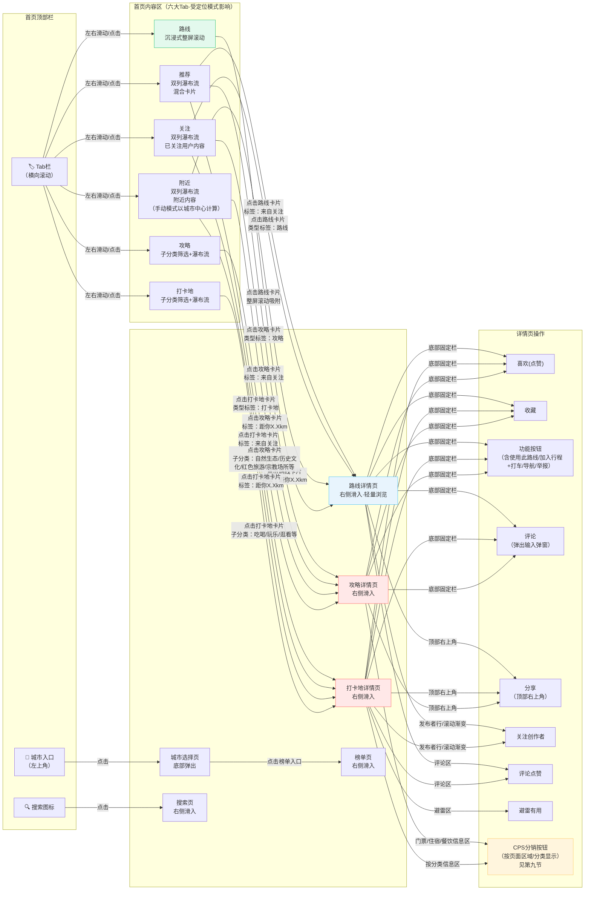
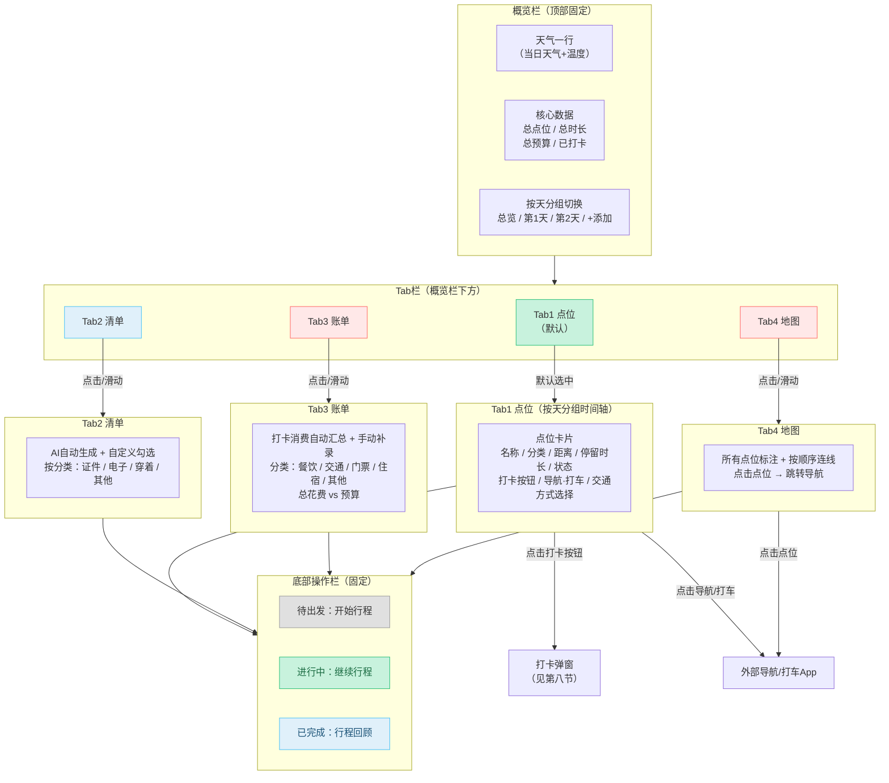
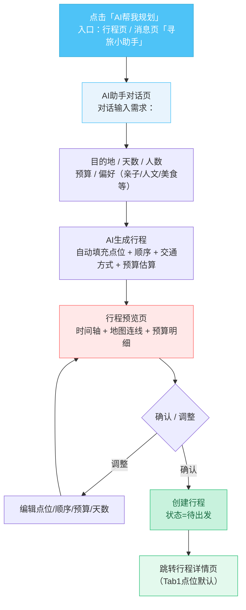
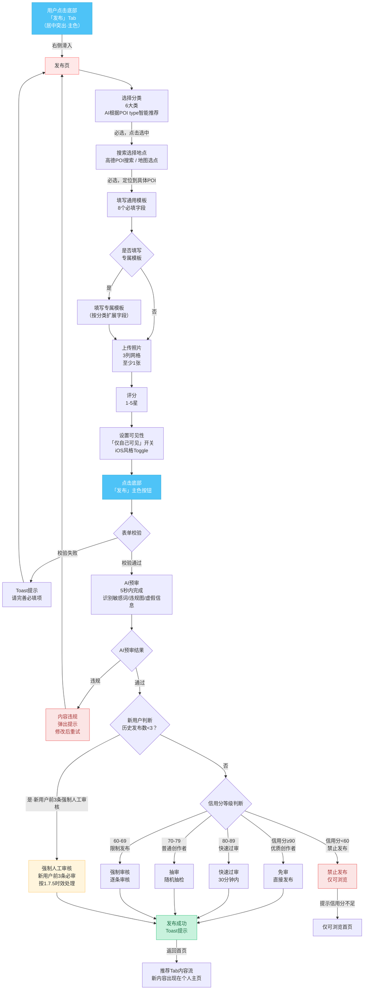
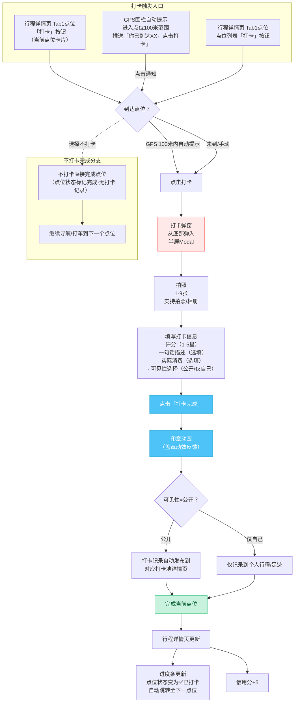
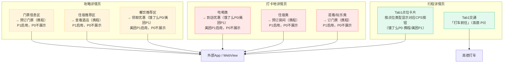
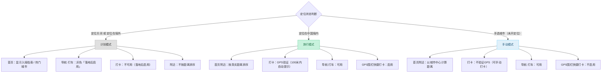

# 寻旅记 App · 页面流转图

> 版本：v2.1.7 | 日期：2026年6月 | 原型版本：v2.1.7

---

## 一、底部导航五大Tab全局流转图

底部导航栏全局固定，五个Tab依次为：首页、出发、发布（居中突出）、消息、我的。底部导航采用**纯文字样式（无图标）**，选中态文字加粗+纯黑#1A1A2E，发布按钮保持黑色描边圆形+加号图标。用户可通过点击底部Tab随时切换，也可通过页面内跳转进入更深层级页面。

> 说明：本图为全局骨架。行程详情页已重构为「概览栏 + 4 Tab（点位/清单/账单/地图）+ 底部操作栏」结构，详见第四节；首页内容受定位模式影响（计划/旅行/手动三态），详见第十节；各详情页及行程详情页内嵌CPS分销入口，详见第九节。

```mermaid
flowchart TB
    subgraph 底部导航栏["底部导航栏（全局固定）"]
        direction LR
        T1["首页"]
        T2["出发"]
        T3["➕ 发布<br/>（居中突出）"]
        T4["消息"]
        T5["我的"]
    end

    subgraph 首页分支["首页分支"]
        H1["首页六大Tab内容区<br/>关注/附近/推荐/攻略/打卡地/路线<br/>（受定位模式影响，见第十节）"]
        H2["搜索页<br/>（右侧滑入）"]
        H3["路线详情页<br/>（右侧滑入·轻量浏览）"]
        H4["打卡地详情页<br/>（右侧滑入）"]
        H5["攻略详情页<br/>（右侧滑入）"]
        H6["榜单页<br/>（右侧滑入）"]
        H7["城市选择页<br/>（底部弹出）"]
        H8["AI助手对话页（P1）<br/>（右侧滑入）"]
    end

    subgraph 行程分支["行程分支"]
        T2_1["行程列表页<br/>待出发/进行中/已完成"]
        T2_2["行程详情页<br/>（右侧滑入）<br/>4 Tab：点位/清单/账单/地图<br/>（见第四节）"]
        T2_3["打卡弹窗<br/>（底部弹出）"]
        T2_4["AI规划预览页<br/>（右侧滑入·见第六节）"]
    end

    subgraph 发布分支["发布分支"]
        T3_1["发布页<br/>（右侧滑入）<br/>6大类+POI搜索+模板<br/>（见第七节）"]
    end

    subgraph 消息分支["消息分支"]
        T4_1["消息列表页"]
        T4_2["AI助手对话页（P1）<br/>（右侧滑入）"]
        T4_3["私信/群聊详情页<br/>（右侧滑入）"]
    end

    subgraph 我的分支["我的分支"]
        T5_1["个人主页"]
        T5_2["足迹地图页<br/>（右侧滑入）"]
        T5_3["设置页<br/>（右侧滑入）"]
        T5_4["个人资料编辑页<br/>（右侧滑入）"]
        T5_5["登录/注册页<br/>（全屏弹出）"]
    end

    T1 -->|点击底部Tab| H1
    T2 -->|点击底部Tab| T2_1
    T3 -->|点击底部Tab<br/>右侧滑入| T3_1
    T4 -->|点击底部Tab| T4_1
    T5 -->|点击底部Tab| T5_1

    H1 -->|点击搜索图标| H2
    H1 -->|点击路线卡片| H3
    H1 -->|点击打卡地卡片| H4
    H1 -->|点击攻略卡片| H5
    H1 -->|左上角城市入口点击| H7
    H7 -->|点击榜单入口| H6

    T2_1 -->|点击"查看详情"| T2_2
    T2_1 -->|点击"AI帮我规划"| T2_4
    T2_2 -->|点击"打卡"按钮| T2_3
    T2_2 -->|Tab切换| T2_2

    H3 -->|点击"使用此路线"<br/>一键创建行程| T2_2
    H4 -->|功能按钮"加入行程"| T2_2
    H5 -->|功能按钮"加入行程"| T2_2

    T4_1 -->|点击「寻旅小助手」| T4_2
    T4_1 -->|点击消息条目| T4_3

    T5_1 -->|点击"我的足迹"| T5_2
    T5_1 -->|点击"设置"| T5_3
    T5_1 -->|点击头像/编辑资料| T5_4
    T5_1 -->|未登录状态| T5_5

    T3_1 -.->|发布成功后返回| H1
    T2_3 -.->|打卡完成后关闭弹窗| T2_2
    T2_4 -.->|确认创建行程| T2_2
    T5_5 -.->|登录成功后返回| T5_1

    style T3 fill:#4EC3F7,stroke:#3AAED6,color:#fff
    style T3_1 fill:#4EC3F7,stroke:#3AAED6,color:#fff
    style T2_2 fill:#E3F9ED,stroke:#31C27C
    style T2_4 fill:#E3F9ED,stroke:#31C27C
```

### 触发方式与进入方式说明

| 序号 | 流转路径 | 触发方式 | 进入方式 |
|------|---------|---------|---------|
| 1 | 任意Tab之间切换 | 点击底部导航Tab | 即时切换，无过渡动画 |
| 2 | 首页 → 搜索页 | 点击顶部搜索图标 | 右侧滑入（Push） |
| 3 | 首页 → 路线/打卡地/攻略详情 | 点击对应卡片 | 右侧滑入（Push） |
| 4 | 首页 → 城市选择页 | 左上角城市入口点击 | 底部弹出（Modal） |
| 5 | 城市选择页 → 榜单页 | 点击榜单入口 | 右侧滑入（Push） |
| 6 | 消息 → AI助手对话页 | 点击「寻旅小助手」会话 | 右侧滑入（Push） |
| 7 | 行程列表 → 行程详情 | 点击"查看详情" | 右侧滑入（Push） |
| 8 | 行程详情 → 打卡弹窗 | 点击"打卡"按钮 | 底部弹出（Modal） |
| 9 | 行程详情 → Tab切换（点位/清单/账单/地图） | 点击Tab或左右滑动 | 页内切换，无新页面入栈 |
| 10 | 行程详情 → 跳过 | 点击"跳过"按钮 | Toast 确认 |
| 11 | 行程详情 → 查看打卡记录 | 点击"已打卡"标签 | 底部弹出（Popup） |
| 12 | 行程详情 → 行程回顾 | 已完成态点击底部"行程回顾" | 右侧滑入（Push） |
| 13 | 行程列表 → AI规划预览页 | 点击"AI帮我规划" | 右侧滑入（Push） |
| 14 | 路线详情 → 行程详情 | 点击"使用此路线"一键创建 | 右侧滑入（Push） |
| 15 | 打卡地/攻略详情 → 行程详情 | 功能按钮"加入行程"→新建/选择行程 | 右侧滑入（Push） |
| 16 | 发布按钮 → 发布页 | 点击底部发布Tab | 右侧滑入（Push） |
| 17 | 消息 → AI助手对话 | 点击「寻旅小助手」会话 | 右侧滑入（Push） |
| 18 | 消息 -> 私信/群聊详情 | 点击消息条目 | 右侧滑入（Push） | 第二阶段 |
| 19 | 我的 -> 足迹地图 | 点击"我的足迹" | 右侧滑入（Push） | 第二阶段 |
| 20 | 我的 -> 排行榜 | 点击"排行榜"入口 | 右侧滑入（Push） | 第二阶段 |
| 21 | 我的 -> 勋章墙 | 点击"我的勋章" | 右侧滑入（Push） | 第二阶段 |
| 20 | 我的 → 设置 | 点击"设置" | 右侧滑入（Push） |
| 21 | 我的 → 个人资料编辑 | 点击头像/编辑资料 | 右侧滑入（Push） |
| 22 | 我的 → 登录/注册 | 未登录时触发 | 全屏弹出（Present） |
| 23 | 详情页 → 评论输入弹窗 | 点击底部"评论"按钮/输入框/回复链接 | 底部弹出（Sheet） |
| 24 | 详情页 → 分享 | 点击顶部右上角分享按钮 | 系统分享面板 |
| 25 | 详情页/行程详情 → CPS外链 | 点击CPS按钮（预订门票/查看酒店/到店优惠/打车前往等） | 唤起外部App或WebView（见第九节） |

---

## 二、首页内容Tab到各详情页流转图

首页顶部栏包含可横向滚动的6个Tab（关注、附近、推荐、攻略、打卡地、路线），左右滑动内容区域时Tab联动切换，点击Tab也可以切换内容。下方详情页根据Tab类型对应不同的详情页。首页内容呈现受**定位模式**影响（计划/旅行/手动三态），详见第十节。



### 首页Tab切换机制

| 操作 | 触发方式 | 行为 |
|------|---------|------|
| 点击Tab | 单击 | 内容区域切换到对应Tab，被点击Tab居中显示 |
| 滑动内容区 | 左右滑动手势 | Tab栏联动切换，选中Tab自动居中 |
| 下拉刷新 | 顶部下拉手势 | 除路线Tab外，所有Tab均支持下拉刷新 |
| 路线Tab切换 | 点击或滑动 | 导航栏变为半透明毛玻璃效果 |

### 首页Tab到详情页映射关系

| 首页Tab | 可到达详情页 | 卡片标识 |
|---------|-------------|---------|
| 关注 | 路线详情、打卡地详情、攻略详情 | 卡片右下角"来自关注" |
| 附近 | 路线详情、打卡地详情、攻略详情 | 卡片右下角"距你 X.X km" |
| 推荐 | 路线详情、打卡地详情、攻略详情 | 卡片左上角类型标签 |
| 攻略 | 攻略详情（仅攻略内容） | 子分类药丸筛选 |
| 打卡地 | 打卡地详情（仅打卡地内容） | 子分类药丸筛选 |
| 路线 | 路线详情（仅路线内容） | 整屏滚动吸附 |

### 定位模式对首页的影响（概览）

> 完整三态流转见第十节。此处仅列首页表现差异。

| 定位模式 | 触发条件 | 首页表现 |
|---------|---------|---------|
| 计划模式 | 定位关闭 / 定位在境外 | 首页显示「入境指南 / 热门城市」；导航打车灰色"落地后启用" |
| 旅行模式 | 定位在中国境内 | 「附近」按真实距离排序；打卡GPS验证；导航打车可用 |
| 手动模式 | 手选城市（未开定位） | 「附近」以城市中心计算距离；打卡不验证GPS；导航打车可用 |

---

## 三、行程状态流转图

行程有三种状态：待出发、进行中、已完成。用户通过行程页管理行程生命周期，状态转换由用户操作触发。行程详情页重构为4 Tab后，进行中操作按Tab分布（点位Tab负责打卡/导航、清单/账单/地图Tab为工具）。

```mermaid
flowchart TB
    subgraph 创建入口["行程创建入口"]
        direction LR
        E1["行程页底部<br/>「新建行程」按钮"]
        E2["路线详情页<br/>底部「使用此路线」<br/>（一键创建·见第五节）"]
        E3["打卡地详情页<br/>功能按钮内「加入行程」"]
        E4["攻略详情页<br/>功能按钮内「加入行程」"]
        E5["AI助手对话页（P1）<br/>「AI帮我规划」<br/>（见第六节）"]
    end

    subgraph 状态节点["行程状态节点"]
        S1["🕐 待出发<br/>（Pending）"]
        S2["🚶 进行中<br/>（In Progress）"]
        S3["✅ 已完成<br/>（Completed）"]
    end

    subgraph 待出发操作["待出发期操作"]
        A1["编辑行程<br/>增删点位/调整顺序"]
        A2["AI实时重算<br/>插入新点位→自动优化顺序"]
        A3["查看详情<br/>预览所有点位（Tab1点位）"]
    end

    subgraph 进行中操作["进行中期操作（按Tab分布）"]
        B1["Tab1点位：打卡<br/>单一打卡模式"]
        B2["Tab1点位：跳过点位<br/>不计入进度"]
        B3["Tab1点位：取消跳过<br/>恢复为待打卡"]
        B4["Tab1点位：导航/打车<br/>前往下一点位"]
        B5["动态重算<br/>跳过/删除后自动优化路线"]
        B6["Tab1点位：查看进度<br/>已打卡/总数-已跳过"]
        B7["Tab2清单：勾选行李"]
        B8["Tab3账单（P1）：补录消费<br/>P0仅展示总预算"]
        B9["Tab4地图：查看路线/跳转导航"]
    end

    subgraph 已完成操作["完成期操作"]
        C1["查看回顾<br/>行程总结与统计"]
        C2["分享行程<br/>生成行程卡片"]
        C3["导出足迹<br/>标记到足迹地图"]
    end

    E1 -->|创建空白行程<br/>手动添加点位| S1
    E2 -->|携带路线所有点位<br/>一键生成行程| S1
    E3 -->|将该打卡地<br/>添加至已有/新建行程| S1
    E4 -->|将该攻略关联地点<br/>添加至已有/新建行程| S1
    E5 -->|AI生成行程<br/>预览确认后创建| S1

    S1 -->|点击底部"开始行程"<br/>（底部操作栏）| S2
    S1 --> A1
    S1 --> A2
    S1 --> A3

    S2 -->|所有点位已打卡<br/>或手动点击"完成行程"| S3
    S2 --> B1
    S2 --> B2
    S2 --> B3
    S2 --> B4
    S2 --> B5
    S2 --> B6
    S2 --> B7
    S2 --> B8
    S2 --> B9

    S3 --> C1
    S3 --> C2
    S3 --> C3

    S1 -.->|删除行程<br/>（长按/左滑）| X1["行程已删除"]
    S2 -.->|删除行程<br/>（不可逆）| X1

    style S1 fill:#E0E0E0,stroke:#9E9E9E,color:#333
    style S2 fill:#C8F2DD,stroke:#31C27C,color:#1A6B42
    style S3 fill:#E0F0FA,stroke:#4EC3F7,color:#1A5276
    style X1 fill:#FBE5E5,stroke:#EB5757,color:#A83838
```

### 行程状态转换规则

| 转换 | 触发条件 | 触发方式 | 页面变化 |
|------|---------|---------|---------|
| 创建 → 待出发 | 新建行程 / 使用路线 / AI规划 / 加入行程 | 点击按钮 | 行程卡片出现在"待出发"Tab |
| 待出发 → 进行中 | 点击底部操作栏"开始行程" | 点击按钮 | 行程卡片移至"进行中"Tab，当前点位高亮 |
| 进行中 → 已完成 | 全部点位打卡完成 / 手动点击"完成行程" | 自动/手动 | 行程卡片移至"已完成"Tab，显示完成标签 |
| 待出发 → 已删除 | 长按/左滑删除 | 手势操作 | 行程从列表中移除 |
| 进行中 → 已删除 | 长按/左滑删除 | 手势操作 | 不可逆删除，提示确认 |

### 行程进度计算

```
进度 = 已打卡数 / (总点数 - 已跳过数) × 100%
```

- 已跳过点位不计入总点数，不纳入进度计算
- 用户跳过或删除点位后，系统自动重新计算剩余路线的最优顺序
- 用户添加新点位后，AI实时提示最佳插入位置

---

## 四、行程详情页结构与4 Tab流转图

行程详情页是用户执行行程的核心操作页，重构为「顶部概览栏 + 4 Tab内容区 + 底部操作栏」三段式结构。4个Tab中，**Tab1点位为执行入口，Tab2清单/Tab3账单/Tab4地图为行程专属工具功能**（路线详情页不具备这些工具，见第五节）。



### 概览栏说明

| 区域 | 内容 | 说明 |
|------|------|------|
| 天气一行 | 当日天气图标 + 温度 + 天气描述 | 取行程所在城市当日天气，提示穿衣/出行 |
| 核心数据 | 总点位 / 总时长 / 总预算 / 已打卡 | 一行四列展示，已打卡随进度实时更新 |
| 按天分组切换 | 总览 / 第1天 / 第2天 / +添加 | 横向滚动胶囊，"+添加"新增一天并重排点位 |

### Tab1 点位 · 时间轴卡片字段

| 字段 | 说明 |
|------|------|
| 名称 | 点位名称 |
| 分类 | 吃喝/玩乐/逛看等（决定CPS按钮类型，见第九节） |
| 距离 | 距上一点位的距离 |
| 停留时长 | 建议停留时长 |
| 状态 | 待打卡 / 已打卡 / 已跳过 |
| 打卡按钮 | 进行中态可点击，触发打卡弹窗 |
| 导航·打车 | 唤起外部导航/打车App（受定位模式影响） |
| 交通方式选择 | 步行 / 公交 / 驾车，影响距离与时间估算 |
| CPS按钮 | 按点位分类显示对应CPS入口（见第九节） |

### Tab2/3/4 工具功能说明

| Tab | 数据来源 | 核心能力 |
|-----|---------|---------|
| Tab2 清单 | AI按行程目的地/天数自动生成 + 用户自定义 | 按分类勾选（证件/电子/穿着/其他），进度统计 |
| Tab3 账单（P1） | 打卡消费自动汇总 + 手动补录（P0 仅展示总预算） | 分类统计（餐饮/交通/门票/住宿/其他），总花费 vs 预算 |
| Tab4 地图 | 行程所有点位 | 标注+按顺序连线，点击点位跳转导航 |

### 底部操作栏状态映射

| 行程状态 | 底部按钮 | 点击行为 |
|---------|---------|---------|
| 待出发 | 开始行程 | 状态切换为进行中，定位至当前点位 |
| 进行中 | 继续行程 | 滚动至当前待打卡点位并高亮 |
| 已完成 | 行程回顾 | 右侧滑入行程回顾页 |

---

## 五、路线与行程关系流转图

「路线」与「行程」是两类不同对象：**路线是可复用的轻量内容模板**（创作者发布的推荐玩法），**行程是用户私有、可执行、带工具的实例**。路线详情页只做信息浏览，行程详情页才承载工具功能（清单/账单/地图）。两者通过"使用此路线"一键转化。

```mermaid
flowchart LR
    subgraph 路线详情页["路线详情页（轻量浏览·不加工具）"]
        R1["时间轴点位列表"]
        R2["核心数据<br/>（总点位/总时长/总预算）"]
        R3["评论区"]
        R4["底部：使用此路线<br/>（一键创建行程）"]
    end

    subgraph 转化["路线→行程转化"]
        CV["携带路线全部点位<br/>一键生成行程实例<br/>状态=待出发"]
    end

    subgraph 行程详情页["行程详情页（含工具功能）"]
        T1["Tab1 点位<br/>打卡/导航/交通"]
        T2["Tab2 清单 ★工具"]
        T3["Tab3 账单 ★工具"]
        T4["Tab4 地图 ★工具"]
        T5["底部操作栏<br/>开始/继续/回顾"]
    end

    R4 -->|点击"使用此路线"| CV
    CV -->|跳转| 行程详情页

    style R4 fill:#4EC3F7,stroke:#3AAED6,color:#fff
    style CV fill:#FFE8E8,stroke:#FF6B6B
    style 行程详情页 fill:#E3F9ED,stroke:#31C27C
```

### 路线详情页 vs 行程详情页 对比

| 维度 | 路线详情页 | 行程详情页 |
|------|-----------|-----------|
| 定位 | 轻量浏览（内容消费） | 私有执行（操作工具） |
| 点位展示 | 时间轴点位列表（只读） | Tab1点位（可打卡/导航/跳过） |
| 核心数据 | 总点位/总时长/总预算 | + 天气 + 已打卡 + 按天分组 |
| 评论区 | 有 | 无（行程为私有） |
| 清单/账单/地图工具 | 无 | 有（Tab2/3/4） |
| 底部主按钮 | 使用此路线（创建行程） | 开始/继续/回顾（按状态） |
| CPS入口 | 按信息区显示 | 按点位分类显示 |
| 创建者 | 创作者发布内容 | 用户私有实例 |

### 转化规则

- 点击"使用此路线" → 携带路线全部点位一键生成行程 → 状态置为「待出发」→ 跳转行程详情页
- 生成后行程与原路线解耦：用户可自由增删点位、调整顺序，不影响原路线
- 一个路线可被多次"使用此路线"生成多个独立行程

---

## 六、AI规划行程流程图

AI规划是行程创建的智能入口，通过对话收集需求后自动生成行程草案，用户预览确认或调整后创建为正式行程。



### AI规划对话输入要素

| 要素 | 是否必填 | 说明 |
|------|---------|------|
| 目的地 | 必填 | 城市/区域，支持多目的地 |
| 天数 | 必填 | 行程总天数，决定点位分组 |
| 人数 | 必填 | 影响预算与点位推荐（如亲子适玩） |
| 预算 | 选填 | 总预算上限，AI据此筛选点位 |
| 偏好 | 选填 | 亲子/人文/美食/户外/休闲等标签 |

### 生成与确认

- AI生成的行程草案在「行程预览页」展示时间轴、地图连线、预算明细
- 用户可逐项调整点位/顺序/预算/天数后重新预览
- 确认后创建为正式行程（状态=待出发），跳转行程详情页Tab1点位
- 创建后行程可继续在行程详情页内编辑、AI实时重算

---

## 七、发布流程图

发布入口位于底部导航栏居中突出位置，点击后从右侧滑入独立的发布页面。本次升级：分类维持**6大类（AI根据POI type智能推荐默认分类）**；地点选择改为**高德POI搜索/地图选点**；表单改为**通用模板（8必填）+ 可选专属模板**；新增评分步骤。发布流程涵盖内容填写、AI预审、人工审核三个环节。



### 发布流程说明

| 步骤 | 操作 | 是否必填 | 说明 |
|------|------|---------|------|
| 1. 选择分类 | 从6大类中点击选中 | 必选 | 吃喝/玩乐/逛看/户外/逛街/住宿；AI根据POI type智能推荐默认分类 |
| 2. 搜索选择地点 | 高德POI搜索 / 地图选点 | 必选 | 定位到具体POI，自动回填地址、坐标等信息 |
| 3. 通用模板（8必填） | 填写8个必填字段 | 必填 | 见下表「通用模板8必填字段」 |
| 4. 专属模板（可选） | 按分类填写扩展字段 | 选填 | 见下表「专属模板示例」 |
| 5. 上传照片 | 点击添加图片 | 必填（至少1张） | 3列网格，虚线边框，支持多选 |
| 6. 评分 | 1-5星 | 选填 | 对该打卡地的整体评分 |
| 7. 设置可见性 | Toggle开关 | 默认公开 | 可选"仅自己可见" |
| 8. 点击发布 | 点击主按钮 | 最终提交 | 触发表单校验 |

### 通用模板8必填字段（PRD 3.3 版本）

| 序号 | 字段 | 说明 |
|------|------|------|
| 1 | 名称 | 打卡地名称，可编辑 |
| 2 | 图片 | 至少上传 1 张图片，最多 9 张 |
| 3 | 描述 | 感受/体验描述文字 |
| 4 | 人均消费 | 单位：元 |
| 5 | 建议时长 | 建议游玩/停留时长，单位：分钟 |
| 6 | 避雷建议 | 至少填写 1 条避雷建议 |
| 7 | 定位 | 定位到具体 POI（高德 POI 搜索/地图选点） |
| 8 | 分类 | 6 大分类之一（吃喝/玩乐/逛看/户外/逛街/住宿） |

> 通用模板字段中定位和分类由 AI 根据 POI 数据预填，其余字段由用户填写。避雷建议为必填项，鼓励用户分享真实体验。

### 专属模板示例（按分类，选填）

| 分类 | 专属扩展字段（示例） |
|------|---------------------|
| 住宿 | 入住/退房时间、房型、是否含早 |
| 吃喝 | 菜系、招牌菜、人均餐标 |
| 玩乐 | 适合年龄、刺激程度、是否需预约 |
| 逛看 | 展览主题、是否免费、讲解服务 |
| 户外 | 难度等级、装备要求、最佳季节 |

### 发布后状态

| 状态 | 可见性 | 用户操作 |
|------|--------|---------|
| 审核中 | 仅自己可见 | 等待审核，可编辑 |
| 已通过 | 公开 | 获得信用分+5 |
| 已驳回 | 仅自己可见 | 查看原因，修改后重提 |

---

## 八、打卡流程图

打卡是寻旅记App的核心闭环环节。采用单一打卡模式。本次升级打卡弹窗流程：到达点位（GPS 100米内自动提示）→ 点击打卡 → 弹窗从底部弹入；弹窗含拍照（1-9张）+ 评分 + 可选一句话描述 + 可选实际消费 + 可见性选择；提交后播放**印章动画**，打卡记录**自动发布到打卡地页面**（公开时）；同时支持**不打卡也可完成点位**，直接继续导航/打车到下一个。



### 打卡弹窗字段说明

| 字段 | 是否必填 | 说明 |
|------|---------|------|
| 拍照 | 必填（1-9张） | 支持拍照/相册，最多9张 |
| 评分 | 选填 | 1-5星 |
| 一句话描述 | 选填 | 简短打卡感受 |
| 实际消费 | 选填 | 单位：元，自动汇入Tab3账单 |
| 可见性 | 默认公开 | 公开 / 仅自己 |

### 打卡触发方式

| 触发方式 | 场景 | 说明 |
|---------|------|------|
| Tab1点位「打卡」按钮 | 正在执行行程，当前点位 | 位于当前点位卡片，主色突出 |
| 点位列表「打卡」按钮 | 查看后续点位，提前打卡 | 位于每个待打卡点位右侧 |
| GPS围栏自动提示 | 用户进入打卡点100米范围 | 推送提示，点击直接进入打卡弹窗（受定位模式影响，手动模式不验证GPS） |
| 不打卡完成 | 不想打卡但需推进行程 | 标记点位完成，无打卡记录，继续导航/打车到下一个 |

### 打卡后联动

- 印章动画反馈打卡成功
- 公开打卡记录自动发布到对应打卡地详情页（成为该打卡地的打卡内容）
- 实际消费自动汇入行程详情页Tab3账单
- 进度条更新，自动跳转下一点位
- 信用分+5

---

## 九、CPS分销入口分布图

CPS（按销售分成）分销入口分布在攻略详情页、打卡地详情页、行程详情页三类页面，按内容区域/点位分类显示对应合作方按钮，点击后唤起外部App或WebView完成跳转。

> **CPS 分阶段口径**：P0阶段启用「高德打车 + 饿了么」分销；携程（门票/酒店）与美团（到店团购）入口为 P1阶段启用，P0阶段不展示。下图中携程/美团入口均已标注"P1启用，P0不展示"。



### CPS入口分布明细

| 所在页面 | 区域/分类 | CPS按钮 | 合作方 | 跳转方式 |
|---------|----------|---------|--------|---------|
| 攻略详情页 | 门票信息区 | 预订门票 | 携程（P1启用，P0不展示） | 唤起携程App / WebView |
| 攻略详情页 | 住宿推荐区 | 查看酒店 | 携程（P1启用，P0不展示） | 唤起携程App / WebView |
| 攻略详情页 | 餐饮推荐区 | 领取优惠 | 饿了么（P0）/ 美团（P1启用，P0不展示） | 唤起对应App / WebView |
| 打卡地详情页 | 吃喝类 | 到店优惠 | 饿了么（P0）/ 美团（P1启用，P0不展示） | 唤起对应App / WebView |
| 打卡地详情页 | 住宿类 | 预订房间 | 携程（P1启用，P0不展示） | 唤起携程App / WebView |
| 打卡地详情页 | 逛看/玩乐类 | 订门票 | 携程（P1启用，P0不展示） | 唤起携程App / WebView |
| 行程详情页 | Tab1点位卡片 | 按类型对应CPS按钮 | 携程（P1）/饿了么（P0）/美团（P1） | 同上，按点位分类匹配 |
| 行程详情页 | Tab1交通 | 打车前往 | 高德（P0） | 唤起高德打车 |

### CPS按钮显示规则

- 攻略详情页：CPS按钮固定在对应信息区（门票/住宿/餐饮），随内容滚动出现
- 打卡地详情页：根据打卡地分类（吃喝/玩乐/逛看/户外/逛街/住宿）显示对应CPS按钮
- 行程详情页Tab1点位卡片：按点位分类自动匹配CPS按钮（与打卡地详情页规则一致）
- 行程详情页交通：每个点位卡片底部固定"打车前往"按钮（受定位模式影响，计划模式灰色"落地后启用"）

---

## 十、定位模式影响流转图

App根据定位状态进入三种模式：计划模式、旅行模式、手动模式。模式影响首页内容呈现、打卡GPS验证、导航打车可用性。



### 三态模式对比

| 维度 | 计划模式 | 旅行模式 | 手动模式 |
|------|---------|---------|---------|
| 触发条件 | 定位关闭 / 定位在境外 | 定位在中国境内 | 手选城市（未开定位） |
| 首页内容 | 入境指南 / 热门城市 | 正常推荐 + 附近按距离 | 正常推荐 + 附近按城市中心距离 |
| 附近排序 | 不按距离 | 真实距离排序 | 城市中心计算距离 |
| 打卡GPS验证 | 不可用 | 验证（100米内提示） | 不验证（可手动打卡） |
| GPS围栏快捷打卡 | 不启用 | 启用 | 不启用 |
| 导航·打车 | 灰色"落地后启用" | 可用 | 可用 |
| 典型场景 | 行前规划/境外未落地 | 行程进行中 | 未开定位但想浏览某城市 |

### 模式切换说明

- 用户开启定位且在国内 → 自动进入旅行模式
- 用户关闭定位或定位在境外 → 进入计划模式
- 用户在城市选择页手选城市（未开定位）→ 进入手动模式
- 落地后（定位回到国内）→ 自动从计划模式切换至旅行模式，导航打车与打卡恢复可用

---

## 十一、完整页面流转总图

以下为寻旅记App的完整页面流转关系图，涵盖所有页面及其之间的导航关系，包含行程详情页4 Tab、路线→行程转化、AI规划、CPS分销、定位模式等新增链路。标注了触发方式与页面进入方式。

```mermaid
flowchart TB
    START["🚀 App启动"] --> SPLASH["启动页/闪屏"]
    SPLASH --> LOC_MODE{"定位模式判断<br/>（见第十节）"}
    LOC_MODE -->|计划/旅行/手动| AUTH_CHECK{"登录状态检查"}

    AUTH_CHECK -->|未登录| LOGIN["登录/注册页<br/>全屏弹出"]
    AUTH_CHECK -->|已登录| MAIN["主界面<br/>底部导航栏"]

    LOGIN -->|登录成功| MAIN

    subgraph BOTTOM_TABS["底部导航五大Tab"]
        direction LR
        HOME["首页<br/>关注/附近/推荐/攻略/打卡地/路线<br/>（6个顶级Tab，受定位模式影响）"]
        TRIP["出发<br/>待出发/进行中/已完成"]
        PUB_TAB["发布<br/>居中突出"]
        MSG["消息"]
        PROFILE["我的"]
    end

    MAIN --> HOME
    MAIN --> TRIP
    MAIN --> PUB_TAB
    MAIN --> MSG
    MAIN --> PROFILE

    subgraph DETAIL_PAGES["详情页层"]
        ROUTE_DETAIL["路线详情页<br/>右侧滑入·轻量浏览"]
        SPOT_DETAIL["打卡地详情页<br/>右侧滑入"]
        GUIDE_DETAIL["攻略详情页<br/>右侧滑入"]
        QA_DETAIL["攻略问答详情<br/>（问大家展开）"]
        TRIP_DETAIL["行程详情页<br/>右侧滑入<br/>4 Tab：点位/清单/账单/地图"]
        AI_PLAN["AI规划预览页<br/>右侧滑入"]
        AI_CHAT["AI助手对话页<br/>右侧滑入"]
        SEARCH["搜索页<br/>右侧滑入"]
        RANKING["榜单页<br/>右侧滑入"]
        CITY_SELECT["城市选择页<br/>底部弹出"]
        FOOTPRINT["足迹地图页<br/>右侧滑入"]
        SETTINGS["设置页<br/>右侧滑入"]
        PROFILE_EDIT["个人资料编辑页<br/>右侧滑入"]
        REVIEW["行程回顾页<br/>右侧滑入"]
    end

    subgraph MODAL_LAYER["弹窗层"]
        CHECKIN_MODAL["打卡弹窗<br/>底部弹出·印章动画"]
        ADD_TRIP_MODAL["加入行程弹窗<br/>底部弹出"]
        COMMENT_MODAL["评论输入弹窗<br/>底部弹出"]
        PUBLISH_PAGE["发布页<br/>右侧滑入<br/>6大类+POI搜索+模板"]
    end

    subgraph CPS_LAYER["CPS外链层"]
        CPS_CTRIP["携程（门票/酒店）"]
        CPS_ELEME["饿了么/美团（到店优惠）"]
        CPS_TAXI["高德打车"]
    end

    %% 首页到详情页
    HOME -->|点击路线卡片| ROUTE_DETAIL
    HOME -->|点击打卡地卡片| SPOT_DETAIL
    HOME -->|点击攻略卡片| GUIDE_DETAIL
    HOME -->|点击搜索图标| SEARCH
    HOME -->|左上角城市入口| CITY_SELECT
    CITY_SELECT -->|点击榜单入口| RANKING

    %% 行程到详情
    TRIP -->|点击查看详情| TRIP_DETAIL
    TRIP -->|点击AI帮我规划| AI_PLAN
    AI_PLAN -->|确认创建行程| TRIP_DETAIL

    %% 行程详情页内部
    TRIP_DETAIL -->|Tab1点击打卡| CHECKIN_MODAL
    TRIP_DETAIL -->|已完成点击行程回顾| REVIEW
    TRIP_DETAIL -->|Tab4点击点位| EXT_NAV["外部导航App"]

    %% 行程详情到路线详情
    TRIP_DETAIL -->|点击关联路线| ROUTE_DETAIL

    %% 路线→行程转化
    ROUTE_DETAIL -->|底部"使用此路线"| TRIP_DETAIL
    ROUTE_DETAIL -->|点击点位>打卡地| SPOT_DETAIL

    %% 打卡地/攻略→行程
    SPOT_DETAIL -->|功能按钮"加入行程"| TRIP_DETAIL
    GUIDE_DETAIL -->|功能按钮"加入行程"| TRIP_DETAIL
    GUIDE_DETAIL -->|点击关联地点| SPOT_DETAIL
    GUIDE_DETAIL -->|点击"问大家"| QA_DETAIL

    %% 打卡自动发布
    CHECKIN_MODAL -.->|公开打卡记录自动发布| SPOT_DETAIL

    %% 评论
    ROUTE_DETAIL -->|点击"评论"按钮| COMMENT_MODAL
    SPOT_DETAIL -->|点击"评论"按钮| COMMENT_MODAL
    GUIDE_DETAIL -->|点击"评论"按钮| COMMENT_MODAL

    %% 导航打车（受定位模式影响）
    SPOT_DETAIL -->|功能按钮"导航"| EXT_NAV
    SPOT_DETAIL -->|功能按钮"打车"| EXT_TAXI["外部打车App"]
    TRIP_DETAIL -->|Tab1"导航"| EXT_NAV
    TRIP_DETAIL -->|Tab1"打车"| EXT_TAXI

    %% CPS分销
    GUIDE_DETAIL -->|门票区预订门票| CPS_CTRIP
    GUIDE_DETAIL -->|住宿区查看酒店| CPS_CTRIP
    GUIDE_DETAIL -->|餐饮区领取优惠| CPS_ELEME
    SPOT_DETAIL -->|吃喝类到店优惠| CPS_ELEME
    SPOT_DETAIL -->|住宿类预订房间| CPS_CTRIP
    SPOT_DETAIL -->|逛看/玩乐类订门票| CPS_CTRIP
    TRIP_DETAIL -->|点位卡片CPS按钮| CPS_CTRIP
    TRIP_DETAIL -->|点位卡片CPS按钮| CPS_ELEME
    TRIP_DETAIL -->|交通"打车前往"| CPS_TAXI

    %% 发布
    PUB_TAB -->|右侧滑入| PUBLISH_PAGE

    %% 消息
    MSG -->|点击「寻旅小助手」| AI_CHAT
    MSG -->|点击消息条目| CHAT_DETAIL["私信/群聊详情页<br/>右侧滑入"]

    %% 我的页面
    PROFILE -->|功能入口"我的足迹"| FOOTPRINT
    PROFILE -->|右上角"设置"图标| SETTINGS
    PROFILE -->|点击头像/编辑资料| PROFILE_EDIT
    PROFILE -->|功能入口"我的勋章"| MEDAL["勋章墙页<br/>右侧滑入"]
    PROFILE -->|Tab切换：发布/收藏/打卡| PROFILE_TABS["个人页瀑布流内容区<br/>（Tab内展示，非独立页面）"]

    %% 设置页
    SETTINGS -->|点击"退出登录"| LOGIN

    %% 配色
    style HOME fill:#E8F4FD,stroke:#4EC3F7
    style TRIP fill:#E3F9ED,stroke:#31C27C
    style PUB_TAB fill:#4EC3F7,stroke:#3AAED6,color:#fff
    style MSG fill:#FFE8E8,stroke:#FF6B6B
    style PROFILE fill:#FFE8E8,stroke:#FF6B6B
    style ROUTE_DETAIL fill:#E8F4FD,stroke:#4EC3F7
    style SPOT_DETAIL fill:#FFE8E8,stroke:#FF6B6B
    style GUIDE_DETAIL fill:#FFE8E8,stroke:#FF6B6B
    style TRIP_DETAIL fill:#E3F9ED,stroke:#31C27C
    style AI_PLAN fill:#E3F9ED,stroke:#31C27C
    style CHECKIN_MODAL fill:#C8F2DD,stroke:#31C27C
    style PUBLISH_PAGE fill:#4EC3F7,stroke:#3AAED6,color:#fff
    style LOGIN fill:#FBE5E5,stroke:#EB5757
    style CPS_CTRIP fill:#FFF5DD,stroke:#FDCB6E
    style CPS_ELEME fill:#FFF5DD,stroke:#FDCB6E
    style CPS_TAXI fill:#FFF5DD,stroke:#FDCB6E
```

### 完整页面清单与导航方式

| 序号 | 页面名称 | 进入方式 | 返回方式 | 所在层级 |
|------|---------|---------|---------|---------|
| 1 | 首页 | 底部Tab / App启动默认 | - | 一级 |
| 2 | 行程页 | 底部Tab | - | 一级 |
| 3 | 发布页 | 底部Tab（居中突出） | 左上角返回箭头 | 一级入口 / 二级页面 |
| 4 | 消息页 | 底部Tab | - | 一级 |
| 5 | 我的页面 | 底部Tab | - | 一级 |
| 6 | 路线详情页 | 首页/行程详情 右侧滑入 | 左上角返回箭头 / 左滑返回 | 二级 |
| 7 | 打卡地详情页 | 首页/路线详情 右侧滑入 | 左上角返回箭头 / 左滑返回 | 二级 |
| 8 | 攻略详情页 | 首页 右侧滑入 | 左上角返回箭头 / 左滑返回 | 二级 |
| 9 | 行程详情页 | 行程列表/路线详情/AI规划 右侧滑入 | 左上角返回箭头 / 左滑返回 | 二级 |
| 10 | AI规划预览页 | 行程页/AI助手 右侧滑入 | 左上角返回箭头 / 左滑返回 | 二级 |
| 11 | AI助手对话页 | 首页/消息 右侧滑入 | 左上角返回箭头 / 左滑返回 | 二级 |
| 12 | 搜索页 | 首页搜索图标 右侧滑入 | 左上角返回箭头 / 左滑返回 | 二级 |
| 13 | 榜单页 | 城市选择页 右侧滑入 | 左上角返回箭头 / 左滑返回 | 二级 |
| 14 | 城市选择页 | 左上角城市入口 底部弹出 | 下滑关闭 / 点击遮罩 | 弹窗层 |
| 15 | 足迹地图页 | 我的页面 右侧滑入 | 左上角返回箭头 / 左滑返回 | 二级 |
| 16 | 设置页 | 我的页面 右侧滑入 | 左上角返回箭头 / 左滑返回 | 二级 |
| 17 | 登录/注册页 | 未登录拦截 全屏弹出 | 登录成功后自动关闭 | 模态层 |
| 18 | 个人资料编辑页 | 我的页面 右侧滑入 | 左上角返回箭头 / 左滑返回 | 二级 |
| 19 | 加入行程弹窗 | 打卡地/攻略详情页底部 | 下滑关闭 | 弹窗层 |
| 20 | 启动页/闪屏 | App启动 | 自动跳转 | - |
| 21 | 打卡弹窗 | 行程详情页Tab1底部弹出 | 下滑关闭 | 弹窗层 |
| 22 | 私信/群聊详情页 | 消息页右侧滑入 | 左上角返回箭头 / 左滑返回 | 二级 |
| 23 | 攻略问答详情页 | 攻略详情页右侧滑入 | 左上角返回箭头 / 左滑返回 | 二级 |
| 24 | 勋章墙页 | 我的页面右侧滑入 | 左上角返回箭头 / 左滑返回 | 二级 |
| 25 | 评论输入弹窗 | 详情页底部弹出 | 下滑关闭 | 弹窗层 |
| 26 | 行程回顾页 | 行程详情页（已完成）右侧滑入 | 左上角返回箭头 / 左滑返回 | 二级 |
| 27 | CPS外链 | 详情页/行程详情页CPS按钮点击 | 唤起外部App / WebView | 外部 |

### 页面进入方式图例

| 进入方式 | 说明 | 交互手势 |
|---------|------|---------|
| 右侧滑入（Push） | 标准Navigation栈推入，从右向左滑入 | 左滑返回 |
| 底部弹出（Modal） | 从底部向上弹出半屏或全屏 | 下滑关闭 |
| 全屏弹出（Present） | 全屏模态，覆盖整个界面 | 无法手势关闭 |
| 即时切换 | 底部Tab间切换，无过渡动画 | 点击Tab |
| 页内切换 | 行程详情页4 Tab切换，无新页面入栈 | 点击Tab / 左右滑动 |
| 外部唤起 | CPS按钮触发，唤起外部App或WebView | 系统返回 |
