# 寻旅记 App · 登录/注册完整流程文档

> 版本：v2.1.7 | 日期：2026年6月 | 用途：产品、设计、开发、测试团队对齐登录注册交互与异常处理逻辑
> 平台：P0 - 微信小程序；P1 - iOS App / Android App

---

## 目录

- [一、概览与设计原则](#一概览与设计原则)
- [二、首次启动流程](#二首次启动流程)
- [三、登录选择页设计](#三登录选择页设计)
- [四、手机号验证码登录流程](#四手机号验证码登录流程)
- [五、第三方登录流程](#五第三方登录流程)
- [六、Email 登录流程](#六email-登录流程)
- [七、新用户注册后引导流程](#七新用户注册后引导流程)
- [八、已登录用户再次打开](#八已登录用户再次打开)
- [九、账号注销流程](#九账号注销流程)
- [十、Token 刷新机制](#十token-刷新机制)
- [十一、全局异常处理规范](#十一全局异常处理规范)
- [十二、用户协议与隐私政策](#十二用户协议与隐私政策)
- [附录：相关接口索引](#附录相关接口索引)

---

## 一、概览与设计原则

### 1.1 登录方式矩阵

| 登录方式 | 适用平台 | 目标用户 | 首次注册 | 说明 |
|---------|---------|---------|---------|------|
| 手机号 + 验证码 | iOS / Android | 国内用户（主力） | 自动注册 | 核心登录方式，一键完成 |
| Apple ID | iOS | iOS 用户 | 自动注册 | Sign in with Apple，iOS 必需 |
| Google | iOS / Android | 海外用户 | 自动注册 | Google Sign-In |
| Email + 密码 | iOS / Android | 海外用户 | 需先绑定 | 不自动注册，需先通过其他方式注册后绑定 |
| 微信授权 | 微信小程序 / App | 小程序用户 / App 关联用户 | 自动注册 | 小程序端唯一登录方式 |

> **P0 端策略说明**：P0阶段聚焦微信小程序单端开发，登录方式以「微信授权登录 + 手机号绑定」为主；Apple ID / Google / Email 等原生 App 第三方登录方式在 P1 原生 App 阶段接入，P0 小程序阶段不展示。小程序端通过微信 unionid 与 App 端打通账号。

### 1.2 设计原则

1. **免打扰优先**：未登录状态下绝大多数浏览功能可用，仅在需要身份的操作（收藏、发布、评论、关注、创建行程）时触发登录拦截。
2. **一键即达**：手机号验证码登录为主路径，输入手机号 → 获取验证码 → 自动填充（iOS 支持短信自动填充）→ 完成，最小化用户操作步骤。
3. **渐进式引导**：新用户注册后不立即要求完善资料，通过兴趣标签 → 城市选择 → 生日/年龄收集 → 推荐关注的渐进式引导路径，降低用户流失率。
4. **会话持久化**：Access Token 有效期 2 小时，Refresh Token 有效期 30 天，已登录用户再次打开 App 无需重新登录，Token 过期后自动无感刷新。
5. **合规安全**：用户协议与隐私政策必须主动勾选确认，验证码发送有频率限制，手机号等敏感信息脱敏展示。

---

## 二、首次启动流程

### 2.1 流程总览

首次启动 App 的用户将经历三个阶段的引导，最终进入登录选择页。已登录用户跳过全部引导直达首页。

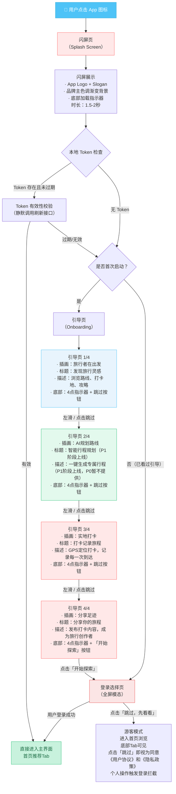

### 2.2 闪屏页设计

| 元素 | 设计规格 | 说明 |
|------|---------|------|
| 背景 | 品牌主色渐变（#4EC3F7 → #7DD3F9） | 从顶部向下渐变，底部偏浅 |
| Logo | 寻旅记 App 图标（居中，120x120pt） | PNG 带透明通道 |
| Slogan | "记录每一次出发与到达" | 白色文字，16pt，Logo下方 24pt |
| 加载指示器 | iOS UIActivityIndicatorView / Android ProgressBar | 白色，Slogan 下方 40pt |
| 底部文字 | 版本号 + "寻旅记" 版权信息 | 灰色，12pt，底部安全区上方 20pt |
| 展示时长 | 1.5 秒（最短），最多 2 秒 | 如 2 秒内 Token 校验未完成，直接进入下一流程 |

### 2.3 引导页设计

| 元素 | 设计规格 | 说明 |
|------|---------|------|
| 插画区域 | 占屏幕高度 55%，居中 | 每页不同主题插画，带动画过渡 |
| 标题 | 24pt，加粗，深色文字 | 4-6 字，简洁有力 |
| 描述文字 | 15pt，常规，灰色文字 | 10-15 字，辅助说明 |
| 页面指示器 | 4 个圆点（当前页实心，其他空心） | 位于标题下方 20pt |
| 跳过按钮 | 右上角，14pt，主色文字 | 前 3 页显示，点击直接进入登录选择页 |
| 开始按钮 | 第 4 页底部，主色圆角按钮，48pt 高 | 「开始探索」，点击进入登录选择页 |
| 页面切换 | 左右滑动，带弹性动画 | 支持手势滑动和点击指示器切换 |

### 2.4 首次启动判断逻辑

```
IF 本地无 LaunchFlag THEN
    → 标记为首次启动
    → 展示引导页
    → 设置 LaunchFlag = true
ELSE IF 本地无 Token THEN
    → 直接进入登录选择页
ELSE IF Token 存在 AND 未过期 THEN
    → 静默刷新验证
    → 有效 → 直接进入首页
    → 无效 → 进入登录选择页
END IF
```

---

## 三、登录选择页设计

### 3.1 页面布局

```
┌─────────────────────────────────┐
│                                 │
│         [App Logo 80x80]        │
│                                 │
│       记录每一次出发与到达        │
│                                 │
│                                 │
│   ┌─────────────────────────┐   │
│   │  📱 手机号登录           │   │  ← 主按钮（主色填充）
│   └─────────────────────────┘   │
│                                 │
│   ┌─────────────────────────┐   │
│   │     Apple ID 登录       │   │  ← 黑色按钮（iOS 显示）
│   └─────────────────────────┘   │
│                                 │
│   ┌─────────────────────────┐   │
│   │   G  Google 登录        │   │  ← Google 品牌色按钮
│   └─────────────────────────┘   │
│                                 │
│   ┌─────────────────────────┐   │
│   │   ✉  Email 登录         │   │  ← 次要按钮（灰色边框）
│   └─────────────────────────┘   │
│                                 │
│   ┌─────────────────────────┐   │
│   │   💬 微信登录            │   │  ← 微信绿色按钮
│   └─────────────────────────┘   │
│                                 │
│                                 │
│      ──── 跳过，先看看 ────       │  ← 底部文字链接
│                                 │
│  登录即表示您已阅读并同意《用户协议》和      │
│  《隐私政策》                    │  ← 协议提示文字
│                                 │
│          [☐] 已阅读并同意        │  ← 协议勾选框
│                                 │
└─────────────────────────────────┘
```

### 3.2 页面状态说明

| 状态 | 触发条件 | 页面表现 |
|------|---------|---------|
| 初始态 | 进入登录选择页 | 所有登录按钮可点击，协议勾选框默认未勾选 |
| 协议未勾选 | 用户点击任意登录按钮但未勾选协议 | 弹出 Toast：「请先阅读并同意用户协议和隐私政策」 |
| 登录中 | 用户点击登录按钮且协议已勾选 | 对应按钮显示 loading 动画，其余按钮置灰不可点击 |
| 登录失败 | 登录接口返回错误 | 对应按钮恢复可点击，显示错误提示 |
| 游客模式 | 点击「跳过，先看看」 | 进入首页，点击"跳过"即视为同意《用户协议》和《隐私政策》，不触发任何登录，功能受限时弹出登录拦截 |

### 3.3 按钮样式规范

| 登录方式 | 按钮背景色 | 图标 | 文字 | 高度 |
|---------|-----------|------|------|------|
| 手机号登录 | #4EC3F7（主色） | 手机图标 | "手机号登录" | 48pt |
| Apple ID 登录 | #000000（黑色） | Apple Logo | "通过 Apple 登录" | 48pt |
| Google 登录 | #FFFFFF（白色）+ 灰色边框 | Google "G" | "通过 Google 登录" | 48pt |
| Email 登录 | 透明 + 主色边框 | 邮件图标 | "Email 登录" | 48pt |
| 微信登录 | #07C160（微信绿） | 微信图标 | "微信登录" | 48pt |

### 3.4 平台差异化显示

| 登录方式 | iOS App | Android App | 微信小程序 |
|---------|---------|-------------|-----------|
| 手机号登录 | 显示 | 显示 | 隐藏（小程序用微信授权） |
| Apple ID 登录 | 显示 | 隐藏（不可用） | 隐藏 |
| Google 登录 | 显示 | 显示 | 隐藏 |
| Email 登录 | 显示 | 显示 | 隐藏 |
| 微信登录 | 显示 | 显示 | 唯一入口，自动获取授权 |

---

## 四、手机号验证码登录流程

### 4.1 完整流程图

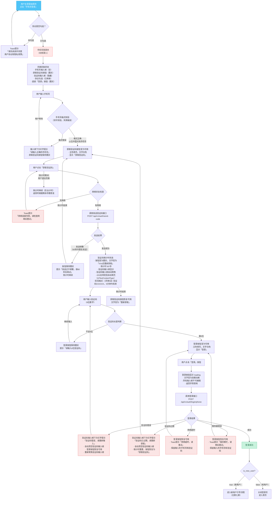

### 4.2 手机号输入校验规则

| 校验项 | 规则 | 触发时机 | 错误提示 |
|--------|------|---------|---------|
| 非空校验 | 输入框不能为空 | 点击「获取验证码」时 | 「请输入手机号」 |
| 长度校验 | 必须为 11 位数字 | 实时校验 | 「请输入11位手机号」 |
| 格式校验 | 匹配中国大陆手机号正则 `/^1[3-9]\d{9}$/` | 失焦时 | 「请输入正确的手机号」 |
| 格式校验 | 输入过程中过滤非数字字符 | 实时过滤 | 无法输入字母和特殊字符 |

### 4.3 验证码倒计时机制

```
倒计时时长：60 秒
按钮状态变化：
  [0s]  → 点击「获取验证码」
  [1s]  → 按钮变为「60s后重新获取」，置灰不可点击
  [2s]  → 「59s后重新获取」
  ...
  [59s] → 「1s后重新获取」
  [60s] → 按钮恢复为「重新获取」，可点击

注意事项：
  1. 倒计时基于本地定时器，不依赖服务端时间
  2. 用户退出页面后倒计时继续（后台计时）
  3. 重新进入页面时，根据剩余秒数恢复倒计时状态
  4. 如倒计时已结束，直接显示「重新获取」按钮
  5. 同一手机号在服务端有 60 秒发送频率限制（错误码 2008）
```

### 4.4 短信验证码规范

| 项目 | 规范 |
|------|------|
| 验证码长度 | 6 位纯数字 |
| 有效期 | 5 分钟（300 秒） |
| 短信模板 | 「【寻旅记】验证码XXXXXX，5分钟内有效，请勿泄露。」 |
| 发送频率 | 同一手机号 60 秒内最多 1 次 |
| 每日上限 | 同一手机号每天最多 10 次 |
| 同一 IP 上限 | 同一 IP 每小时最多 20 次 |
| iOS 自动填充 | 设置 `textContentType = .oneTimeCode`，系统自动识别短信验证码 |

### 4.5 手机号登录页完整状态矩阵

| 状态 | 手机号输入框 | 验证码输入框 | 获取验证码按钮 | 登录按钮 | 协议勾选 |
|------|------------|------------|--------------|---------|---------|
| 初始态 | 空，可输入 | 隐藏 | 置灰，不可点击 | 置灰，不可点击 | 继承登录选择页状态 |
| 输入手机号中 | 有内容，未满11位 | 隐藏 | 置灰，不可点击 | 置灰，不可点击 | 已勾选 |
| 手机号格式错误 | 有内容，红框+红字提示 | 隐藏 | 置灰，不可点击 | 置灰，不可点击 | 已勾选 |
| 手机号格式正确 | 11位数字，正常 | 隐藏 | 主色，可点击 | 置灰，不可点击 | 已勾选 |
| 发送验证码中 | 不可编辑 | 隐藏 | loading 动画 | 置灰，不可点击 | 已勾选 |
| 验证码已发送 | 可编辑 | 显示，空，可输入 | 倒计时 + 置灰 | 置灰，不可点击 | 已勾选 |
| 输入验证码中 | 可编辑 | 有内容，未满6位 | 倒计时 + 置灰 | 置灰，不可点击 | 已勾选 |
| 验证码满6位 | 可编辑 | 6位数字 | 倒计时 + 置灰 | 主色，可点击 | 已勾选 |
| 登录中 | 不可编辑 | 不可编辑 | 倒计时 + 置灰 | loading 动画 | 已勾选 |
| 验证码错误 | 可编辑 | 清空，红框+红字 | 倒计时 + 置灰 | 恢复可点击 | 已勾选 |
| 验证码过期 | 可编辑 | 清空，红框+红字 | 恢复「获取验证码」 | 置灰，不可点击 | 已勾选 |
| 登录成功 | - | - | - | - | 跳转 |

---

## 五、第三方登录流程

> **P0 端策略说明**：以下 Apple ID / Google 第三方登录流程为 P1 原生 App 阶段接入能力。P0 小程序阶段使用微信授权登录 + 手机号绑定，Apple ID / Google / Email 登录在 P1 原生 App 阶段接入，P0 不展示对应入口。

### 5.1 Apple ID 登录流程

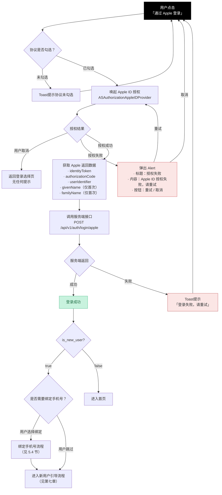

### 5.2 Google 登录流程

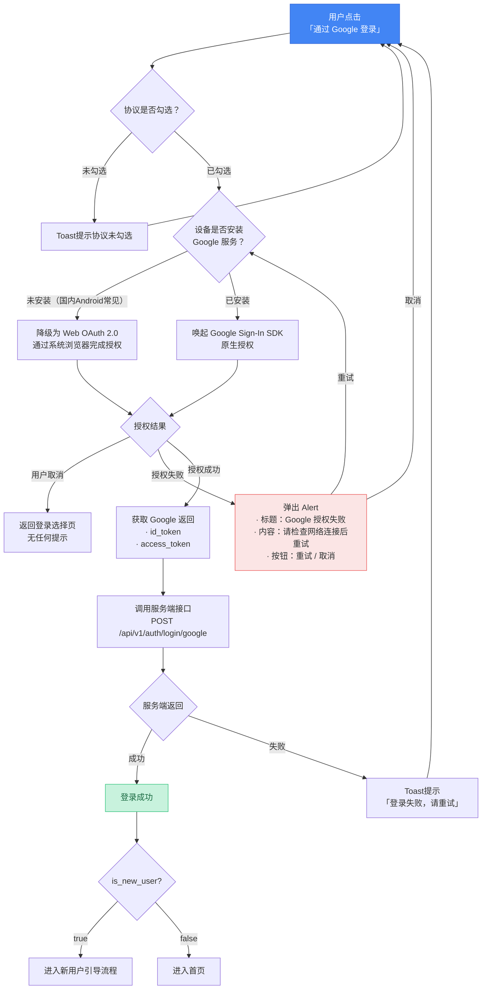

### 5.3 微信登录流程

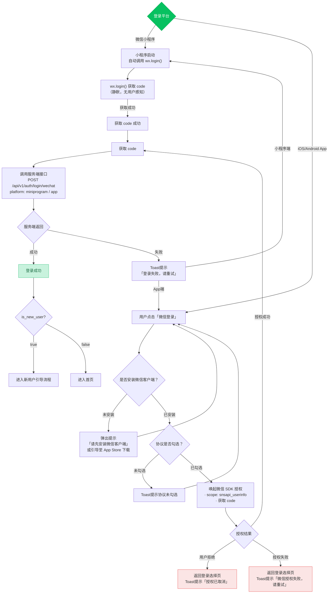

### 5.4 第三方登录后绑定手机号流程

第三方登录成功后，系统提示用户绑定手机号（可选步骤）。绑定手机号可实现跨平台账号打通和找回账号功能。

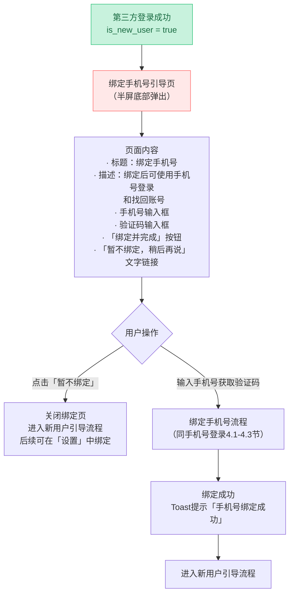

### 5.5 第三方登录异常处理汇总

| 异常场景 | 平台 | 处理方式 |
|---------|------|---------|
| 用户取消授权 | 全部 | 返回登录选择页，无错误提示（用户主动行为） |
| 授权失败 | Apple | Alert 弹窗，提供重试和取消选项 |
| 授权失败 | Google | Alert 弹窗，提供重试和取消选项 |
| 授权失败 | 微信 | Toast 提示「微信授权失败，请重试」 |
| 网络异常 | 全部 | Toast 提示「网络连接失败，请检查网络」 |
| 服务端返回错误 | 全部 | Toast 提示具体错误信息 |
| 微信未安装 | App | 提示安装微信，或引导至应用商店 |
| Google 服务不可用 | Android | 降级为 Web OAuth 2.0 授权 |
| Apple ID 不可用 | 非 iOS | 按钮隐藏，不显示 |
| Token 验证失败 | 全部 | 返回登录选择页，清除本地 Token |

---

## 六、Email 登录流程

Email 登录不自动注册，仅限已有账号且绑定了邮箱和密码的用户使用。

### 6.1 流程图

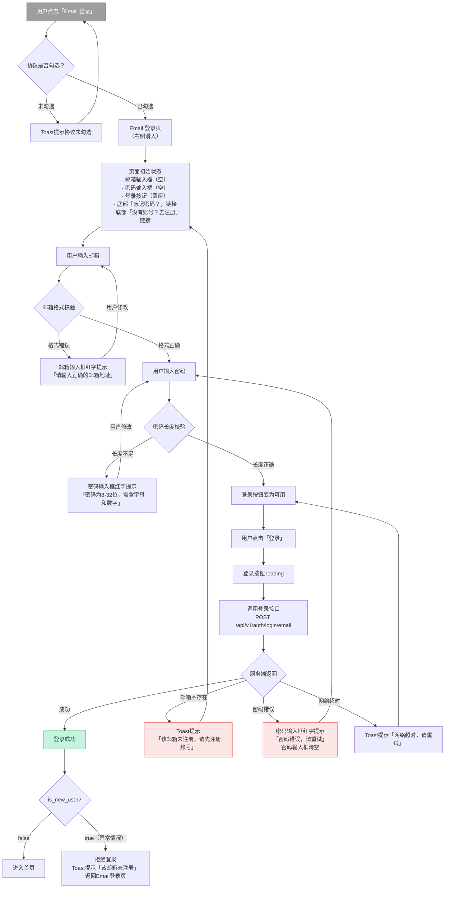

### 6.2 Email 登录特殊说明

| 说明项 | 内容 |
|--------|------|
| 不自动注册 | Email 登录仅用于已有账号的登录，不能通过 Email 直接注册新账号 |
| 注册路径 | 用户需先通过手机号/第三方登录创建账号，再在「设置」中绑定邮箱和密码 |
| 忘记密码 | 点击「忘记密码？」发送重置密码邮件到绑定邮箱 |
| 密码规则 | 长度 8-32 位，需包含字母和数字，服务端 bcrypt 加密存储 |
| 登录失败次数限制 | 同一账号连续 5 次密码错误，锁定 15 分钟 |

---

## 七、新用户注册后引导流程

### 7.1 完整引导流程图

```mermaid
flowchart TB
    START["登录成功<br/>is_new_user = true"] --> STEP1["步骤一：选择兴趣标签"]

    STEP1 --> STEP1_PAGE["兴趣标签选择页<br/>· 标题：选择你的旅行偏好<br/>· 副标题：我们将为你推荐相关内容<br/>· 标签网格：4列，多选<br/>· 标签列表：<br/>  美食、古镇、户外、拍照、<br/>  博物馆、自然风光、城市漫步、<br/>  自驾、骑行、徒步、露营、<br/>  亲子、情侣、独旅、<br/>  购物、演出、美食探店<br/>· 底部：「下一步」按钮<br/>  （至少选1个后可用）<br/>· 右上角：「跳过」文字链接"]

    STEP1_PAGE --> TAG_ACTION{"用户操作"}
    TAG_ACTION -->|点击「跳过」| SKIP1["跳过标签选择<br/>偏好标签为空<br/>首页推荐内容为通用推荐"]
    TAG_ACTION -->|选择标签后点击「下一步」| TAG_SAVE["保存标签偏好<br/>调用 PUT /api/v1/user/profile<br/>更新 prefer_tags"]

    SKIP1 --> STEP2
    TAG_SAVE --> STEP2["步骤二：选择城市"]

    STEP2 --> STEP2_PAGE["城市选择页<br/>· 标题：选择常驻城市<br/>· 搜索框：支持搜索城市<br/>· 热门城市：横向滚动卡片<br/>  （北京、上海、广州、深圳、<br/>   杭州、成都、重庆、武汉、<br/>   西安、南京、长沙、厦门）<br/>· 定位当前城市（需授权）<br/>· 底部：「下一步」按钮<br/>· 右上角：「跳过」文字链接"]

    STEP2_PAGE --> CITY_ACTION{"用户操作"}
    CITY_ACTION -->|点击「跳过」| SKIP2["跳过城市选择<br/>首页附近Tab默认展示全国热门"]
    CITY_ACTION -->|选择城市后点击「下一步」| CITY_SAVE["保存城市偏好<br/>首页附近Tab默认定位到所选城市"]

    SKIP2 --> STEP3
    CITY_SAVE --> STEP3["步骤三：生日/年龄收集"]

    STEP3 --> STEP3_PAGE["生日/年龄收集页<br/>· 标题：你的生日<br/>· 副标题：用于个性化推荐和未成年人保护<br/>· 日期选择器（滚轮式）<br/>· 底部：「下一步」按钮<br/>· 右上角：「跳过」文字链接"]

    STEP3_PAGE --> AGE_ACTION{"用户操作"}
    AGE_ACTION -->|点击「跳过」| SKIP3["跳过年龄收集<br/>年龄标记为未知<br/>不触发未成年人保护逻辑"]
    AGE_ACTION -->|选择生日后点击「下一步」| AGE_SAVE["保存生日/年龄<br/>调用 PUT /api/v1/user/profile<br/>更新 birthday<br/>如未成年则标记未成年人状态"]

    SKIP3 --> STEP4
    AGE_SAVE --> STEP4["步骤四：关注推荐用户"]

    STEP4 --> STEP4_PAGE["推荐关注页<br/>· 标题：关注旅行达人<br/>· 副标题：发现更多旅行灵感<br/>· 推荐用户列表：<br/>  · 头像 + 昵称 + 简介<br/>  · 「+关注」按钮（主色）<br/>  · 展示 10-20 位推荐用户<br/>· 推荐逻辑：<br/>  · 官方认证创作者<br/>  · 高信用分用户<br/>  · 与用户偏好标签匹配<br/>· 底部：「进入寻旅记」主按钮<br/>  （可跳过关注直接进入）<br/>· 右上角：「跳过」文字链接"]

    STEP4_PAGE --> FOLLOW_ACTION{"用户操作"}
    FOLLOW_ACTION -->|点击「跳过」| SKIP4["跳过关注<br/>关注列表为空<br/>首页关注Tab为空状态"]
    FOLLOW_ACTION -->|关注部分用户| PARTIAL_FOLLOW["已关注的用户显示「已关注」<br/>关注Tab展示已关注用户内容"]
    FOLLOW_ACTION -->|点击「进入寻旅记」| ENTER_APP["进入主界面"]

    SKIP4 --> ENTER_APP
    PARTIAL_FOLLOW --> ENTER_APP

    ENTER_APP --> MAIN["首页推荐Tab<br/>· 根据用户偏好标签推荐内容<br/>· 如未选择标签，展示通用热门内容<br/>· 底部导航栏完整显示"]

    style START fill:#C8F2DD,stroke:#31C27C,color:#1A6B42
    style STEP1_PAGE fill:#E8F4FD,stroke:#4EC3F7
    style STEP2_PAGE fill:#E3F9ED,stroke:#31C27C
    style STEP3_PAGE fill:#FFE8E8,stroke:#FF6B6B
    style MAIN fill:#C8F2DD,stroke:#31C27C,color:#1A6B42
```

### 7.2 各步骤页面状态详述

#### 步骤一：兴趣标签选择页

| 状态 | 页面表现 |
|------|---------|
| 初始态 | 所有标签未选中，标签为灰色边框 + 浅灰背景，「下一步」按钮置灰 |
| 选中标签 | 已选标签变为主色边框 + 浅主色背景 + 主色文字，右上角出现勾选标记 |
| 取消选中 | 点击已选标签取消选中，恢复初始样式 |
| 可点击下一步 | 至少选中 1 个标签后，「下一步」按钮变为可用（主色填充） |
| 点击跳过 | 弹出确认弹窗：「跳过此步骤将无法获得个性化推荐，确定跳过吗？」→「确定」/「取消」 |
| 标签数量上限 | 最多选择 5 个标签，超出时 Toast 提示「最多选择 5 个标签」 |

#### 步骤二：城市选择页

| 状态 | 页面表现 |
|------|---------|
| 初始态 | 热门城市卡片横向滚动，当前定位城市高亮显示（如已授权定位），「下一步」按钮置灰 |
| 搜索城市 | 输入关键词，实时过滤城市列表，支持拼音搜索 |
| 选中城市 | 选中城市卡片高亮，主色边框，「下一步」按钮变为可用 |
| 点击跳过 | 弹出确认弹窗：「跳过此步骤将无法获得本地化推荐，确定跳过吗？」→「确定」/「取消」 |
| 定位权限未授权 | 不显示定位城市，仅展示热门城市列表，不弹权限请求弹窗（避免打扰） |

#### 步骤三：生日/年龄收集页

| 状态 | 页面表现 |
|------|---------|
| 初始态 | 日期选择器默认显示 2000-01-01，「下一步」按钮置灰 |
| 选择生日 | 滚轮式日期选择器，年/月/日三列滚动选择 |
| 点击跳过 | 弹出确认弹窗：「跳过后将无法获得个性化推荐和未成年人保护，确定跳过吗？」→「确定」/「取消」 |
| 未成年人标记 | 如选择生日后计算年龄 < 18 岁，标记为未成年人，后续触发未成年人保护逻辑（限制发布时长、内容过滤等） |

#### 步骤四：推荐关注页

| 状态 | 页面表现 |
|------|---------|
| 初始态 | 推荐用户列表加载中，展示骨架屏 |
| 加载完成 | 展示 10-20 位推荐用户，头像 + 昵称 + 简介 + 关注按钮 |
| 点击关注 | 按钮变为「已关注」状态（浅灰背景 + 灰色文字），动画过渡 |
| 取消关注 | 再次点击「已关注」按钮，恢复为「+关注」 |
| 全部关注 | 按钮变为「已关注」（可取消） |
| 点击「进入寻旅记」 | 直接进入首页，已关注用户生效 |
| 点击跳过 | 不关注任何人，直接进入首页 |

### 7.3 新用户引导流程特殊规则

| 规则 | 说明 |
|------|------|
| 不可返回 | 新用户引导流程中的四个步骤不可返回上一页（防止用户困惑） |
| 全部跳过 | 三步骤均可跳过，用户随时可进入首页 |
| 后续补填 | 用户可在「我的」→「编辑资料」中补充兴趣标签和城市 |
| 再次展示 | 引导流程仅展示一次，不会重复出现 |
| 中断恢复 | 如用户在引导流程中关闭 App，重新打开后检查 is_onboarded 字段，未完成则继续引导流程（从中断步骤恢复） |

---

## 八、已登录用户再次打开

### 8.1 自动登录流程

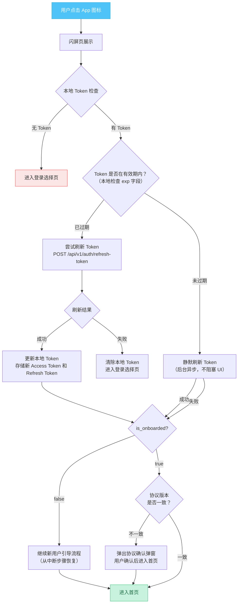

### 8.2 登录状态持久化策略

| 存储项 | 存储位置 | 加密 | 说明 |
|--------|---------|------|------|
| Access Token | iOS Keychain / Android KeyStore | 系统级加密 | 有效期 2 小时 |
| Refresh Token | iOS Keychain / Android KeyStore | 系统级加密 | 有效期 30 天 |
| 用户基本信息 | 本地 SQLite / UserDefaults | 明文 | id, nickname, avatar, phone（脱敏） |
| 用户偏好标签 | 本地 SQLite | 明文 | 用于离线展示和快速启动 |

### 8.3 多设备登录策略

| 场景 | 策略 |
|------|------|
| 同一设备 | 后登录的 Token 覆盖前一个 Token，前一个 Token 失效 |
| 不同设备 | 允许多设备同时登录，各自持有独立 Token |
| 小程序与 App | 使用微信 unionid 打通账号，各自独立 Token |
| 修改密码后 | 所有设备的 Token 全部失效，需重新登录 |
| 账号注销后 | 所有设备的 Token 全部失效 |

---

## 九、账号注销流程

### 9.1 注销流程图

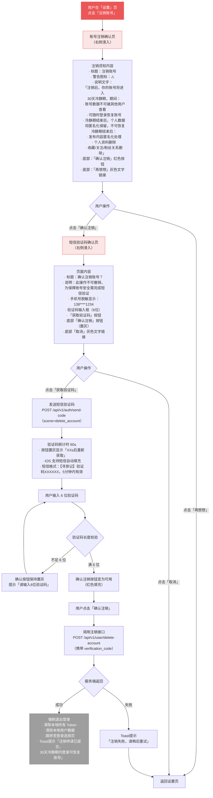

### 9.2 注销后数据保留策略

| 时间节点 | 账号状态 | 数据处理 |
|---------|---------|---------|
| 提交注销申请 | 账号标记为「待注销」 | 用户可正常登录，登录后自动恢复账号 |
| 注销后 0-30 天 | 账号处于「注销冷静期」 | 数据保留，不可被其他用户查看，允许登录恢复 |
| 注销后第 30 天 | 冷静期结束 | 个人数据匿名化保留，发布内容匿名化处理（显示为「已注销用户」），不可恢复 |
| 保护期内登录 | 账号自动恢复 | 数据完整恢复，Token 重新签发 |

### 9.3 注销后内容处理

| 内容类型 | 处理方式 |
|---------|---------|
| 发布的打卡记录 | 匿名化（显示为「已注销用户」），内容保留 |
| 创建的路线 | 匿名化，路线保留（如被他人使用） |
| 评论 | 匿名化，评论内容保留 |
| 收藏 | 删除 |
| 关注/粉丝关系 | 删除 |
| 行程数据 | 删除 |
| 个人资料 | 删除 |
| 消息记录 | 删除 |

---

## 十、Token 刷新机制

### 10.1 Token 体系设计

| Token 类型 | 有效期 | 存储位置 | 用途 |
|-----------|--------|---------|------|
| Access Token（JWT） | 2 小时 | Keychain / KeyStore | 接口鉴权，携带在请求头 `Authorization: Bearer {token}` |
| Refresh Token | 30 天 | Keychain / KeyStore | 刷新 Access Token，不参与接口鉴权 |

### 10.2 Token 刷新序列图

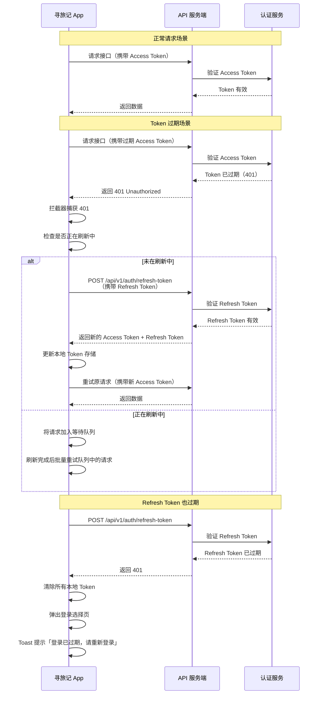

### 10.3 Token 刷新实现策略

#### 客户端实现

```
拦截器（Interceptor）流程：
1. 发起 API 请求
2. 检查响应状态码
3. 如果 statusCode == 401：
   a. 检查是否有正在进行的刷新请求（isRefreshing 标志）
   b. 如果无：发起刷新请求，设置 isRefreshing = true
   c. 如果有：将当前请求加入 pendingRequests 队列
4. 刷新成功后：
   a. 更新本地存储的 Access Token 和 Refresh Token
   b. 遍历 pendingRequests 队列，用新 Token 重试所有请求
   c. 设置 isRefreshing = false，清空队列
5. 刷新失败：
   a. 清除所有本地 Token 和用户数据
   b. 弹出登录选择页
   c. 拒绝 pendingRequests 队列中所有请求
   d. 设置 isRefreshing = false，清空队列
```

#### 并发刷新保护

```javascript
// 伪代码
let isRefreshing = false;
let pendingRequests = [];

async function handleTokenRefresh(failedRequest) {
    if (isRefreshing) {
        // 已有刷新请求在进行中，将当前请求加入等待队列
        return new Promise((resolve, reject) => {
            pendingRequests.push({ resolve, reject, request: failedRequest });
        });
    }

    isRefreshing = true;

    try {
        const newTokens = await refreshToken(); // 调用刷新接口
        updateLocalTokens(newTokens);

        // 重试等待队列中的所有请求
        for (const pending of pendingRequests) {
            pending.resolve(retry(pending.request, newTokens.accessToken));
        }

        return retry(failedRequest, newTokens.accessToken);
    } catch (error) {
        // 刷新失败，清除所有状态
        for (const pending of pendingRequests) {
            pending.reject(error);
        }
        clearLocalTokens();
        navigateToLogin();
        throw error;
    } finally {
        isRefreshing = false;
        pendingRequests = [];
    }
}
```

### 10.3.1 Token 并发刷新 — 原生实现指引

**iOS 实现要点（Swift）**：

```swift
// Token 刷新管理器 — 使用 NSLock 保证线程安全
actor TokenRefreshManager {
    private var isRefreshing = false
    private var pendingContinuations: [CheckedContinuation<(String, String), Error>] = []
    
    func refreshTokenIfNeeded() async throws -> (String, String) {
        if !isRefreshing {
            isRefreshing = true
            defer { isRefreshing = false }
            
            do {
                let tokens = try await performRefresh()
                // 唤醒所有等待的 continuation
                for continuation in pendingContinuations {
                    continuation.resume(returning: tokens)
                }
                pendingContinuations.removeAll()
                return tokens
            } catch {
                for continuation in pendingContinuations {
                    continuation.resume(throwing: error)
                }
                pendingContinuations.removeAll()
                throw error
            }
        } else {
            // 已有刷新进行中，挂起等待
            return try await withCheckedThrowingContinuation { continuation in
                pendingContinuations.append(continuation)
            }
        }
    }
}
```

**Android 实现要点（Kotlin）**：

```kotlin
// Token 刷新管理器 — 使用 Mutex 保证协程安全
class TokenRefreshManager {
    private val mutex = Mutex()
    private var pendingDeferreds = mutableListOf<CompletableDeferred<Pair<String, String>>>()
    
    suspend fun refreshTokenIfNeeded(): Pair<String, String> {
        return mutex.withLock {
            if (pendingDeferreds.isEmpty()) {
                val deferred = CompletableDeferred<Pair<String, String>>()
                pendingDeferreds.add(deferred)
                try {
                    val tokens = performRefresh()
                    pendingDeferreds.forEach { it.complete(tokens) }
                    pendingDeferreds.clear()
                    tokens
                } catch (e: Exception) {
                    pendingDeferreds.forEach { it.completeExceptionally(e) }
                    pendingDeferreds.clear()
                    throw e
                }
            } else {
                val deferred = CompletableDeferred<Pair<String, String>>()
                pendingDeferreds.add(deferred)
                deferred.await()
            }
        }
    }
}
```

**关键设计原则**：
- 使用线程安全机制（iOS: `actor` / `NSLock`，Android: `Mutex`）防止并发刷新
- 多个并发请求触发 401 时，仅第一个请求发起刷新，其余请求挂起等待
- 刷新成功后，所有等待请求使用新 Token 重试
- 刷新失败时，所有等待请求统一失败处理，清除本地 Token 并跳转登录页

### 10.4 Token 刷新时间窗口

| 场景 | 触发时机 | 说明 |
|------|---------|------|
| 主动刷新 | Access Token 剩余有效期 < 10 分钟 | App 前台时主动刷新，减少用户感知 |
| 被动刷新 | API 返回 401 | 拦截器自动刷新后重试 |
| 静默刷新 | App 启动时 | 后台异步刷新，不阻塞 UI |
| 强制刷新 | 修改密码、注销登录等操作后 | 使旧 Token 立即失效 |

### 10.5 Token 安全机制

| 机制 | 说明 |
|------|------|
| JWT 签名 | 使用 HS256 算法，服务端密钥签名，防止篡改 |
| Token 绑定设备 | JWT payload 中包含设备指纹（device_id），防止 Token 被盗用 |
| Refresh Token 轮换 | 每次刷新 Token 时，同时下发新的 Refresh Token，旧的 Refresh Token 立即失效 |
| Token 黑名单 | 服务端维护 Token 黑名单，注销、修改密码等操作后加入黑名单 |
| 敏感操作二次验证 | 修改密码、注销账号、绑定手机号等操作需要二次验证（验证码或密码） |

---

## 十一、全局异常处理规范

### 11.1 网络异常处理

| 异常场景 | 检测方式 | 用户提示 | 恢复方式 |
|---------|---------|---------|---------|
| 无网络连接 | 请求前检查网络状态 | Toast：「网络连接失败，请检查网络」 | 用户恢复网络后自动重试 |
| 请求超时 | 超时时间 15 秒 | Toast：「网络超时，请重试」 | 保留输入内容，用户手动重试 |
| 服务器 500 错误 | HTTP 状态码 500 | Toast：「服务繁忙，请稍后重试」 | 保留输入内容，用户手动重试 |
| DNS 解析失败 | 请求异常 | Toast：「网络连接失败，请检查网络」 | 用户手动重试 |
| SSL 证书错误 | 请求异常 | Toast：「网络安全错误，请重试」 | 用户手动重试 |

### 11.2 登录相关错误码处理

| 错误码 | 含义 | 用户提示 | 页面行为 |
|--------|------|---------|---------|
| 1003 | 参数格式不正确（手机号格式错误） | 「请输入正确的手机号」 | 输入框红框 + 红字提示 |
| 2006 | 验证码错误 | 「验证码错误，请重新输入」 | 清空验证码输入框 |
| 2007 | 验证码已过期 | 「验证码已过期，请重新获取」 | 清空验证码输入框，按钮恢复为「获取验证码」 |
| 2008 | 验证码发送过于频繁 | 「发送过于频繁，请稍后再试」 | 按钮保持倒计时状态 |
| 2010 | 手机号未注册 | 「该账号未注册」 | 引导至注册流程 |
| 2005 | 账号已被封禁 | 「账号已被禁用，请联系客服」 | 无法登录，显示客服入口 |
| 2011 | 密码错误 | 「密码错误，请重试」 | 清空密码输入框 |
| 2012 | 第三方登录授权失败 | 「授权失败，请重试」 | 返回登录选择页 |
| 401 | Token 无效或过期 | 静默刷新 / 「登录已过期，请重新登录」 | 进入登录选择页 |

### 11.3 用户操作限制

| 操作 | 限制规则 | 超出限制提示 |
|------|---------|-------------|
| 发送验证码 | 同一手机号 60 秒内 1 次，每日 10 次 | 按钮置灰 + 倒计时 / Toast 提示 |
| 密码错误 | 连续 5 次锁定 15 分钟 | 「密码错误次数过多，请15分钟后再试」 |
| 登录失败 | 同一设备 1 小时内 20 次 | 「登录尝试过于频繁，请稍后再试」 |

---

## 十二、用户协议与隐私政策

### 12.1 协议勾选机制

| 触发场景 | 行为 |
|---------|------|
| 首次进入登录选择页 | 协议勾选框默认未勾选 |
| 点击任意登录方式 | 检查协议勾选状态，未勾选则弹出 Toast 提示 |
| 勾选后成功登录 | 记录用户同意协议的时间戳和版本号 |
| 协议更新后 | 用户下次登录时需重新勾选新版协议 |
| 游客模式 | 点击"跳过"即视为同意《用户协议》和《隐私政策》，协议链接在"跳过"按钮附近展示，用户可随时查阅 |

### 12.2 协议页面设计

| 元素 | 设计规格 |
|------|---------|
| 协议链接文字 | 蓝色可点击文字 + 下划线 |
| 用户协议 | 点击跳转至 WebView 页面，展示完整《用户协议》 |
| 隐私政策 | 点击跳转至 WebView 页面，展示完整《隐私政策》 |
| 勾选框 | iOS 风格 Toggle 或方形 Checkbox，需有明确的选中/未选中视觉反馈 |
| 协议文字 | 「登录即表示您已阅读并同意《用户协议》和《隐私政策》」，14pt，灰色 |

### 12.3 协议存储与版本管理

| 存储项 | 说明 |
|--------|------|
| 用户同意协议版本号 | 记录在用户表中，用于判断是否需要重新确认 |
| 同意时间戳 | 记录用户首次同意协议的时间 |
| 协议历史版本 | 服务端存储所有协议版本，用于合规审计 |
| 协议变更通知 | 重大变更需通过 App 内弹窗或推送通知告知用户 |

---

## 附录：相关接口索引

| 序号 | 接口名称 | 方法 | 路径 | 认证 | 说明 |
|------|---------|------|------|------|------|
| 1 | 发送验证码 | POST | /api/v1/auth/send-code | 无 | 向手机号发送短信验证码 |
| 2 | 手机号验证码登录 | POST | /api/v1/auth/login/phone | 无 | 手机号 + 验证码登录，新用户自动注册 |
| 3 | Apple ID 登录 | POST | /api/v1/auth/login/apple | 无 | Apple ID 授权登录 |
| 4 | Google 登录 | POST | /api/v1/auth/login/google | 无 | Google 账号授权登录 |
| 5 | Email 登录 | POST | /api/v1/auth/login/email | 无 | 邮箱 + 密码登录 |
| 6 | 微信登录 | POST | /api/v1/auth/login/wechat | 无 | 微信授权登录 |
| 7 | 刷新 Token | POST | /api/v1/auth/refresh-token | @auth | 刷新 Access Token |
| 8 | 获取用户信息 | GET | /api/v1/user/profile | @auth | 获取当前用户完整信息 |
| 9 | 更新用户资料 | PUT | /api/v1/user/profile | @auth | 更新昵称、头像、偏好标签等 |
| 10 | 绑定手机号 | POST | /api/v1/user/bind-phone | @auth | 第三方登录用户绑定手机号 |
| 11 | 绑定邮箱 | POST | /api/v1/user/bind-email | @auth | 绑定邮箱并设置密码 |
| 12 | 账号注销 | POST | /api/v1/user/delete-account | @auth | 注销账号（30天保护期） |
