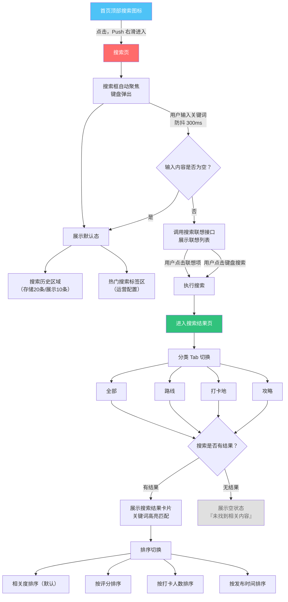
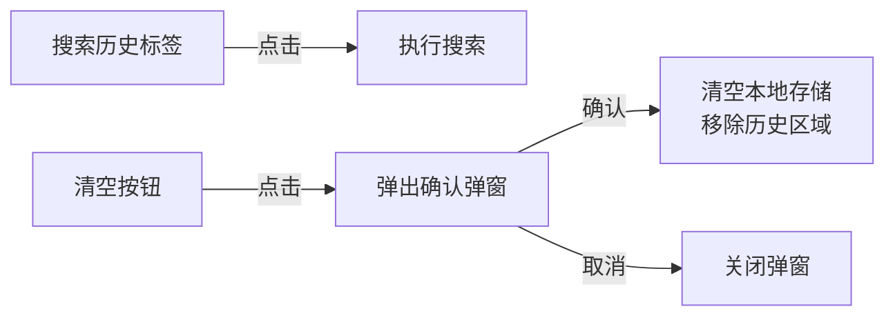
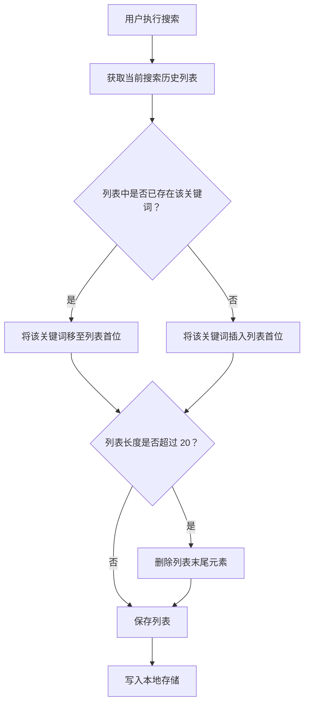
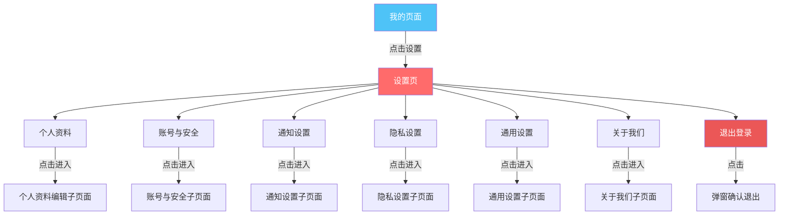
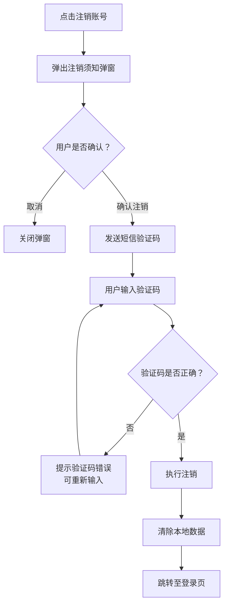
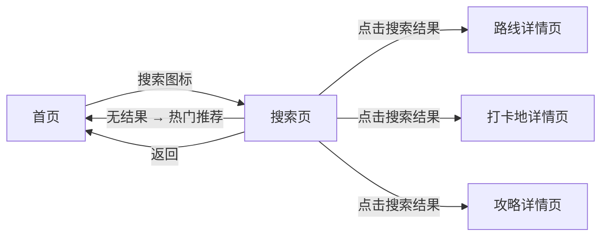
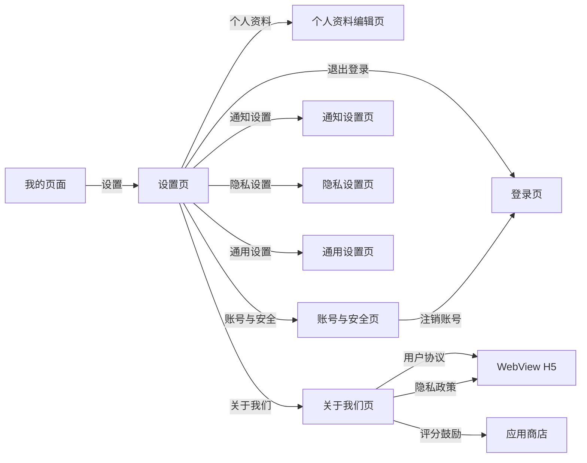

# 寻旅记 -- 搜索页与设置页设计文档

> 版本：v2.1.7  
> 更新日期：2026年6月  
> 关联文档：02_产品需求文档_PRD.md / 07_页面流转图.md

---

## 一、搜索页设计

### 1.1 页面概述

搜索页是用户发现路线、打卡地、攻略的核心入口。

| 属性 | 说明 |
|------|------|
| 入口 | 首页顶部导航栏右侧 **搜索图标**（放大镜） |
| 转场动画 | 从右侧滑入（Push，`SlideInRight`），返回时从左侧滑出 |
| 键盘行为 | 进入页面后搜索框**自动聚焦**，键盘自动弹出 |
| 页面层级 | 独立一级页面，`/search` 路由 |

---

### 1.2 搜索流程图



---

### 1.3 页面结构详设

#### 1.3.1 默认态（搜索前）

页面进入后展示两个区域：

**A. 搜索历史区域**

| 属性 | 说明 |
|------|------|
| 标题 | "搜索历史" |
| 右侧操作 | "清空"按钮（垃圾桶图标），点击弹出确认弹窗 |
| 最大条数 | 本地存储最多 20 条（按 FIFO 淘汰），搜索页展示最近 10 条 |
| 排列方式 | 横向流式布局，每条历史记录为一个圆角标签 |
| 点击行为 | 点击标签 → 直接以该关键词执行搜索 |
| 存储方式 | 本地存储（`AsyncStorage`），按用户维度保存 |
| 空状态 | 若用户无搜索历史，则隐藏该区域 |

**B. 热门搜索标签区**

| 属性 | 说明 |
|------|------|
| 标题 | "热门搜索" |
| 数据来源 | 运营后台配置，支持置顶和排序 |
| 最大展示数 | 10 个标签 |
| 标签样式 | 热门前三用主题色标签 + 火焰图标，其余用浅灰底色 |
| 刷新频率 | 每日/每周更新，由运营配置刷新周期 |
| 点击行为 | 点击标签 → 直接以该关键词执行搜索 |

**搜索历史交互流程：**



---

#### 1.3.2 搜索联想（输入中）

| 属性 | 说明 |
|------|------|
| 触发条件 | 搜索框内容变化，且非空 |
| 防抖策略 | **300ms 防抖**，避免频繁请求 |
| 联想列表 | 下拉浮层，覆盖在搜索历史/热门搜索上方 |
| 最大展示数 | 10 条联想结果 |
| 高亮规则 | 联想词中匹配的关键字部分以**主题色加粗**显示 |
| 联想来源 | 路线标题、打卡地名称、攻略标题 |
| 点击行为 | 点击联想项 → 执行搜索，同时将该词加入搜索历史 |
| 取消联想 | 点击搜索框右侧清除按钮或清空输入框 → 回到默认态 |

---

#### 1.3.3 搜索结果页

**A. 分类 Tab 栏**

| Tab | 搜索范围 | 展示形式 |
|-----|---------|---------|
| 全部 | 混合展示所有类型 | 混合卡片流，按类型分组并标注类型标签 |
| 路线 | 路线标题 + 路线标签 | 路线卡片（与首页路线卡片一致） |
| 打卡地 | 打卡地名称 + 分类 | 打卡地卡片（与首页打卡地卡片一致） |
| 攻略 | 攻略标题 + 分类 | 攻略卡片（与首页攻略卡片一致） |

**B. 搜索结果卡片**

- 卡片样式与首页保持一致，确保视觉统一性
- **关键词高亮**：匹配的搜索关键词以**主题色（#4EC3F7）加粗**显示在标题、标签等文本中
- 每条结果标注所属类型（路线/打卡地/攻略）
- 支持下拉刷新和上拉加载更多（分页加载，每页 20 条）

**C. 排序切换**

| 排序方式 | 适用 Tab | 说明 |
|---------|---------|------|
| 相关度排序（默认） | 全部 Tab | 基于全文搜索匹配度 + 热度权重 |
| 按评分排序 | 路线、打卡地 | 评分从高到低 |
| 按打卡人数排序 | 路线、打卡地 | 打卡人数从多到少 |
| 按发布时间排序 | 攻略 | 发布时间从新到旧 |

排序栏位于搜索框下方、分类 Tab 上方，为横向滚动选择器样式。

**D. 搜索范围详细说明**

| 搜索对象 | 搜索字段 | 权重说明 |
|---------|---------|---------|
| 路线 | 标题（主）+ 标签（辅） | 标题完全匹配权重最高 |
| 打卡地 | 名称（主）+ 分类（辅） | 名称完全匹配权重最高 |
| 攻略 | 标题（主）+ 分类（辅） | 标题完全匹配权重最高 |

**E. 无搜索结果（空状态）**

```
┌──────────────────────────────┐
│                              │
│         [搜索图标/插图]       │
│                              │
│      未找到相关内容           │
│      试试其他关键词           │
│                              │
└──────────────────────────────┘
```

- 展示搜索插图（空状态专用插图）
- 主文案："未找到相关内容"
- 副文案："试试其他关键词"
- 操作按钮：无（与原型一致，用户直接在搜索框修改关键词即可）

---

### 1.4 搜索交互细节

| 场景 | 交互行为 |
|------|---------|
| 搜索框获得焦点 | 键盘弹出，搜索框边框变为主题色，光标闪烁 |
| 搜索框输入中 | 实时展示联想列表（防抖 300ms），搜索框右侧出现清除按钮（X） |
| 点击清除按钮 | 清空搜索框内容，收起联想列表，展示默认态 |
| 点击联想项 | 执行搜索，联词加入搜索历史，键盘收起 |
| 键盘搜索键 | 执行搜索，当前关键词加入搜索历史，键盘收起 |
| 点击搜索历史标签 | 执行搜索，不重复加入历史 |
| 点击热门搜索标签 | 执行搜索，该词加入搜索历史 |
| 切换分类 Tab | 在当前搜索词下切换结果类型，不重新请求 |
| 切换排序方式 | 重新请求搜索结果，按新排序规则展示 |
| 点击结果卡片 | 跳转至对应详情页（路线详情/打卡地详情/攻略详情） |
| 返回上一页 | 键盘收起，页面从左侧滑出，回到上一页 |
| 清空搜索历史 | 弹窗确认后清空 |

---

### 1.5 搜索历史管理逻辑



---

## 二、设置页设计

### 2.1 页面概述

| 属性 | 说明 |
|------|------|
| 入口 | 我的页面 → 顶部"设置"入口（齿轮图标） |
| 转场动画 | 从右侧滑入（Push，`SlideInRight`），返回时从左侧滑出 |
| 页面层级 | 二级页面，`/settings` 路由 |
| 页面结构 | 分组列表，每组之间有分隔间距 |

---

### 2.2 设置项总览



---

### 2.3 详细设置项

#### 2.3.1 个人资料

| 设置项 | 交互方式 | 右侧样式 | 说明 |
|--------|---------|---------|------|
| 头像 | 点击 → 弹出 ActionSheet（拍照/从相册选择/查看大图） | 圆形头像缩略图 + 箭头 | 支持裁剪，最大 2MB |
| 昵称 | 点击 → 进入昵称编辑页面 | 当前昵称文字 + 箭头 | 2-20 个字符，支持 emoji |
| 性别 | 点击 → 弹出选择器（男/女/保密） | 当前性别文字 + 箭头 | 单选，默认"保密" |
| 简介 | 点击 → 进入简介编辑页面 | 当前简介截断文字 + 箭头 | 最多 200 字，支持换行 |
| 城市 | 点击 → 进入城市选择页面 | 当前城市文字 + 箭头 | 省市二级联动选择 |

**交互说明**：整个"个人资料"为一个分组，点击分组标题行进入子页面。子页面顶部为头像+背景图区域，下方为各字段编辑入口。

---

#### 2.3.2 账号与安全

| 设置项 | 交互方式 | 右侧样式 | 说明 |
|--------|---------|---------|------|
| 手机号绑定/换绑 | 点击 → 进入手机号绑定流程 | 已绑定手机号（脱敏显示）+ 箭头 | 需要短信验证码验证 |
| 微信绑定 | 点击 → 唤起微信授权 | "已绑定"/"未绑定" + 箭头 | OAuth 2.0 授权 |
| Apple ID / Google 绑定 | 点击 → 唤起对应平台授权 | "已绑定"/"未绑定" + 箭头 | 根据平台显示对应选项 |
| 修改密码 | 点击 → 进入修改密码页面 | 箭头 | 需要验证旧密码 |
| 注销账号 | 点击 → 弹出二次确认弹窗 → 输入验证码 → 确认注销 | 箭头（红色文字） | 不可逆操作，需阅读注销须知 |

> **P0 端策略说明**：P0 小程序阶段仅展示「手机号绑定/换绑」「微信绑定」「修改密码」「注销账号」；「Apple ID / Google 绑定」为 P1 原生 App 阶段接入项，P0 小程序阶段不展示。

**注销账号确认流程**：



---

#### 2.3.3 通知设置

| 设置项 | 交互方式 | 右侧样式 | 说明 |
|--------|---------|---------|------|
| 推送通知总开关 | 开关切换 | Switch 开关 | 关闭后所有推送均不发送 |
| 互动通知 | 开关切换 | Switch 开关 | 点赞、评论、关注、收藏 |
| 系统通知 | 开关切换 | Switch 开关 | 系统更新、活动通知、运营消息 |
| 运营推送 | 开关切换 | Switch 开关 | 促销活动、运营推广消息（可独立关闭） |
| 行程提醒 | 开关切换 | Switch 开关 | 行程开始提醒、签到提醒（P0，不可关闭） |
| 免打扰时段 | 点击 → 进入免打扰时段设置 | 当前时段文字 + 箭头 | 支持设置开始/结束时间 |
| 声音 | 开关切换 | Switch 开关 | 推送声音开关，关闭后静音推送 |
| 震动 | 开关切换 | Switch 开关 | 推送震动开关，关闭后无震动反馈 |
| 每日推送上限 | 点击 -> 进入上限设置 | 当前上限数字 + 箭头 | 每日推送条数上限（默认 10 条，可配置 5-20），防止打扰 |

**说明**：
- 推送通知总开关关闭时，下方所有设置项置灰且不可操作
- 免打扰时段默认开启，默认时段为 22:00 - 08:00，用户可自定义起止时间
- 行程提醒为 P0 优先级，免打扰期间强制推送，不可关闭
- 每日推送上限达到后，P0 消息不计入日上限，非 P0 消息合并为次日批量推送

---

#### 2.3.4 隐私设置

| 设置项 | 字段 | 交互方式 | 右侧样式 | 说明 |
|--------|------|---------|---------|------|
| 谁可以看我的足迹 | — | 点击 → 进入选择页面 | 当前选项文字 + 箭头 | 公开 / 仅好友 / 仅自己（实时足迹可见性） |
| 谁可以关注我 | follow_scope | 点击 → 进入选择页面 | 当前选项文字 + 箭头 | 所有人 / 需验证 / 不允许 |
| 谁可以给我发私信 | allow_dm_scope | 点击 → 进入选择页面 | 当前选项文字 + 箭头 | 所有人 / 关注我的人 / 不允许 |
| 收藏可见性 | show_favorites | 点击 → 进入选择页面 | 当前选项文字 + 箭头 | 公开 / 仅好友 / 仅自己 |
| 关注/粉丝列表可见性 | show_following | 点击 → 进入选择页面 | 当前选项文字 + 箭头 | 公开 / 仅好友 / 仅自己 |
| 个人主页可见性 | profile_visibility | 点击 → 进入选择页面 | 当前选项文字 + 箭头 | 公开 / 仅好友 / 仅自己 |
| 发布内容公开 | content_public | 开关切换 | Switch 开关 | 开启后发布的攻略/打卡内容对外公开，关闭则仅自己可见 |
| 位置信息公开 | location_public | 开关切换 | Switch 开关 | 开启后行程/打卡中的位置信息对外可见，关闭则隐藏精确位置 |
| 历史行程公开 | history_public | 开关切换 | Switch 开关 | 开启后历史行程对外可见，关闭则仅自己可见 |
| 个性化推荐 | personalized_recomm | 开关切换 | Switch 开关 | 开启后首页推荐流基于行为数据个性化推荐，关闭后仅按热度/时间排序 |
| 黑名单管理 | — | 点击 → 进入黑名单列表页 | 箭头 | 展示已拉黑用户列表，支持移除 |

**字段说明**：
- `follow_scope`：关注权限范围，支撑"谁可以关注我"选项（所有人 / 需验证 / 不允许）。
- `allow_dm_scope`：私信权限范围，"关注我的人"对应 `followers`（即允许我的粉丝给我发私信），与"我关注的人"语义区分。
- `show_favorites` / `show_following` / `profile_visibility`：三档可见性（公开 / 仅好友 / 仅自己），分别控制收藏列表、关注与粉丝列表、个人主页的对外可见范围。
- `content_public` / `location_public` / `history_public`：三个公开开关，控制发布内容、位置信息、历史行程是否对外公开。
- `personalized_recomm`：个性化推荐开关，关闭后首页推荐流不再基于用户行为推荐，仅按热度/时间排序。

**黑名单管理子页面**：
- 列表展示已拉黑用户的头像、昵称、拉黑时间
- 每个用户右侧有"移除"按钮
- 点击"移除" → 弹窗确认 → 从黑名单中移除
- 空状态："暂无黑名单用户"

---

#### 2.3.5 通用设置

| 设置项 | 交互方式 | 右侧样式 | 说明 |
|--------|---------|---------|------|
| 语言切换 | 点击 → 弹出选择器 | 当前语言文字 + 箭头 | 简体中文 / English / 繁體中文（后续版本） |
| 清除缓存 | 点击 → 弹出确认弹窗 | 当前缓存大小 + 箭头 | 清除图片缓存、临时文件、离线数据 |
| 深色模式 | 开关切换（置灰） | Switch 开关 + "P0暂不支持"标签 | 深色模式为P1/P2预留规范，P0阶段暂不支持，后续版本开放 |
| 字体大小 | 点击 → 进入字体大小调节页 | 当前字号文字 + 箭头 | 小/标准/大/特大，实时预览 |

**清除缓存确认弹窗**：

```
┌──────────────────────────────┐
│        清除缓存               │
│──────────────────────────────│
│                              │
│   将清除图片缓存、临时文件     │
│   和离线数据。               │
│   不会影响你的个人数据和       │
│   账号信息。                │
│                              │
│   当前缓存：128.5 MB         │
│                              │
│  ┌──────────┐ ┌──────────┐  │
│  │   取消    │ │ 确定清除  │  │
│  └──────────┘ └──────────┘  │
└──────────────────────────────┘
```

---

#### 2.3.6 关于我们

| 设置项 | 交互方式 | 右侧样式 | 说明 |
|--------|---------|---------|------|
| 版本号 | 文字显示 | 版本号（如 v2.1.7） | 无箭头，不可点击 |
| 功能介绍 | 点击 → 进入功能介绍页面 | 箭头 | 图文介绍主要功能 |
| 用户协议 | 点击 → 进入用户协议页面（WebView） | 箭头 | 加载 H5 页面 |
| 隐私政策 | 点击 → 进入隐私政策页面（WebView） | 箭头 | 加载 H5 页面 |
| 帮助与反馈 | 点击 → 进入帮助与反馈页面 | 箭头 | FAQ + 意见反馈入口 |

> **游客模式合规说明**：游客模式下点击"跳过"即视为同意《用户协议》和《隐私政策》，进入 App 后可在"关于我们"中随时查阅完整协议文本。
| 评分鼓励 | 点击 → 跳转应用商店评分页 | 箭头 | 引导用户前往 App Store / 应用商店评分 |

> **P0 端策略说明**：「评分鼓励」跳转应用商店评分为 P1 原生 App 阶段能力（App Store / 应用商店）；P0 小程序阶段无应用商店评分入口，改为引导用户在小程序内「分享给朋友」或前往小程序评价。游客模式合规说明中"进入 App"在 P0 小程序阶段指"进入小程序"。

**帮助与反馈子页面**：
- 顶部：常见问题（FAQ）列表，点击展开/收起
- 底部："意见反馈"按钮 → 进入反馈表单（问题描述 + 截图上传 + 联系方式）

---

#### 2.3.7 退出登录

| 设置项 | 交互方式 | 样式 | 说明 |
|--------|---------|------|------|
| 退出登录 | 点击 → 弹出确认弹窗 → 确认退出 | **红色文字**，居中，底部独立按钮 | 退出后清除本地登录态，跳转至登录页 |

**退出登录确认弹窗**：

```
┌──────────────────────────────┐
│                              │
│       确定要退出登录吗？       │
│                              │
│  ┌──────────┐ ┌──────────┐  │
│  │   取消    │ │ 确定退出  │  │
│  └──────────┘ └──────────┘  │
└──────────────────────────────┘
```

---

### 2.4 设置页布局结构

```
┌──────────────────────────────────────┐
│  ← 设置                               │  ← 导航栏
├──────────────────────────────────────┤
│                                      │
│  ┌──────────────────────────────────┐│
│  │ 个人资料                    >    ││  ← 分组一
│  └──────────────────────────────────┘│
│                                      │
│  ┌──────────────────────────────────┐│
│  │ 账号与安全                  >    ││
│  └──────────────────────────────────┘│  ← 分组二
│                                      │
│  ┌──────────────────────────────────┐│
│  │ 通知设置                    >    ││
│  └──────────────────────────────────┘│  ← 分组三
│                                      │
│  ┌──────────────────────────────────┐│
│  │ 隐私设置                    >    ││
│  └──────────────────────────────────┘│  ← 分组四
│                                      │
│  ┌──────────────────────────────────┐│
│  │ 通用设置                    >    ││
│  └──────────────────────────────────┘│  ← 分组五
│                                      │
│  ┌──────────────────────────────────┐│
│  │ 关于我们                    >    ││
│  └──────────────────────────────────┘│  ← 分组六
│                                      │
│                                      │
│          退出登录                      │  ← 红色文字，底部
│                                      │
└──────────────────────────────────────┘
```

**布局规则**：
- 每个分组之间间隔 12px 灰色背景分隔
- 每行高度 52px，左侧图标 + 文字，右侧交互控件
- 每个分组圆角卡片样式，左右边距 16px
- 退出登录按钮位于所有分组下方 40px 处，居中，红色文字，字号 16px
- 页面背景色：#F5F5F5，卡片背景色：#FFFFFF

---

### 2.5 交互方式图例

| 图例 | 交互方式 | 使用场景 |
|------|---------|---------|
| `>` | 点击进入子页面 | 个人资料、账号与安全、通知设置、隐私设置、通用设置、关于我们 |
| `Switch` | 开关切换 | 推送通知总开关、互动通知、系统通知、行程提醒、深色模式（置灰，P0暂不支持）、个性化推荐、发布内容公开、位置信息公开、历史行程公开 |
| `文字 + >` | 当前值显示 + 点击进入 | 免打扰时段、隐私选项、语言切换、清除缓存（显示缓存大小）、字体大小 |
| `文字（无箭头）` | 纯信息展示 | 版本号 |
| `弹窗确认` | 点击 → 弹窗 → 确认/取消 | 清除缓存、退出登录、注销账号、清空搜索历史 |
| `ActionSheet` | 点击 → 底部弹出操作菜单 | 头像修改 |
| `红色文字` | 警示/危险操作 | 退出登录、注销账号 |

---

## 三、页面跳转关系

### 3.1 搜索页跳转



### 3.2 设置页跳转



---

## 四、数据结构

### 4.1 搜索历史存储

```json
{
  "userId": "123456",
  "searchHistory": [
    {
      "keyword": "西藏",
      "timestamp": 1719033600000
    },
    {
      "keyword": "自驾路线",
      "timestamp": 1719030000000
    }
  ]
}
```

### 4.2 热门搜索配置

```json
{
  "hotSearchList": [
    { "keyword": "川西环线", "rank": 1, "isActive": true },
    { "keyword": "大理", "rank": 2, "isActive": true },
    { "keyword": "徒步雨崩", "rank": 3, "isActive": true },
    { "keyword": "新疆自驾", "rank": 4, "isActive": true },
    { "keyword": "三亚潜水", "rank": 5, "isActive": true }
  ]
}
```

### 4.3 搜索结果接口请求参数

```json
{
  "keyword": "西藏",
  "tab": "all",
  "sortBy": "relevance",
  "page": 1,
  "pageSize": 20
}
```

---

## 五、附录：交互方式汇总表

| 序号 | 设置项 | 所属分组 | 交互方式 | 备注 |
|------|--------|---------|---------|------|
| 1 | 头像 | 个人资料 | ActionSheet | 拍照/相册/查看大图 |
| 2 | 昵称 | 个人资料 | 点击进入子页面 | 文本框编辑 |
| 3 | 性别 | 个人资料 | 点击弹出选择器 | 男/女/保密 |
| 4 | 简介 | 个人资料 | 点击进入子页面 | 多行文本编辑 |
| 5 | 城市 | 个人资料 | 点击进入子页面 | 省市二级联动 |
| 6 | 手机号绑定 | 账号与安全 | 点击进入子页面 | 短信验证 |
| 7 | 微信绑定 | 账号与安全 | 点击 → OAuth | 第三方授权 |
| 8 | Apple ID/Google | 账号与安全 | 点击 → OAuth | 平台授权 |
| 9 | 修改密码 | 账号与安全 | 点击进入子页面 | 旧密码验证 |
| 10 | 注销账号 | 账号与安全 | 弹窗确认 | 红色文字，不可逆 |
| 11 | 推送通知总开关 | 通知设置 | Switch 开关 | 控制所有推送 |
| 12 | 互动通知 | 通知设置 | Switch 开关 | 依赖总开关 |
| 13 | 系统通知 | 通知设置 | Switch 开关 | 依赖总开关 |
| 14 | 行程提醒 | 通知设置 | Switch 开关 | 依赖总开关 |
| 15 | 免打扰时段 | 通知设置 | 点击进入子页面 | 时间选择 |
| 15a | 运营推送 | 通知设置 | Switch 开关 | 可独立关闭 |
| 15b | 声音 | 通知设置 | Switch 开关 | 推送声音 |
| 15c | 震动 | 通知设置 | Switch 开关 | 推送震动 |
| 15d | 每日推送上限 | 通知设置 | 点击进入子页面 | 默认10条 |
| 16 | 谁可以看我的足迹 | 隐私设置 | 点击进入子页面 | 三选一 |
| 17 | 谁可以关注我 | 隐私设置 | 点击进入子页面 | 三选一（follow_scope） |
| 18 | 谁可以给我发私信 | 隐私设置 | 点击进入子页面 | 三选一（allow_dm_scope） |
| 18a | 收藏可见性 | 隐私设置 | 点击进入子页面 | 三选一（show_favorites） |
| 18b | 关注/粉丝列表可见性 | 隐私设置 | 点击进入子页面 | 三选一（show_following） |
| 18c | 个人主页可见性 | 隐私设置 | 点击进入子页面 | 三选一（profile_visibility） |
| 18d | 发布内容公开 | 隐私设置 | Switch 开关 | content_public |
| 18e | 位置信息公开 | 隐私设置 | Switch 开关 | location_public |
| 18f | 历史行程公开 | 隐私设置 | Switch 开关 | history_public |
| 18g | 个性化推荐 | 隐私设置 | Switch 开关 | personalized_recomm |
| 19 | 黑名单管理 | 隐私设置 | 点击进入子页面 | 列表页 |
| 20 | 语言切换 | 通用设置 | 点击弹出选择器 | 多语言 |
| 21 | 清除缓存 | 通用设置 | 弹窗确认 | 显示缓存大小 |
| 22 | 深色模式 | 通用设置 | Switch（置灰） | P0暂不支持（P1/P2预留） |
| 23 | 字体大小 | 通用设置 | 点击进入子页面 | 四档可选 |
| 24 | 版本号 | 关于我们 | 纯文字 | 不可点击 |
| 25 | 功能介绍 | 关于我们 | 点击进入子页面 | 图文介绍 |
| 26 | 用户协议 | 关于我们 | WebView | H5 页面 |
| 27 | 隐私政策 | 关于我们 | WebView | H5 页面 |
| 28 | 帮助与反馈 | 关于我们 | 点击进入子页面 | FAQ + 反馈 |
| 29 | 评分鼓励 | 关于我们 | 跳转应用商店 | 评分引导 |
| 30 | 退出登录 | 底部 | 弹窗确认 | 红色文字 |

---

> **文档结束**  
> 下篇预告：11_路线详情页设计.md