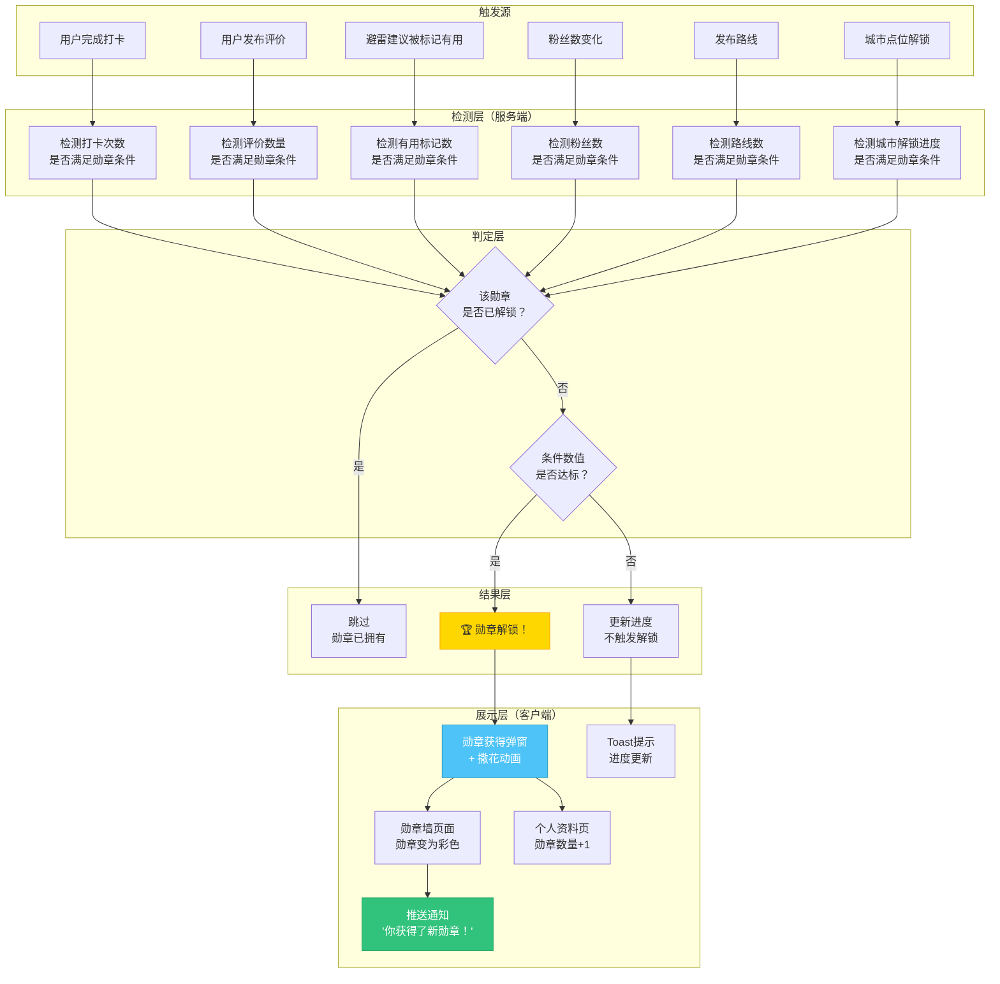
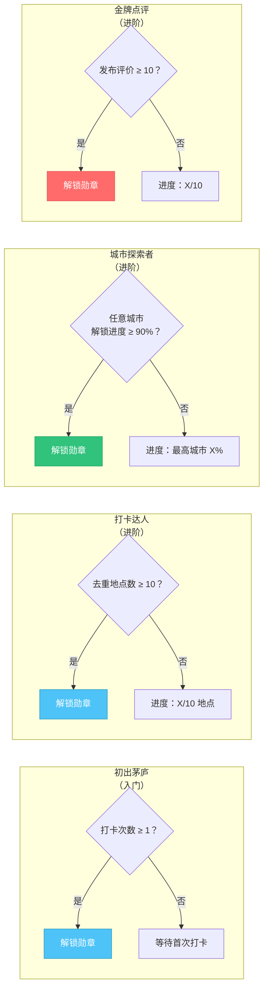
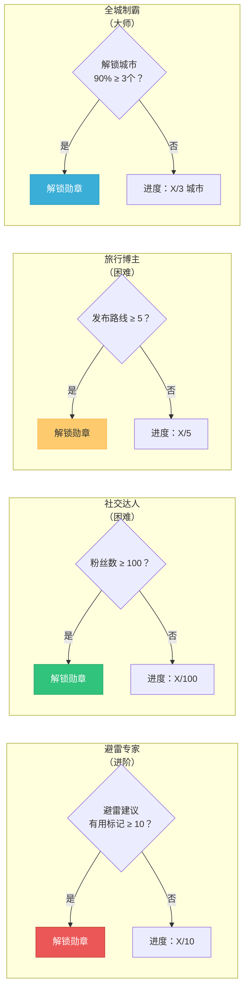

# 寻旅记 App · 勋章系统设计

> 版本：v2.1.7 | 日期：2026年6月 | 状态：正式版 | 用途：产品、交互设计、前端/后端开发团队执行标准

---

## 目录

- [一、设计概述](#一设计概述)
- [二、勋章详细规格](#二勋章详细规格)
- [三、勋章解锁流程图](#三勋章解锁流程图)
- [四、勋章进度展示](#四勋章进度展示)
- [五、勋章墙页面设计](#五勋章墙页面设计)
- [六、勋章获得动画](#六勋章获得动画)
- [七、个人资料页勋章展示](#七个人资料页勋章展示)
- [八、数据模型](#八数据模型)
- [九、接口设计](#九接口设计)
- [十、推送通知策略](#十推送通知策略)

---

## 一、设计概述

### 1.1 勋章系统定位

勋章系统是寻旅记 App 的用户激励体系核心组件，通过游戏化设计（Gamification）提升用户活跃度、留存率和内容产出。勋章作为用户成就的视觉化象征，在个人资料页和勋章墙中展示，同时也是社交货币的一部分。

### 1.2 设计原则

| 原则 | 说明 |
|------|------|
| **渐进式解锁** | 勋章从简单到困难递进，让用户持续有目标感 |
| **即时反馈** | 达成条件后立即触发勋章获得动画，给予正向激励 |
| **可视化进度** | 未解锁勋章显示当前进度，让用户知道离目标还有多远 |
| **社交炫耀** | 勋章可在个人资料页展示，已解锁勋章支持分享 |
| **不可逆性** | 勋章一旦解锁永久保留，不会因后续行为被收回 |

### 1.3 勋章总览

| 序号 | 勋章名称 | 难度 | 解锁条件 | 勋章边框 |
|------|---------|------|---------|---------|
| 1 | 初出茅庐 | 入门 | 首次完成打卡（仅统计审核通过的打卡） | 铜色边框 |
| 2 | 打卡达人 | 进阶 | 累计打卡 10 个不同地点（仅统计审核通过的打卡） | 银色边框 |
| 3 | 城市探索者 | 进阶 | 解锁第一个城市 90%（城市之王等级，仅统计审核通过的打卡） | 金色边框 |
| 4 | 金牌点评 | 进阶 | 发布 10 条评价（仅统计审核通过的评价） | 金色边框 |
| 5 | 避雷专家 | 进阶 | 10 条避雷建议被标记为"有用"（仅统计审核通过的内容） | 银色边框 |
| 6 | 社交达人 | 困难 | 获得 100 个粉丝 | 金色边框 |
| 7 | 旅行博主 | 困难 | 发布 5 条路线（需审核通过） | 金色边框 |
| 8 | 全城制霸 | 大师 | 解锁 3 个城市 90%（城市之王等级，仅统计审核通过的打卡） | 钻石边框 |

### 1.4 色彩体系适配

勋章系统配色统一适配寻旅记品牌色彩体系，采用"天蓝 + 珊瑚红 + 生机绿"三色体系，勋章主色调与品牌记忆点保持一致。

| 色彩角色 | 色值 | 用途 |
|---------|------|------|
| 天蓝 | #4EC3F7 | 主品牌色，用于入门/成长类勋章主色调、勋章弹窗装饰条 |
| 珊瑚红 | #FF6B6B | 激励/强调色，用于进度提示文字、Toast 激励文案、撒花粒子 |
| 生机绿 | #31C27C | 成就/达成色，用于已解锁状态强调、达成类勋章点缀 |

**适配规则**：
- 入门类勋章（初出茅庐等）主色调采用天蓝 #4EC3F7（纯色，禁止渐变）。
- 进阶/成长类勋章在原有辅色基础上，点缀珊瑚红或生机绿作为高光色，与品牌色呼应。
- 大师级勋章保留钻石/金色边框，但解锁动画粒子统一使用三色体系。
- 全局激励色（进度条提示、里程碑推送文案）统一使用珊瑚红 #FF6B6B。

### 1.5 阶段说明

| 阶段 | 勋章系统状态 | 说明 |
|------|------------|------|
| 第一阶段（P0） | **不做勋章** | 第一阶段聚焦核心打卡、攻略、行程功能，勋章系统暂不上线 |
| 第二阶段（P1） | 勋章系统上线 | 移至第二阶段 P1 优先级实现，本文档设计规范完整保留，供第二阶段直接落地 |

> **说明**：第一阶段虽不做勋章功能，但相关数据埋点（打卡次数、评价数、粉丝数、路线数、城市解锁进度）须在第一阶段完成，确保第二阶段上线时勋章可基于历史数据自动解锁，无需用户重新积累。

---

## 二、勋章详细规格

### 2.1 勋章一：初出茅庐

| 属性 | 规范 |
|------|------|
| 勋章名称 | 初出茅庐 |
| 勋章编号 | MEDAL-001 |
| 解锁条件 | 用户首次完成打卡（任意类型：到店打卡或普通打卡，仅统计审核通过的打卡） |
| 难度等级 | 入门（1 星） |
| 勋章边框 | 铜色边框（#CD7F32），2pt 描边，带轻微金属光泽 |
| 主色调 | 天蓝 #4EC3F7（纯色） |
| 图标描述 | 圆形勋章，中央为一枚脚印/足迹图形，象征"迈出第一步"。背景为天蓝 #4EC3F7（纯色），底部有细微的放射状光芒线条。 |
| 解锁后文案 | "恭喜！你迈出了旅行的第一步，从此足迹遍布山海。" |
| 分享文案 | "我在寻旅记完成了第一次打卡，获得了'初出茅庐'勋章！" |
| 素材编号 | IMG-MEDAL-001（已解锁）/ IMG-MEDAL-001-GRAY（未解锁） |

### 2.2 勋章二：打卡达人

| 属性 | 规范 |
|------|------|
| 勋章名称 | 打卡达人 |
| 勋章编号 | MEDAL-002 |
| 解锁条件 | 累计打卡 10 个不同地点（去重地点数，仅统计审核通过的打卡） |
| 难度等级 | 进阶（2 星） |
| 勋章边框 | 银色边框（#C0C0C0），2pt 描边，带金属光泽 |
| 主色调 | 天蓝 #4EC3F7（纯色） |
| 图标描述 | 圆形勋章，中央为三个叠加的打卡标记（定位水滴图形），由浅入深排列，象征"多次打卡"。背景为天蓝 #4EC3F7（纯色），有同心圆环装饰。 |
| 解锁后文案 | "10 个地点打卡达成！你已经是资深打卡玩家了。" |
| 分享文案 | "我在寻旅记完成了 10 个不同地点打卡，获得了'打卡达人'勋章！" |
| 素材编号 | IMG-MEDAL-002（已解锁）/ IMG-MEDAL-002-GRAY（未解锁） |

### 2.3 勋章三：城市探索者

| 属性 | 规范 |
|------|------|
| 勋章名称 | 城市探索者 |
| 勋章编号 | MEDAL-003 |
| 解锁条件 | 解锁任意一个城市 90%（城市之王等级，仅统计审核通过的打卡） |
| 难度等级 | 进阶（2 星） |
| 勋章边框 | 金色边框（#FFD700），2pt 描边，带光泽和轻微外发光 |
| 主色调 | 生机绿 #31C27C（纯色） |
| 图标描述 | 圆形勋章，中央为城市建筑剪影（天际线），上方叠加"90%"标记。建筑群中有地标元素（如电视塔、古建筑），象征"全面探索一座城市"。背景为生机绿 #31C27C（纯色），有星光点缀。 |
| 解锁后文案 | "你已踏遍这座城市的每一个角落，真正的城市探索者！" |
| 分享文案 | "我在寻旅记完成了一座城市 90% 打卡，获得了'城市探索者'勋章！" |
| 素材编号 | IMG-MEDAL-003（已解锁）/ IMG-MEDAL-003-GRAY（未解锁） |

### 2.4 勋章四：金牌点评

| 属性 | 规范 |
|------|------|
| 勋章名称 | 金牌点评 |
| 勋章编号 | MEDAL-004 |
| 解锁条件 | 累计发布 10 条评价（到店打卡附带的有效评价，含评分+描述，仅统计审核通过的评价） |
| 难度等级 | 进阶（2 星） |
| 勋章边框 | 金色边框（#FFD700），2pt 描边，带光泽 |
| 主色调 | 珊瑚红 #FF6B6B（纯色） |
| 图标描述 | 圆形勋章，中央为金色五角星叠加对话气泡，五角星代表"优质点评"，对话气泡代表"评价内容"。背景为珊瑚红 #FF6B6B（纯色），有星光效果。 |
| 解锁后文案 | "10 条用心评价，你的声音帮助了无数旅行者！" |
| 分享文案 | "我在寻旅记发布了 10 条评价，获得了'金牌点评'勋章！" |
| 素材编号 | IMG-MEDAL-004（已解锁）/ IMG-MEDAL-004-GRAY（未解锁） |

### 2.5 勋章五：避雷专家

| 属性 | 规范 |
|------|------|
| 勋章名称 | 避雷专家 |
| 勋章编号 | MEDAL-005 |
| 解锁条件 | 累计 10 条避雷建议被其他用户标记为"有用"（仅统计审核通过的内容） |
| 难度等级 | 进阶（2 星） |
| 勋章边框 | 银色边框（#C0C0C0），2pt 描边，带金属光泽 |
| 主色调 | 警示红 #EB5757（纯色） |
| 图标描述 | 圆形勋章，中央为闪电（避雷）+ 盾牌（保护）组合图形。闪电从盾牌后方穿过，象征"为他人避雷"。背景为警示红 #EB5757（纯色），有警示条纹装饰。 |
| 解锁后文案 | "你的避雷建议帮助 10 个人躲过了坑，避雷专家实至名归！" |
| 分享文案 | "我在寻旅记的避雷建议帮助了很多人，获得了'避雷专家'勋章！" |
| 素材编号 | IMG-MEDAL-005（已解锁）/ IMG-MEDAL-005-GRAY（未解锁） |

### 2.6 勋章六：社交达人

| 属性 | 规范 |
|------|------|
| 勋章名称 | 社交达人 |
| 勋章编号 | MEDAL-006 |
| 解锁条件 | 累计获得 100 个粉丝 |
| 难度等级 | 困难（3 星） |
| 勋章边框 | 金色边框（#FFD700），2pt 描边，带光泽 |
| 主色调 | 生机绿 #31C27C（纯色） |
| 图标描述 | 圆形勋章，中央为三个重叠的人物剪影，右侧有心形符号，象征"受人关注和喜爱"。背景为生机绿 #31C27C（纯色），有飘散的小爱心装饰。 |
| 解锁后文案 | "100 个粉丝为你而来！你的旅行故事正在影响更多人。" |
| 分享文案 | "我在寻旅记获得了 100 个粉丝，获得了'社交达人'勋章！" |
| 素材编号 | IMG-MEDAL-006（已解锁）/ IMG-MEDAL-006-GRAY（未解锁） |

### 2.7 勋章七：旅行博主

| 属性 | 规范 |
|------|------|
| 勋章名称 | 旅行博主 |
| 勋章编号 | MEDAL-007 |
| 解锁条件 | 累计发布 5 条路线（需审核通过） |
| 难度等级 | 困难（3 星） |
| 勋章边框 | 金色边框（#FFD700），2pt 描边，带金属光泽（3 星困难配金色，不低于 2 星进阶「金牌点评」） |
| 主色调 | 蜜橙 #FDCB6E（纯色） |
| 图标描述 | 圆形勋章，中央为路线折线路径，路径上叠加一支羽毛笔，象征"创作路线"。背景为蜜橙 #FDCB6E（纯色），有路径节点装饰。 |
| 解锁后文案 | "5 条路线发布！你是真正的旅行内容创作者。" |
| 分享文案 | "我在寻旅记发布了 5 条路线，获得了'旅行博主'勋章！" |
| 素材编号 | IMG-MEDAL-007（已解锁）/ IMG-MEDAL-007-GRAY（未解锁） |

### 2.8 勋章八：全城制霸

| 属性 | 规范 |
|------|------|
| 勋章名称 | 全城制霸 |
| 勋章编号 | MEDAL-008 |
| 解锁条件 | 解锁 3 个城市 90%（城市之王等级，仅统计审核通过的打卡） |
| 难度等级 | 大师（4 星） |
| 勋章边框 | 钻石边框（#B9F2FF），3pt 描边，带强烈外发光和闪烁光点效果 |
| 主色调 | 天蓝深色 #3AAED6（纯色） |
| 图标描述 | 圆形勋章，中央为三座城市建筑剪影叠加排列，顶部有皇冠标记，象征"征服多座城市"。建筑剪影风格各异，代表不同城市特色。背景为天蓝深色 #3AAED6（纯色），有钻石光芒和粒子效果。 |
| 解锁后文案 | "三座城市，90% 征服！你是寻旅记的传奇旅行者！" |
| 分享文案 | "我在寻旅记解锁了 3 座城市 90%（城市之王等级），获得了'全城制霸'勋章！" |
| 素材编号 | IMG-MEDAL-008（已解锁）/ IMG-MEDAL-008-GRAY（未解锁） |

### 2.9 打卡相关勋章构思（第二阶段预留）

围绕核心打卡玩法，预留以下打卡主题勋章构思，作为第二阶段勋章体系扩展方向。以下为构思草案，正式上线前需细化解锁数值与视觉规格。

| 序号 | 勋章名称（暂定） | 难度（预估） | 解锁条件构思 | 勋章边框（预估） |
|------|----------------|------------|------------|----------------|
| 9 | GPS 验证打卡徽章 | 入门 | 首次完成 GPS 到店验证打卡（非手动打卡） | 铜色边框 |
| 10 | 连续打卡勋章 | 进阶 | 连续 7 天完成至少 1 次有效打卡（审核通过） | 银色边框 |
| 11 | 多城市打卡勋章 | 困难 | 在 5 个不同城市各完成至少 1 次 GPS 验证打卡 | 金色边框 |
| 12 | 打卡内容丰富度勋章 | 进阶 | 累计 10 条打卡包含图文+评分+避雷提醒的"完整打卡" | 银色边框 |

**构思说明**：

- **GPS 验证打卡徽章**：与地图解锁系统的 GPS 验证机制联动，鼓励用户实地到访，区分"真到店"与"远程打卡"，强化内容真实性。主色调建议生机绿 #31C27C，象征"真实足迹"。
- **连续打卡勋章**：培养用户旅行期间的持续打卡习惯，断签后进度清零（与勋章不可逆性不冲突：解锁后永久保留，未解锁时进度可重置）。主色调建议珊瑚红 #FF6B6B，象征"持续热情"。
- **多城市打卡勋章**：激励跨城市探索，与全城制霸形成阶梯（多城市打卡为广度，全城制霸为深度）。主色调建议天蓝 #4EC3F7，象征"足迹遍布"。
- **打卡内容丰富度勋章**：引导用户产出高质量打卡内容（图文并茂+评价+避雷），提升 UGC 整体质量，与信用分体系联动。

> **阶段说明**：以上 4 枚勋章均为第二阶段 P1 预留构思，第一阶段不做实现，但相关数据埋点（GPS 验证标记、连续打卡天数、跨城市打卡数、打卡内容完整度）须在第一阶段采集，确保第二阶段可追溯计算。

---

## 三、勋章解锁流程图

### 3.1 勋章解锁主流程



### 3.2 各勋章解锁条件详解





---

## 四、勋章进度展示

### 4.1 进度展示方式

勋章在未解锁状态下，需要向用户展示当前进度，激励用户完成目标。进度展示分为三种方式：

#### 4.1.1 数值型进度（X/Y）

适用于有明确计数的勋章，展示为"当前值/目标值"。

| 勋章 | 进度展示示例 | 进度条颜色 |
|------|-------------|-----------|
| 打卡达人 | 3/10 个地点 | 天蓝 #4EC3F7 |
| 金牌点评 | 5/10 条评价 | 珊瑚红 #FF6B6B |
| 避雷专家 | 2/10 条有用 | 警示红 #EB5757 |
| 社交达人 | 45/100 粉丝 | 生机绿 #31C27C |
| 旅行博主 | 2/5 条路线 | 蜜橙 #FDCB6E |

#### 4.1.2 百分比型进度（X%）

适用于城市解锁类勋章，展示为百分比。

| 勋章 | 进度展示示例 | 进度条颜色 |
|------|-------------|-----------|
| 城市探索者 | 最高城市进度 65% | 生机绿 #31C27C |
| 全城制霸 | 2/3 城市，最高 90% | 天蓝深色 #3AAED6 |

#### 4.1.3 二元型进度（0/1）

适用于一次性成就勋章，只有"已完成"和"未完成"两种状态，不展示进度条。

| 勋章 | 进度展示示例 |
|------|-------------|
| 初出茅庐 | 完成首次打卡即可解锁 |

### 4.2 进度条组件规范

```
┌──────────────────────────────────────────┐
│  [勋章图标]  勋章名称                      │
│  (灰色)     打卡达人                       │
│                                          │
│  ┌──────────────────────────────┐        │
│  │████████████░░░░░░░░░░░░░░░░░│        │
│  └──────────────────────────────┘        │
│  3/10 个地点                              │
│  还差 7 个地点即可解锁                     │
└──────────────────────────────────────────┘
```

| 属性 | 规范 |
|------|------|
| 进度条高度 | 6pt |
| 进度条圆角 | 3pt |
| 进度条底色 | #F0F0F0 |
| 进度条填充色 | 根据勋章主色调 |
| 进度文字 | 字号 12pt，颜色 #999999 |
| 提示文字 | 字号 12pt，颜色 #FF6B6B（珊瑚红激励色），位于进度条下方 |

---

## 五、勋章墙页面设计

### 5.1 页面入口

勋章墙页面从"我的"页面入口进入：点击"我的勋章"入口，右侧滑入（Push）。

### 5.2 页面布局

```
┌──────────────────────────────────────────┐
│  ← 返回    勋章墙        (8枚勋章)        │
├──────────────────────────────────────────┤
│                                          │
│   ┌──────────┐ ┌──────────┐ ┌──────────┐│
│   │          │ │          │ │          ││
│   │  勋章1   │ │  勋章2   │ │  勋章3   ││
│   │  (彩色)  │ │  (彩色)  │ │  (灰色)  ││
│   │          │ │          │ │          ││
│   │ 初出茅庐 │ │ 打卡达人 │ │城市探索者 ││
│   │          │ │          │ │  65%     ││
│   └──────────┘ └──────────┘ └──────────┘│
│                                          │
│   ┌──────────┐ ┌──────────┐ ┌──────────┐│
│   │          │ │          │ │          ││
│   │  勋章4   │ │  勋章5   │ │  勋章6   ││
│   │  (灰色)  │ │  (灰色)  │ │  (灰色)  ││
│   │          │ │          │ │          ││
│   │ 金牌点评 │ │ 避雷专家 │ │ 社交达人 ││
│   │  5/10    │ │  2/10    │ │ 45/100   ││
│   └──────────┘ └──────────┘ └──────────┘│
│                                          │
│   ┌──────────┐ ┌──────────┐              │
│   │          │ │          │              │
│   │  勋章7   │ │  勋章8   │              │
│   │  (灰色)  │ │  (灰色)  │              │
│   │          │ │          │              │
│   │ 旅行博主 │ │ 全城制霸 │              │
│   │  2/5     │ │  2/3     │              │
│   └──────────┘ └──────────┘              │
│                                          │
└──────────────────────────────────────────┘
```

### 5.3 网格布局规范

| 属性 | 规范 |
|------|------|
| 布局方式 | 3 列网格（`UICollectionView` / `RecyclerView`） |
| 列数 | 3 列 |
| 勋章卡片尺寸 | 宽度 = (屏幕宽 - 48pt - 24pt) / 3，高度 = 宽度 + 40pt（名称区域） |
| 卡片间距 | 水平间距 12pt，垂直间距 16pt |
| 页面边距 | 左右各 24pt，顶部 16pt |
| 勋章图标尺寸 | 占卡片宽度 80%，居中显示 |
| 勋章名称 | 图标下方，12pt，居中，颜色根据解锁状态 |
| 进度文字 | 名称下方，11pt，居中，颜色 #999999 |

### 5.4 已解锁 vs 未解锁视觉差异

| 维度 | 已解锁 | 未解锁 |
|------|--------|--------|
| 勋章图标 | 彩色，边框发光，完整清晰 | 灰色（#CCCCCC），无光泽，85% 不透明度 |
| 卡片背景 | 白色，有轻微彩色阴影（根据勋章主色调） | 白色，无阴影 |
| 勋章名称 | 深色 #1A1A1A，字重 Medium | 灰色 #CCCCCC，字重 Regular |
| 进度信息 | 不显示进度（已解锁） | 显示进度条和进度文字 |
| 点击行为 | 弹出勋章详情弹窗 | 弹出勋章详情弹窗（含进度） |

### 5.5 勋章详情弹窗

点击勋章卡片后，底部弹出半屏弹窗（Modal），展示勋章详情：

```
┌──────────────────────────────────────────┐
│              ┌─────────────┐             │
│              │             │             │
│              │  勋章大图    │             │
│              │  (120×120)  │             │
│              │             │             │
│              └─────────────┘             │
│                                          │
│            勋章名称（20pt Bold）           │
│                                          │
│        解锁条件描述（14pt，灰色）           │
│                                          │
│     ┌──────────────────────────┐         │
│     │  ████████████░░░░░░░░░░  │         │
│     └──────────────────────────┘         │
│     进度：3/10 个地点（进度条）             │
│     还差 7 个地点即可解锁                   │
│                                          │
│     ┌──────────────────────────┐         │
│     │       分享勋章            │         │
│     └──────────────────────────┘         │
│                                          │
│     获得时间：2026-06-15 14:30            │
│     （已解锁时显示）                       │
└──────────────────────────────────────────┘
```

| 属性 | 规范 |
|------|------|
| 弹窗类型 | 底部弹出半屏 Modal |
| 弹窗高度 | 约 60% 屏幕高度 |
| 背景 | 白色，顶部圆角 16pt |
| 关闭方式 | 下滑关闭 / 点击遮罩关闭 / 点击关闭按钮 |
| 入场动画 | 从底部滑入，duration 300ms，easing: ease-out |
| 分享按钮 | 已解锁勋章显示"分享勋章"按钮（主色填充），未解锁置灰不可点击 |

---

## 六、勋章获得动画

### 6.1 动画触发时机

勋章获得动画在以下时机触发：

1. **实时触发**：用户完成操作后，服务端检测到勋章条件满足，推送通知，客户端收到后展示动画。
2. **进入App触发**：用户离线完成操作，启动App联网同步后，检测到勋章条件满足，展示动画。
3. **延迟触发**：用户正在浏览关键页面（如打卡弹窗），动画延迟到当前操作完成后展示。

### 6.2 动画流程

```
时间轴（总时长约 3.5 秒）：

0.0s ─── 屏幕变暗（半透明黑色遮罩，opacity 0 → 0.7，duration 300ms）

0.3s ─── 勋章弹窗从屏幕中央弹出
         scale 0.3 → 1.1 → 1.0（弹性动画）
         duration 500ms，easing: ease-out + bounce

0.8s ─── 印章动画落下（品牌记忆点）
         一枚印章从弹窗上方落下，盖在勋章图标中央
         印章下落 scale 1.4 → 1.0 + 轻微旋转修正
         落下瞬间触发"盖章"缩放反馈（勋章 scale 1.0 → 0.92 → 1.0）
         印章停留 200ms 后淡出，留下勋章完整图案
         duration 600ms，easing: ease-in + bounce
         印章风格与打卡印章动画统一（详见 6.5）

1.4s ─── 勋章名称和文案淡入
         opacity 0 → 1，translateY 20pt → 0
         duration 300ms

1.5s ─── 撒花粒子效果开始
         从屏幕顶部飘落彩色纸屑/星星
         持续 2 秒
         粒子数量：约 50 个
         粒子颜色：天蓝 #4EC3F7、珊瑚红 #FF6B6B、生机绿 #31C27C、金色 #FFD700、白色 #FFFFFF
         粒子形状：圆形、五角星、菱形混合

2.0s ─── "知道了"按钮出现
         scale 0 → 1，duration 300ms

用户点击"知道了"或 3.5s 后自动关闭
```

### 6.3 动画视觉规范

| 属性 | 规范 |
|------|------|
| 遮罩背景 | 黑色，opacity 0.7 |
| 弹窗尺寸 | 280pt × 380pt（近似正方形） |
| 弹窗圆角 | 20pt |
| 弹窗背景 | 白色，顶部有天蓝 #4EC3F7 纯色装饰条（高度 8pt） |
| 勋章图标 | 120pt × 120pt，居中 |
| 印章图形 | 60pt × 60pt，印章主体为珊瑚红 #FF6B6B，下落时带轻微投影 |
| 勋章名称 | 字号 22pt，Bold，颜色 #1A1A1A，图标下方 16pt |
| 解锁文案 | 字号 14pt，Regular，颜色 #666666，名称下方 8pt，最多两行 |
| 按钮 | "知道了"，天蓝 #4EC3F7 填充，高度 44pt，圆角 22pt，宽度 200pt，弹窗底部 |
| 撒花粒子 | 50个，从顶部 (-50pt ~ 屏幕宽度+50pt) 随机位置起始，飘落到底部，颜色取三色体系+金色+白色 |

### 6.4 音效建议

| 场景 | 音效描述 |
|------|---------|
| 勋章弹窗弹出 | 清脆的"叮"声，类似获得成就的系统提示音 |
| 印章落下 | 沉稳的"咚"声，模拟印章盖在纸面的质感，与打卡印章音效一致 |
| 撒花粒子 | 轻柔的沙沙声，模拟纸屑飘落 |
| 音效优先级 | 跟随系统静音模式，震动模式下不播放 |

### 6.5 印章动画与品牌记忆点

勋章解锁动画的核心记忆点是"印章落下"效果，与打卡地验证时的"打卡印章"动画风格统一，形成寻旅记独有的"盖章"品牌符号。

| 维度 | 规范 |
|------|------|
| 动画类型 | 印章下落 + 盖压反馈 + 淡出留印 |
| 印章图形 | 圆形印章，主体珊瑚红 #FF6B6B，中心镂空勋章编号/图标轮廓 |
| 下落轨迹 | 从弹窗顶部上方 40pt 处垂直下落至勋章图标中心 |
| 盖压反馈 | 落地瞬间勋章 scale 1.0 → 0.92 → 1.0，伴随 8pt 投影扩散 |
| 留印效果 | 印章淡出后，勋章图标上保留 200ms 的"印泥"光晕（生机绿 #31C27C，opacity 0.3 → 0） |
| 与打卡印章统一 | 印章图形、下落曲线、盖压反馈、音效均与打卡地验证印章动画共用同一套动画资源，仅颜色/镂空图案按场景替换 |
| 品牌一致性 | 用户在"打卡盖章"和"勋章解锁"两个高光时刻看到同一套印章语言，强化"寻旅记 = 盖章旅行"的品牌认知 |

---

## 七、个人资料页勋章展示

### 7.1 展示位置

在"我的"页面（个人资料页），勋章展示位于用户统计数据下方，占用一个横向滚动的卡片区域。

### 7.2 布局规范

```
┌──────────────────────────────────────────┐
│  ┌──────┐                                │
│  │ 头像 │  用户昵称                       │
│  │      │  @username                     │
│  └──────┘                                │
│                                          │
│   45       128      12                   │
│  粉丝    关注    获赞                    │
│                                          │
│  ┌──────────────────────────────────┐    │
│  │ 我的勋章（8枚）           查看全部 > │    │
│  │                                  │    │
│  │  ┌────┐ ┌────┐ ┌────┐ ┌────┐   │    │
│  │  │勋章│ │勋章│ │勋章│ │勋章│   │    │
│  │  │ 1  │ │ 2  │ │ 3  │ │ 4  │ → │    │
│  │  └────┘ └────┘ └────┘ └────┘   │    │
│  │  (彩色)(彩色)(灰色)(灰色)        │    │
│  └──────────────────────────────────┘    │
│                                          │
│  我的足迹          >                     │
│  我的勋章          >                     │
│  ...                                     │
└──────────────────────────────────────────┘
```

| 属性 | 规范 |
|------|------|
| 勋章区域 | 独立卡片，白色背景，圆角 12pt，左右边距 16pt |
| 头部标题 | "我的勋章（X/8）"，X 为已解锁数量，右侧"查看全部 >" |
| 勋章展示 | 横向滚动（`UIScrollView` / `HorizontalScrollView`），最多展示 4 个勋章后需要滚动 |
| 单个勋章 | 44pt × 44pt，间距 12pt |
| 排序规则 | 已解锁勋章在前，按解锁时间倒序；未解锁勋章在后，按勋章编号正序 |

### 7.3 勋章展示优先级

当用户已解锁勋章超过 4 个时，个人资料页仅展示最近解锁的 4 个勋章，其余通过"查看全部"进入勋章墙查看。

---

## 八、数据模型

### 8.1 勋章定义表（服务端配置）

```sql
CREATE TABLE medal_definition (
    id          INT PRIMARY KEY AUTO_INCREMENT,
    medal_code  VARCHAR(32)  NOT NULL COMMENT '勋章编码，如 MEDAL_001',
    name        VARCHAR(64)  NOT NULL COMMENT '勋章名称',
    description VARCHAR(256) NOT NULL COMMENT '勋章描述',
    unlock_type ENUM('CHECKIN_COUNT', 'REVIEW_COUNT', 'TIP_USEFUL_COUNT',
                     'FOLLOWER_COUNT', 'ROUTE_COUNT', 'CITY_PROGRESS',
                     'FIRST_CHECKIN') NOT NULL COMMENT '解锁条件类型',
    unlock_value INT         NOT NULL COMMENT '解锁条件数值',
    difficulty   TINYINT     NOT NULL DEFAULT 1 COMMENT '难度 1-4',
    border_color VARCHAR(16)  NOT NULL COMMENT '边框颜色',
    theme_color  VARCHAR(16)  NOT NULL COMMENT '主题色',
    sort_order   INT         NOT NULL DEFAULT 0 COMMENT '排序',
    icon_url     VARCHAR(512) COMMENT '勋章图标URL（已解锁）',
    icon_gray_url VARCHAR(512) COMMENT '勋章图标URL（未解锁）',
    unlock_text  VARCHAR(256) COMMENT '解锁文案',
    share_text   VARCHAR(256) COMMENT '分享文案',
    created_at   DATETIME    NOT NULL DEFAULT CURRENT_TIMESTAMP,
    updated_at   DATETIME    NOT NULL DEFAULT CURRENT_TIMESTAMP ON UPDATE CURRENT_TIMESTAMP,
    UNIQUE KEY uk_medal_code (medal_code)
) COMMENT='勋章定义表';
```

### 8.2 用户勋章表

```sql
CREATE TABLE user_medal (
    id          BIGINT PRIMARY KEY AUTO_INCREMENT,
    user_id     BIGINT       NOT NULL COMMENT '用户ID',
    medal_id    INT          NOT NULL COMMENT '勋章定义ID',
    status      ENUM('LOCKED', 'UNLOCKED') NOT NULL DEFAULT 'LOCKED' COMMENT '解锁状态',
    progress    INT          NOT NULL DEFAULT 0 COMMENT '当前进度',
    unlocked_at DATETIME     NULL COMMENT '解锁时间',
    created_at  DATETIME     NOT NULL DEFAULT CURRENT_TIMESTAMP,
    updated_at  DATETIME     NOT NULL DEFAULT CURRENT_TIMESTAMP ON UPDATE CURRENT_TIMESTAMP,
    UNIQUE KEY uk_user_medal (user_id, medal_id),
    INDEX idx_user_status (user_id, status)
) COMMENT='用户勋章表';
```

### 8.3 勋章进度快照（用于排行榜/展示）

```sql
CREATE TABLE user_medal_summary (
    user_id          BIGINT PRIMARY KEY COMMENT '用户ID',
    total_unlocked   INT NOT NULL DEFAULT 0 COMMENT '已解锁勋章数',
    total_medals     INT NOT NULL DEFAULT 8 COMMENT '勋章总数',
    latest_unlock_at DATETIME NULL COMMENT '最近解锁时间',
    updated_at       DATETIME NOT NULL DEFAULT CURRENT_TIMESTAMP ON UPDATE CURRENT_TIMESTAMP
) COMMENT='用户勋章汇总表';
```

---

## 九、接口设计

### 9.1 获取用户勋章列表

```
GET /api/v1/user/medals
```

**响应**：
```json
{
  "code": 0,
  "data": {
    "total_unlocked": 3,
    "total_medals": 8,
    "medals": [
      {
        "medal_code": "MEDAL_001",
        "name": "初出茅庐",
        "description": "完成首次打卡",
        "status": "UNLOCKED",
        "progress": 1,
        "unlock_value": 1,
        "unlocked_at": "2026-06-15T14:30:00Z",
        "icon_url": "https://cdn.xunlvji.com/medals/medal_001.png",
        "icon_gray_url": "https://cdn.xunlvji.com/medals/medal_001_gray.png",
        "unlock_text": "恭喜！你迈出了旅行的第一步..."
      },
      ...
    ]
  }
}
```

### 9.2 勋章解锁通知（WebSocket / 推送）

```
POST /api/v1/notifications/medal-unlock
```

服务端在检测到勋章解锁后，通过 WebSocket 实时推送，或通过推送通知告知客户端。

---

## 十、推送通知策略

### 10.1 勋章解锁推送

| 属性 | 规范 |
|------|------|
| 推送标题 | "恭喜获得新勋章！" |
| 推送内容 | 勋章名称 + 解锁文案（如"你获得了'初出茅庐'勋章，迈出了旅行的第一步！"） |
| 推送时机 | 勋章解锁后 5 秒内推送（延迟避免与App内动画冲突） |
| 不在App内 | 直接推送系统通知 |
| 在App内 | 不推送系统通知，直接展示勋章获得动画 |
| 点击行为 | 跳转至勋章墙页面 |

### 10.2 进度里程碑推送

当用户离解锁勋章仅差一步时，可选择性推送激励通知：

| 勋章 | 推送时机 | 推送文案示例 |
|------|---------|-------------|
| 打卡达人 | 还差 2 个地点 | "再打卡 2 个地点就能获得'打卡达人'勋章，加油！" |
| 金牌点评 | 还差 1 条评价 | "还差 1 条评价就能成为'金牌点评'，分享你的体验吧！" |
| 社交达人 | 还差 10 个粉丝 | "离'社交达人'只差 10 个粉丝了，邀请好友关注你吧！" |