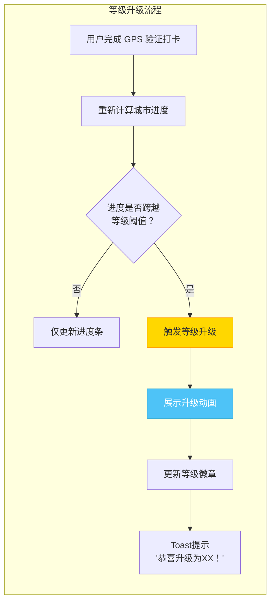
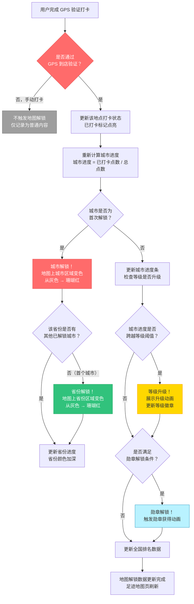
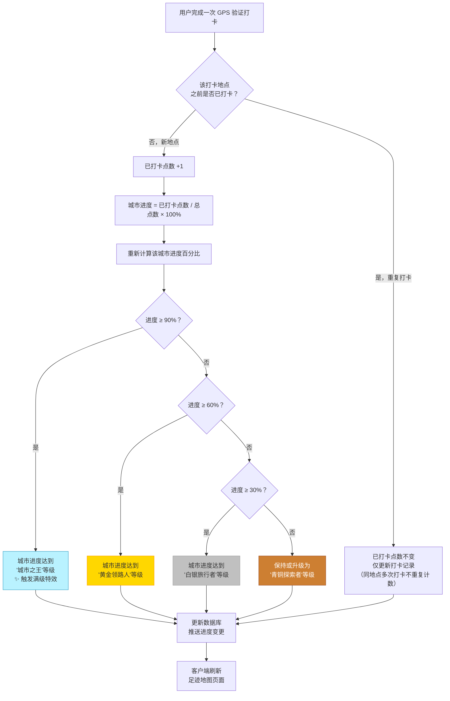
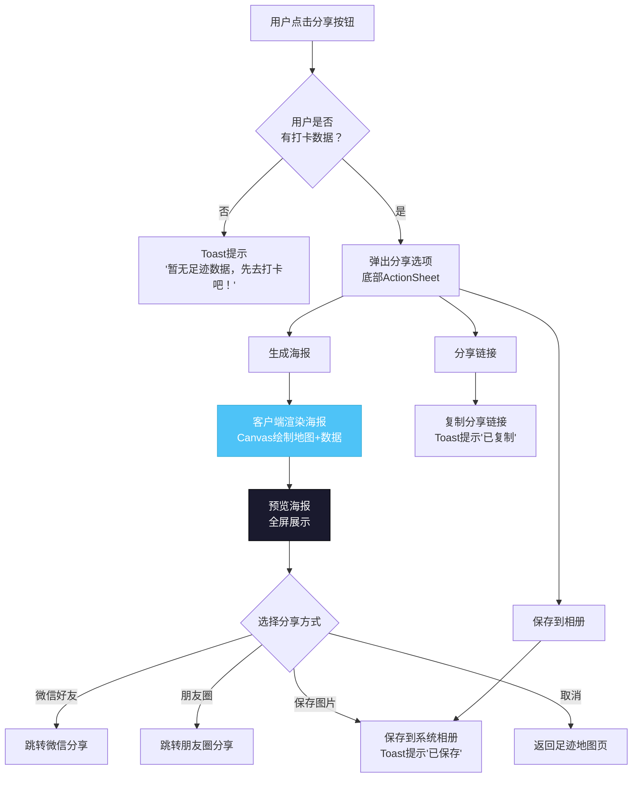

# 寻旅记 App · 地图解锁系统设计

> 版本：v2.1.7 | 日期：2026年6月 | 状态：正式版 | 用途：产品、交互设计、前端/后端开发团队执行标准

---

## 目录

- [一、设计概述](#一设计概述)
- [二、地图交互设计](#二地图交互设计)
- [三、解锁规则](#三解锁规则)
- [四、进度等级体系](#四进度等级体系)
- [五、地图解锁进度流程图](#五地图解锁进度流程图)
- [六、全国排名系统](#六全国排名系统)
- [七、足迹地图页面设计](#七足迹地图页面设计)
- [八、解锁动画与音效](#八解锁动画与音效)
- [九、分享足迹地图](#九分享足迹地图)
- [十、数据模型](#十数据模型)
- [十一、接口设计](#十一接口设计)
- [十二、技术实现建议](#十二技术实现建议)

---

## 一、设计概述

### 1.1 系统定位

地图解锁系统是寻旅记 App 的核心激励与可视化体系，通过将用户的打卡行为映射到中国地图上，以"点亮地图"的游戏化方式，激励用户探索更多城市和地点，形成持续的旅行动力。

### 1.2 设计原则

| 原则 | 说明 |
|------|------|
| **可视化激励** | 将抽象的打卡数据转化为直观的地图色彩变化，让用户"看到"自己的旅行成果 |
| **渐进式解锁** | 从城市到省份到全国，层层递进，始终有下一个目标 |
| **社交对比** | 全国排名让用户了解自己在所有用户中的位置，激发竞争和分享欲望 |
| **真实可信** | 所有解锁基于 GPS 验证打卡数据（到店 GPS 验证为准），不做虚假繁荣，杜绝远程"云解锁" |
| **轻量交互** | 地图操作流畅，缩放、平移、点击响应迅速，避免卡顿 |

### 1.3 解锁层级概览

```
打卡地点（最小单位）
    └── 城市解锁（完成该城市至少 1 次 GPS 验证打卡）
          └── 省份解锁（完成该省至少 1 个城市解锁）
                └── 全国制霸（解锁所有省份）
```

### 1.4 定位模式适配

地图解锁与寻旅记的三种定位模式（计划模式、旅行模式、手动模式）深度联动，不同模式下地图解锁行为不同：

| 定位模式 | 地图解锁行为 | 说明 |
|---------|------------|------|
| 计划模式 | **不可解锁地图** | 计划模式用于行前规划，用户尚未落地，不触发任何地图解锁；用户可浏览、收藏目的地，但地图保持未解锁状态，需落地后启用解锁 |
| 旅行模式 | **自动解锁当前城市** | 旅行模式下系统获取用户实时定位，识别用户所在城市后自动解锁该城市地图，无需用户手动操作 |
| 手动模式 | **可手动解锁已选城市** | 手动模式下用户可手动选择已到达的城市进行解锁（适用于定位不可用或用户主动选择场景），但需满足 GPS 验证条件（详见 1.5） |

> **模式切换**：用户从计划模式切换至旅行模式（落地后）时，系统自动检测定位并解锁当前城市；手动模式下解锁需配合 GPS 验证，确保解锁基于真实到访。

### 1.5 GPS 验证结合

地图解锁以 GPS 验证为核心依据，确保所有解锁基于用户真实到访，杜绝虚假解锁：

- **到达城市后 GPS 验证解锁**：用户到达某城市后，通过 GPS 定位验证实际位置，验证通过后自动解锁该城市地图，非手动解锁。
- **解锁触发条件**：用户在该城市完成 **1 次 GPS 验证打卡**后，自动解锁该城市详细地图（含打卡标记点、城市进度、等级体系）。
- **非 GPS 打卡不计入解锁**：纯手动打卡（未通过 GPS 到店验证）不触发城市地图解锁，仅记录为普通内容，避免用户远程"云解锁"城市。
- **GPS 信号异常降级**：当 GPS 信号弱或定位失败时，引导用户到开阔处重试，或暂不解锁（不降级为手动解锁，保证解锁真实性）。

### 1.6 阶段说明

| 阶段 | 地图解锁系统状态 | 说明 |
|------|----------------|------|
| 第一阶段（P0） | **只做手动选城市** | 第一阶段不做地图解锁系统，仅提供手动选择城市功能（用户手动选择当前/目标城市，浏览该城市内容），不涉及地图点亮、进度计算、等级体系 |
| 第二阶段（P1） | **地图解锁系统上线** | 移至第二阶段 P1 优先级实现完整地图解锁系统，本文档设计规范完整保留，供第二阶段直接落地 |

> **说明**：第一阶段虽不做地图解锁功能，但相关数据埋点（城市打卡记录、GPS 验证标记、打卡地点归属城市）须在第一阶段完成，确保第二阶段上线时地图解锁可基于历史打卡数据自动点亮已到访城市。

---

## 二、地图交互设计

### 2.1 地图 SDK 选型

| 维度 | 高德地图 SDK | 百度地图 SDK | 推荐 |
|------|------------|------------|------|
| 覆盖范围 | 中国地图数据全面 | 中国地图数据全面 | 两者均可 |
| 自定义样式 | 支持自定义地图样式 | 支持自定义地图样式 | 高德 |
| 行政区划数据 | 提供省/市/区边界数据 | 提供省/市/区边界数据 | 高德 |
| 覆盖物自定义 | 支持自定义 Marker | 支持自定义 Marker | 两者均可 |
| Android/iOS 支持 | 完善 | 完善 | 两者均可 |
| 费用 | 按量计费 | 按量计费 | 需评估 |

**推荐方案**：高德地图 SDK（AMap），综合数据精度和自定义能力更优。

### 2.2 地图基础交互

| 交互 | 手势 | 行为 |
|------|------|------|
| 缩放 | 双指捏合/展开 | 缩放地图，省级缩放到一定级别自动切换为市级视图 |
| 平移 | 单指拖动 | 移动地图视野 |
| 旋转 | 双指旋转 | 旋转地图视角（可选，默认锁定为上北下南） |
| 倾斜 | 双指上下滑动 | 3D 视角倾斜（可选，默认 2D 平面） |
| 点击省份 | 单击 | 选中省份，高亮边界，弹出省份信息卡片 |
| 点击城市 | 双击/放大后单击 | 选中城市，显示城市打卡进度 |
| 点击标记点 | 单击 | 弹出打卡地详情气泡 |

### 2.3 地图视觉样式

#### 2.3.1 省份/城市颜色映射

| 解锁状态 | 颜色 | 色值 | 说明 |
|---------|------|------|------|
| 未解锁 | 浅灰 | #E8E8E8 | 用户尚未在该省份/城市完成任何打卡 |
| 部分解锁 | 珊瑚红 | #FF6B6B | 用户在该省份/城市有打卡但未达到 100% |
| 进度较高 | 珊瑚红 | #FF6B6B | 用户在该省份/城市解锁进度 ≥ 60% |
| 完全解锁 | 生机绿 | #31C27C | 用户在该省份/城市解锁进度 = 100%（已解锁用生机绿，品牌色天蓝 #4EC3F7 不用于数据可视化） |
| 当前选中 | 边框高亮 | #1A1A2E（纯黑） | 当前选中省份/城市的边框高亮色 |

#### 2.3.2 底图样式

| 属性 | 规范 |
|------|------|
| 底图风格 | 浅色简约风格，淡化道路和建筑细节，突出行政区划边界 |
| 海洋颜色 | #E3F2FD（浅蓝） |
| 国界线 | 标准国界线，不可修改 |
| 省界线 | 白色或浅灰，宽度 1pt |
| 未解锁区域 | 浅灰填充 #E8E8E8，透明度 60% |
| 地名标注 | 保留省会城市名称，字号 10pt，颜色 #666666 |

### 2.4 省份信息卡片

点击省份后，底部弹出省份信息卡片：

```
┌──────────────────────────────────────────┐
│  ┌──────────────────────────────────┐    │
│  │  浙江省                           │    │
│  │  ────────────────────────────────│    │
│  │  解锁进度：███░░ 60%              │    │
│  │                                  │    │
│  │  已解锁城市：3/11                 │    │
│  │  ├─ 杭州 ✅ 100% (12/12)         │    │
│  │  ├─ 宁波 ✅ 85%  (17/20)         │    │
│  │  ├─ 温州 ✅ 40%  (8/20)          │    │
│  │  └─ 其他 8 个城市未解锁           │    │
│  │                                  │    │
│  │  等级：白银旅行者                  │    │
│  │                                  │    │
│  │  ┌──────────────────────────┐    │    │
│  │  │    查看该省打卡详情        │    │    │
│  │  └──────────────────────────┘    │    │
│  └──────────────────────────────────┘    │
│                                          │
│  底部导航栏                               │
└──────────────────────────────────────────┘
```

---

## 三、解锁规则

### 3.1 城市解锁规则

| 维度 | 规则 |
|------|------|
| 解锁条件 | 用户在该城市完成至少 **1 次 GPS 验证打卡**（到店 GPS 验证通过，非手动打卡） |
| 城市定义 | 以中国地级市/直辖市为基本单位，共计约 333 个 |
| 解锁时机 | GPS 验证打卡提交成功后即时触发 |
| 解锁后行为 | 城市在地图上从灰色变为珊瑚红，进度条显示 1/N |
| 定位模式约束 | 计划模式不可解锁；旅行模式自动解锁当前城市；手动模式需配合 GPS 验证解锁已选城市（详见 1.4） |
| 不可逆性 | 城市一旦解锁，永久保持解锁状态 |

> **GPS 验证说明**：解锁以 GPS 到店验证为准，纯手动打卡（未通过 GPS 验证）不触发城市解锁，避免用户远程"云解锁"。GPS 信号异常时暂不解锁，引导用户重试，不降级为手动解锁。

### 3.2 省份解锁规则

| 维度 | 规则 |
|------|------|
| 解锁条件 | 用户在该省份内完成至少 1 个城市的解锁 |
| 省份定义 | 以中国 34 个省级行政区为基本单位（23省+5自治区+4直辖市+2特别行政区） |
| 解锁时机 | 城市解锁后自动检测该省是否首次解锁 |
| 解锁后行为 | 省份在地图上从灰色变为珊瑚红 |
| 不可逆性 | 省份一旦解锁，永久保持解锁状态 |

### 3.3 城市进度计算

```
城市进度 = 已打卡点数 / 该城市总点数 × 100%
```

| 变量 | 说明 |
|------|------|
| 已打卡点数 | 用户在该城市已完成的 GPS 验证打卡地点数量（去重，同一地点多次打卡只计 1 次，仅统计 GPS 验证通过的打卡） |
| 该城市总点数 | 系统中该城市收录的打卡地点总数 |
| 进度范围 | 0% ~ 100% |
| 达到 90% | 触发"城市之王"等级，解锁相关勋章（城市探索者/全城制霸） |

> **说明**：城市进度仅统计 GPS 验证打卡，纯手动打卡不计入进度，确保进度数据反映用户真实到访情况。

### 3.4 省份进度计算

```
省份进度 = 该省已解锁城市数 / 该省总城市数 × 100%
```

| 变量 | 说明 |
|------|------|
| 已解锁城市数 | 该省中用户已完成至少 1 个打卡的城市数量 |
| 该省总城市数 | 该省的地级市/直辖市数量 |
| 进度范围 | 0% ~ 100% |

### 3.5 进度锁定机制（等级只升不降，P1-12）

> **问题背景**：城市进度 = 已打卡点数 / 该城市总点数。运营持续新增打卡地（POI）会使分母（总点数）变大，导致已达 90%（城市之王）的用户在新增 POI 后进度可能掉回 89%，等级倒退，严重打击用户积极性且不合理。
>
> **修复原则**：**城市等级只升不降**。用户已获得的等级永久保留，运营新增 POI 不会导致用户等级倒退。

#### 3.5.1 快照锁定规则

| 项 | 规则 |
|----|------|
| 锁定时机 | 用户**首次达到某等级**时，系统记录当时的「该城市总点数」作为该等级的进度分母快照 |
| 分母冻结 | 快照分母一旦记录即**冻结**，后续运营新增 POI 不再增加该用户的进度分母 |
| 分子可增 | 运营新增的 POI 仍可被用户打卡，计入分子（已打卡点数）可能性，但**不计入分母** |
| 等级只升 | 用户当前展示等级 = 历史最高等级（`highest_level`），永不倒退 |
| 升级判定 | 以冻结快照分母计算进度，跨越更高等级阈值时升级并刷新快照分母为当前总点数 |

#### 3.5.2 计算公式（锁定后）

```
锁定进度 = min(已打卡点数 / 进度分母快照, 100%) × 100%
展示等级 = highest_level（历史最高等级，只升不降）
```

> 说明：展示进度百分比以「进度分母快照」为分母，并上限 100%，避免分子超过快照分母导致 >100%。运营新增 POI 只增加分子可达上限，不增加分母，因此不会拉低进度、不会导致等级倒退。

#### 3.5.3 举例

| 阶段 | 城市总点数（全局） | 用户已打卡 | 快照分母 | 锁定进度 | 展示等级 | 说明 |
|------|--------------------|------------|----------|----------|----------|------|
| T1 | 20 | 12 | 20 | 60% | 黄金领路人 | 首次达 60%，锁定快照分母=20，等级=黄金 |
| T2 | 20 | 18 | 18（升级刷新） | 90% | 城市之王 | 首次达 90%，升级并刷新快照分母=18，等级=城市之王 |
| T3 | 25（运营新增 5 个 POI） | 18 | 18 | 100% | 城市之王 | 分母冻结仍为 18，进度不降；等级锁定为城市之王 |
| T4 | 25 | 20（用户打卡了 2 个新 POI） | 18 | 100% | 城市之王 | 新 POI 打卡增加分子，分母不变，进度维持 100% |

#### 3.5.4 数据字段

进度锁定相关字段见 10.1「城市解锁进度表」的 `highest_level`、`total_spots_snapshot`、`level_locked_at`。

---

## 四、进度等级体系

### 4.1 等级定义

以城市为单位，根据用户在城市中的打卡进度，划分四个等级：

| 等级 | 名称 | 进度阈值 | 图标 | 颜色 | 等级描述 |
|------|------|---------|------|------|---------|
| Lv.1 | 青铜探索者 | 1% ~ 29% | 青铜徽章 | #CD7F32 | 初来乍到，刚刚开始探索这座城市 |
| Lv.2 | 白银旅行者 | 30% ~ 59% | 白银徽章 | #C0C0C0 | 渐入佳境，已经打卡了不少地方 |
| Lv.3 | 黄金领路人 | 60% ~ 89% | 黄金徽章 | #FFD700 | 资深玩家，对这座城市了如指掌 |
| Lv.4 | 城市之王 | 90% ~ 100% | 钻石王冠 | #B9F2FF | 城市征服者，几乎踏遍每一个角落 |

### 4.2 等级特殊说明

| 说明 | 内容 |
|------|------|
| 0% 状态 | 进度低于 1% 时，不显示等级，仅显示"已解锁" |
| 城市之王 | 需要达到 90% 以上，非严格 100%，考虑到部分打卡地可能季节性关闭或被移除 |
| 等级升级 | 每次打卡后自动重新计算等级，达到升级条件时触发升级动画 |
| 等级只升不降 | 等级一经获得永久保留，运营新增 POI 不会导致等级倒退（进度锁定机制，详见 3.5） |
| 等级展示 | 在城市信息卡片、足迹地图详情中展示 |

### 4.3 等级升级触发



---

## 五、地图解锁进度流程图

### 5.1 整体解锁流程



### 5.2 城市打卡进度计算流程



---

## 六、全国排名系统

### 6.1 排名计算规则

全国排名基于用户综合探索指数，计算公式如下：

```
综合探索指数 = 解锁城市数 × 10 + 打卡总数 × 1

排名 = 综合探索指数在所有用户中的降序排位
排名百分比 = 排名 / 总用户数 × 100%
```

| 变量 | 说明 | 权重 |
|------|------|------|
| 解锁城市数 | 用户已解锁的地级市数量 | 权重 10 |
| 打卡总数 | 用户累计打卡次数（去重地点） | 权重 1 |

**举例**：用户解锁了 15 个城市，累计打卡 45 个地点
- 综合探索指数 = 15 × 10 + 45 × 1 = 195

### 6.2 排名展示

```
┌──────────────────────────────────────────┐
│  ← 返回    全国排名                        │
├──────────────────────────────────────────┤
│                                          │
│        你的全国排名                         │
│                                          │
│          第 12,345 名                     │
│     超过 87.6% 的寻旅记用户                 │
│                                          │
│  ┌──────────────────────────────────┐    │
│  │  解锁城市：15 个                   │    │
│  │  打卡总数：45 个                   │    │
│  │  综合指数：195                    │    │
│  │  解锁省份：8 个                    │    │
│  └──────────────────────────────────┘    │
│                                          │
│  排名段位：                                │
│  ┌──────────────────────────────────┐    │
│  │ 前 1%    │ 传奇旅行者    │ 金色    │    │
│  │ 前 5%    │ 资深旅行家    │ 银色    │    │
│  │ 前 10%   │ 进阶探索者    │ 铜色    │    │
│  │ 前 30%   │ 活跃旅行者    │ 灰色    │    │
│  │ 其余     │ 初来乍到      │ 无      │    │
│  └──────────────────────────────────┘    │
│                                          │
└──────────────────────────────────────────┘
```

### 6.3 排名段位定义

| 排名范围 | 段位名称 | 段位颜色 | 图标 |
|---------|---------|---------|------|
| 前 1% | 传奇旅行者 | 金色 #FFD700 | 钻石地图标记 |
| 前 5% | 资深旅行家 | 银色 #C0C0C0 | 双星地图标记 |
| 前 10% | 进阶探索者 | 铜色 #CD7F32 | 单星地图标记 |
| 前 30% | 活跃旅行者 | 灰色 #9E9E9E | 普通地图标记 |
| 其余 | 初来乍到 | 无特殊标记 | 基础地图标记 |

### 6.4 排名更新策略

| 属性 | 规范 |
|------|------|
| 更新频率 | 用户每次打卡后实时更新个人排名 |
| 全量重算 | 每日凌晨 2:00 全量重新计算所有用户排名 |
| 缓存策略 | 排名数据缓存 1 小时，减少数据库压力 |
| 展示精度 | 用户看到的排名可能有 1 小时延迟（非实时场景） |

---

## 七、足迹地图页面设计

### 7.1 页面入口

从"我的"页面点击"我的足迹"入口，右侧滑入（Push）。

### 7.2 页面整体布局

```
┌──────────────────────────────────────────┐
│  ← 返回    我的足迹          分享         │
├──────────────────────────────────────────┤
│  ┌──────────────────────────────────┐    │
│  │                                  │    │
│  │                                  │    │
│  │         中国地图区域              │    │
│  │      （高德/百度地图 SDK）         │    │
│  │                                  │    │
│  │   省份按解锁状态着色               │    │
│  │   已解锁城市显示打卡标记点          │    │
│  │                                  │    │
│  │                                  │    │
│  └──────────────────────────────────┘    │
│                                          │
│  ┌──────────────────────────────────┐    │
│  │  📊 探索统计                      │    │
│  │  ────────────────────────────────│    │
│  │  已解锁城市  15 个                │    │
│  │  已解锁省份   8 个                │    │
│  │  打卡总数    45 个                │    │
│  │  全国排名  前 12.4%              │    │
│  │  段位：资深旅行家                  │    │
│  └──────────────────────────────────┘    │
│                                          │
│  ┌──────────────────────────────────┐    │
│  │  🏆 城市进度排行                   │    │
│  │  ────────────────────────────────│    │
│  │  1. 杭州  ████████░░ 85% 黄金领路人│    │
│  │  2. 上海  ██████░░░░ 60% 黄金领路人│    │
│  │  3. 成都  ████░░░░░░ 40% 白银旅行者│    │
│  │  ...                             │    │
│  └──────────────────────────────────┘    │
│                                          │
└──────────────────────────────────────────┘
```

### 7.3 页面滚动结构

页面采用垂直滚动布局，从上到下依次为：

1. **地图区域**（固定高度 320pt，不随内容滚动，或作为吸顶元素）
2. **探索统计卡片**（可滚动区域内）
3. **城市进度排行列表**（可滚动区域内）
4. **底部留白**（避免与底部导航栏重叠）

### 7.4 交互细节补充

| 交互 | 触发方式 | 行为 |
|------|---------|------|
| 地图缩放 | 双指捏合/双击 | 放大到省级/市级视图，显示更多细节 |
| 点击省份 | 地图上单击省份 | 省份高亮，底部弹出省份信息卡片 |
| 点击城市 | 放大后点击城市标记 | 底部弹出城市进度卡片 |
| 点击打卡标记 | 点击地图上的标记点 | 弹出打卡地详情气泡，点击气泡跳转详情页 |
| 城市进度排行 | 点击排行条目 | 地图自动定位到该城市，高亮显示 |
| 分享按钮 | 点击右上角分享 | 弹出分享选项（生成海报/分享链接） |
| 下拉刷新 | 顶部下拉 | 刷新地图数据和排名数据 |

### 7.5 空状态

当用户从未打卡时，足迹地图页展示空状态（详见《09_空状态与错误处理.md》场景ID：`PROFILE_FOOTPRINT_EMPTY`）：

- 图标：空白地图轮廓 + 问号标记
- 主标题："还没有旅行足迹"
- 副标题："完成一次打卡，你的足迹就会点亮地图"
- 操作按钮："去首页看看"

---

## 八、解锁动画与音效

### 8.1 城市首次解锁动画

```
时间轴（总时长约 2.5 秒）：

0.0s ─── 城市区域从灰色渐变为珊瑚红
         color transition，duration 800ms
         同时，城市中心出现一个光点

0.3s ─── 光点向外扩散为光圈波纹
         光圈从中心扩散至城市边界
         scale 0 → 1.5，opacity 1 → 0
         duration 1000ms，easing: ease-out

0.5s ─── 城市名称弹出动画
         scale 0 → 1.2 → 1.0（弹性）
         duration 400ms

1.0s ─── 城市上方出现粒子效果
         彩色粒子从中心向四周扩散
         粒子数量：约 20 个
         粒子颜色：主色 #4EC3F7，金色 #FFD700
         duration 800ms

1.5s ─── Toast提示
         "恭喜解锁 [城市名]！"
         从底部滑入，duration 300ms
         显示 2 秒后自动消失
```

### 8.2 省份首次解锁动画

城市解锁触发省份首次解锁时，省份解锁动画在城市解锁动画之后延迟 500ms 播放：

| 属性 | 规范 |
|------|------|
| 省份变色 | 省份区域从灰色渐变为珊瑚红，duration 1000ms |
| 省界高亮 | 省界线短暂高亮（白色 → 金色 → 白色），duration 1200ms |
| 粒子效果 | 全省范围内随机散布粒子，粒子数量约 30 个 |
| 持续时间 | 约 2.0 秒 |

### 8.3 等级升级动画

| 等级 | 动画效果 |
|------|---------|
| 青铜探索者 | 城市标记点出现铜色光环，简短闪烁 3 次 |
| 白银旅行者 | 城市标记点出现银色光环，旋转一周后定格 |
| 黄金领路人 | 城市标记点出现金色光柱从天而降，带粒子散落 |
| 城市之王 | 城市标记点出现钻石光芒，屏幕中央弹出"城市之王"徽章，带皇冠下落动画 + 全屏撒花（持续 3 秒） |

### 8.4 音效建议

| 场景 | 音效描述 | 优先级 |
|------|---------|--------|
| 城市解锁 | 清脆的"叮咚"声，类似通知提示音，带有上升音调 | 高 |
| 省份解锁 | 更宏大的"铛"声，类似钟声，带有回响 | 高 |
| 等级升级 | 根据等级不同，音调递进升高（青铜→白银→黄金→钻石） | 中 |
| 城市之王 | 特殊的胜利号角声 + 礼花音效 | 高 |
| 打卡标记点亮 | 轻柔的"嘀"声，极简 | 低 |

---

## 九、分享足迹地图

### 9.1 分享功能概述

用户可以将自己的足迹地图生成为精美海报，分享到微信、微博、朋友圈等社交平台，或保存到相册。

### 9.2 海报生成规格

| 属性 | 规范 |
|------|------|
| 海报尺寸 | 750 × 1334 px（竖版，适配手机屏幕分享） |
| 海报格式 | PNG（高质量） |
| 生成方式 | 客户端本地渲染（Canvas / 截图），不上传服务端，保护隐私 |
| 水印 | 右下角"寻旅记"Logo + 二维码（引导下载） |
| 二维码内容 | App 下载链接（应用宝/App Store 统一落地页） |

### 9.3 海报布局设计

```
┌──────────────────────────────────────────┐
│  ┌──────────────────────────────────┐    │
│  │                                  │    │
│  │       足迹地图（截图区域）          │    │
│  │       中国地图 + 已解锁省份         │    │
│  │       已打卡城市标记点              │    │
│  │                                  │    │
│  └──────────────────────────────────┘    │
│                                          │
│  我的旅行足迹                             │
│  ───────────────────────────────────     │
│                                          │
│  ┌─────────┐ ┌─────────┐ ┌─────────┐    │
│  │ 15      │ │ 8       │ │ 45      │    │
│  │ 解锁城市 │ │ 解锁省份 │ │ 打卡总数 │    │
│  └─────────┘ └─────────┘ └─────────┘    │
│                                          │
│  全国排名：前 12.4%                        │
│  段位：资深旅行家                          │
│                                          │
│  已解锁城市：                              │
│  杭州、上海、成都、北京、广州、深圳、        │
│  南京、苏州、西安、重庆、武汉、长沙、        │
│  厦门、青岛、大连                          │
│                                          │
│  ┌──────────────────────────────────┐    │
│  │     扫码下载寻旅记，一起探索世界      │    │
│  │     [二维码]                      │    │
│  └──────────────────────────────────┘    │
│                                          │
│              寻旅记 Logo                  │
└──────────────────────────────────────────┘
```

### 9.4 分享流程



### 9.5 海报隐私保护

| 策略 | 说明 |
|------|------|
| 数据脱敏 | 海报中的排名数据可选择是否展示（默认展示） |
| 城市脱敏 | 如用户选择"隐藏具体城市"，仅展示解锁城市数量，不展示城市名称列表 |
| 本地生成 | 海报在客户端本地生成，不上传用户数据到服务端 |
| 水印保护 | 海报必须包含"寻旅记"水印和二维码，防止被裁剪后二次利用 |

---

## 十、数据模型

### 10.1 城市解锁进度表

```sql
CREATE TABLE user_city_progress (
    id              BIGINT PRIMARY KEY AUTO_INCREMENT,
    user_id         BIGINT       NOT NULL COMMENT '用户ID',
    city_code       VARCHAR(16)  NOT NULL COMMENT '城市编码（行政区划代码）',
    city_name       VARCHAR(64)  NOT NULL COMMENT '城市名称',
    province_code   VARCHAR(16)  NOT NULL COMMENT '省份编码',
    province_name   VARCHAR(64)  NOT NULL COMMENT '省份名称',
    total_spots     INT          NOT NULL DEFAULT 0 COMMENT '该城市当前总打卡点数（全局实时值，运营新增POI会增大）',
    checked_spots   INT          NOT NULL DEFAULT 0 COMMENT '已打卡点数',
    progress        DECIMAL(5,2) NOT NULL DEFAULT 0 COMMENT '进度百分比（基于快照分母计算，上限100）',
    level           ENUM('NONE','BRONZE','SILVER','GOLD','KING')
                                NOT NULL DEFAULT 'NONE' COMMENT '当前等级（=highest_level，只升不降）',
    highest_level   ENUM('NONE','BRONZE','SILVER','GOLD','KING')
                                NOT NULL DEFAULT 'NONE' COMMENT '历史最高等级（进度锁定，只升不降，见3.5）',
    total_spots_snapshot INT     NOT NULL DEFAULT 0 COMMENT '进度分母快照（首次达到当前最高等级时的总点数，冻结不再随新POI增大，见3.5）',
    level_locked_at DATETIME     NULL COMMENT '当前最高等级锁定时间（首次达到highest_level时记录）',
    is_unlocked     TINYINT(1)   NOT NULL DEFAULT 0 COMMENT '是否已解锁',
    unlocked_at     DATETIME     NULL COMMENT '首次解锁时间',
    level_up_at     DATETIME     NULL COMMENT '最近等级升级时间',
    created_at      DATETIME     NOT NULL DEFAULT CURRENT_TIMESTAMP,
    updated_at      DATETIME     NOT NULL DEFAULT CURRENT_TIMESTAMP ON UPDATE CURRENT_TIMESTAMP,
    UNIQUE KEY uk_user_city (user_id, city_code),
    INDEX idx_user_province (user_id, province_code)
) COMMENT='用户城市解锁进度表';
```

> **进度锁定字段说明（P1-12）**：`highest_level` 记录历史最高等级且只升不降；`total_spots_snapshot` 为该等级锁定时的分母快照，运营新增 POI 仅增大 `total_spots`（全局值），不增大 `total_spots_snapshot`，从而避免用户等级倒退。`progress` 与 `level` 均基于 `total_spots_snapshot` 计算后取 `highest_level`，详见 3.5 进度锁定机制。

### 10.2 省份解锁进度表

```sql
CREATE TABLE user_province_progress (
    id              BIGINT PRIMARY KEY AUTO_INCREMENT,
    user_id         BIGINT       NOT NULL COMMENT '用户ID',
    province_code   VARCHAR(16)  NOT NULL COMMENT '省份编码',
    province_name   VARCHAR(64)  NOT NULL COMMENT '省份名称',
    total_cities    INT          NOT NULL DEFAULT 0 COMMENT '该省总城市数',
    unlocked_cities INT          NOT NULL DEFAULT 0 COMMENT '已解锁城市数',
    progress        DECIMAL(5,2) NOT NULL DEFAULT 0 COMMENT '进度百分比',
    is_unlocked     TINYINT(1)   NOT NULL DEFAULT 0 COMMENT '是否已解锁',
    unlocked_at     DATETIME     NULL COMMENT '首次解锁时间',
    created_at      DATETIME     NOT NULL DEFAULT CURRENT_TIMESTAMP,
    updated_at      DATETIME     NOT NULL DEFAULT CURRENT_TIMESTAMP ON UPDATE CURRENT_TIMESTAMP,
    UNIQUE KEY uk_user_province (user_id, province_code)
) COMMENT='用户省份解锁进度表';
```

### 10.3 全国排名表

```sql
CREATE TABLE user_national_ranking (
    user_id         BIGINT PRIMARY KEY COMMENT '用户ID',
    total_cities    INT          NOT NULL DEFAULT 0 COMMENT '解锁城市数',
    total_checkins  INT          NOT NULL DEFAULT 0 COMMENT '打卡总数',
    explore_score   INT          NOT NULL DEFAULT 0 COMMENT '综合探索指数',
    ranking         INT          NULL COMMENT '全国排名',
    ranking_percent DECIMAL(5,2) NULL COMMENT '排名百分比',
    tier            ENUM('LEGEND','ELITE','ADVANCED','ACTIVE','BEGINNER')
                                NOT NULL DEFAULT 'BEGINNER' COMMENT '段位',
    calculated_at   DATETIME     NOT NULL COMMENT '排名计算时间',
    created_at      DATETIME     NOT NULL DEFAULT CURRENT_TIMESTAMP,
    updated_at      DATETIME     NOT NULL DEFAULT CURRENT_TIMESTAMP ON UPDATE CURRENT_TIMESTAMP
) COMMENT='用户全国排名表';
```

---

## 十一、接口设计

### 11.1 获取足迹地图数据

```
GET /api/v1/footprint/map
```

**响应**：
```json
{
  "code": 0,
  "data": {
    "summary": {
      "total_cities": 15,
      "total_provinces": 8,
      "total_checkins": 45,
      "total_spots": 320
    },
    "ranking": {
      "rank": 12345,
      "percent": 12.4,
      "tier": "ELITE",
      "tier_name": "资深旅行家"
    },
    "provinces": [
      {
        "province_code": "330000",
        "province_name": "浙江省",
        "is_unlocked": true,
        "progress": 60.0,
        "unlocked_cities": 3,
        "total_cities": 11
      }
    ],
    "cities": [
      {
        "city_code": "330100",
        "city_name": "杭州",
        "province_name": "浙江省",
        "is_unlocked": true,
        "progress": 85.0,
        "level": "GOLD",
        "level_name": "黄金领路人",
        "checked_spots": 17,
        "total_spots": 20
      }
    ]
  }
}
```

### 11.2 获取城市进度详情

```
GET /api/v1/footprint/city/{city_code}
```

### 11.3 获取全国排名列表

```
GET /api/v1/footprint/ranking?page=1&size=20
```

### 11.4 生成分享海报数据

```
GET /api/v1/footprint/share-data
```

---

## 十二、技术实现建议

### 12.1 地图 SDK 集成要点

| 要点 | 建议 |
|------|------|
| 离线地图 | 预缓存中国地图基础数据，减少首次加载和弱网环境下的白屏问题 |
| 行政区划数据 | 使用高德/百度提供的行政区划边界数据 API，获取省/市边界 GeoJSON 用于着色 |
| 自定义图层 | 使用 SDK 的自定义图层能力，根据用户解锁数据动态渲染省份/城市颜色 |
| 标记点聚合 | 打卡标记点较多时，使用点聚合算法（基于网格或距离），减少渲染压力 |
| 性能优化 | 地图区域渲染使用单独的渲染线程，避免阻塞主线程 UI |

### 12.2 进度计算性能优化

| 策略 | 说明 |
|------|------|
| 增量更新 | 打卡后仅更新该城市和省份的进度，不重算全局 |
| 定时任务 | 每日凌晨全量重算所有用户的排名数据 |
| 缓存预热 | 热点用户（高活跃度）的排名数据预加载到 Redis |
| 异步处理 | 打卡后的进度更新使用消息队列异步处理，避免阻塞打卡响应 |

### 12.3 省/市/打卡地点数据同步

| 数据 | 来源 | 更新频率 |
|------|------|---------|
| 省份/城市列表 | 国家统计局行政区划数据 | 按需更新 |
| 城市打卡地点总数 | 系统录入的打卡地数据 | 实时（新增/删除打卡地时更新） |
| 用户打卡数据 | 用户打卡记录 | 实时 |